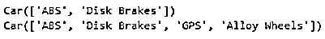

# Python 中的 classmethod

> 原文：<https://www.educba.com/classmethod-in-python/>

## Python 中的 classmethod()简介

要在 Python 中使用 Class 方法，我们必须使用 Class 方法 decorator '@classmethod '。类方法装饰器是在函数定义之前定义的。类是作为参数传入函数的，它应该是第一个参数。我们使用“cls”关键字传递给函数。Cls 表示类作为变量传递。这样做是为了我们可以修改类和对象的变量。因为在 Python 中一切都是对象。

**语法:**

<small>网页开发、编程语言、软件测试&其他</small>

`class anyName:
@classmethod
def methodName(cls, arg1,arg2 ….):
----
----
(lines of code)`

### classmethod()在 Python 中是如何工作的？

class 方法只能访问类的参数和实参。class 方法没有 self 参数，所以它只能访问类本身和表示类的对象。当我们创建类的实例并调用类方法时，我们将无法访问自身对象；它只能访问类本身的属性。

当我们想要处理工厂方法时，推荐使用类方法，因为它返回类对象。Class method decorator 允许我们在类中调用函数，而不必实例化它们。使用 class 方法时，请注意，它接收调用主题的最低类，当试图通过传入的类更新类的数据时，它可能会导致隐含。

我们可以知道，类方法总是实现实例树中的最低层。当处理层次结构中每个类可能不同的数据时，最适合使用类方法。

### 用 Python 实现 classmethod 的示例

以下是 Python 中 classmethod 的示例:

#### 示例#1

**代码:**

`class sampleclass():
def __init__(self, name):
self.studentname = name
@classmethod
def squareroot(cls, number):
sampleclass.result = number * number
sampleclass.squareroot(5)
print(sampleclass.result)`

**输出:**

上面的程序计算数字的平方根。我们已经创建了类“sampleclass ”,并在其中定义了一个构造函数。我们已经在方法之前定义了类方法装饰器。我们已经创建了一个方法“squareroot ”,第一个参数是 cls，它表示类并传递数字参数。我们还创建了一个存储输出的类级变量“result”。

现在，您可以使用 classname.methodname 调用该方法并传递参数。

#### 实施例 2

**代码:**

`class Car:
def __init__(self, features):
self.features = features
def __repr__(self):
return f'Car({self.features})'
@classmethod
def audi(cls):
return cls(['ABS', 'Disk Brakes'])
@classmethod
def mercedes(cls):
return cls(['ABS', 'Disk Brakes', 'GPS', 'Alloy Wheels'])
print(Car.audi())
print(Car.mercedes())`

**输出:**

在上面的程序中，我们创建了一个类“Car ”,还定义了一个构造函数。我们定义了两个类方法“audi”和“mercedes ”,并且创建了该类的实例。当我们调用我们的类方法时，这些值将被返回。我们只要叫车类就可以叫我们的奥迪和奔驰类；我们不需要传递任何实例。

#### 实施例 3

**代码:**

`class Organisation:
intern = 0
increment = 10000
def __init__(self, firstname, lastname, salary):
self.firstname = firstname
self.lastname = lastname
self.salary = salary
@classmethod
def set_increment(cls, amount):
cls.increment = amount
emp_1 = Organisation('Corey', 'Schafer', 50000)
emp_2 = Organisation('Test', 'Organisation', 60000)
Organisation.set_increment(15000)
print(Organisation.increment)
print(emp_1.increment)
print(emp_2.increment)`

**输出:**

在上面的程序中，我们创建了一个类组织，并创建了两个变量，intern 和 increment。我们已经定义了一个自构造函数，它接受 3 个参数。我们已经定义了我们的类方法，创建了类变量 increment，并分配了与 cls 一起传递的 amount 参数。

我们已经创建了两个组织实例。现在我们注释掉' organization . set _ increment(15000)'行，然后我们得到所有三个打印命令的输出为 10000，因为我们已经在类级别分配了 10，000。现在我们调用 Organisation 类，调用我们的类方法，即 set_increment。所以我们在类方法中使用这个数量，现在如果我们运行它，所有的输出将是 15000。发生这种情况是因为我们运行了 set_increment 方法，即 class 方法，这意味着现在我们使用的是 class 而不是 instance，并且我们将 class 变量 raise amount 设置为等于我们在这里传递的数量。

我们也可以使用 instance 运行一个类方法，但是这没有任何意义，也不是一个好的实践。我们可以使用 class 方法作为替代的构造函数，并提供多种创建对象的方法。

### 结论

class 方法对于创建代码非常有用，管理代码也非常容易；我们不需要对代码的每个地方都进行修改。用 classmethod 创建 API 非常容易。class 方法的最佳用途是当我们创建了太多的方法时，我们希望使用 class 而不是 objects 来调用这些方法。

### 推荐文章

这是 Python 中 classmethod 的指南。在这里，我们讨论 Python 中的 classmethod 及其示例的简要概述，以及它的代码实现。您也可以浏览我们推荐的其他文章，了解更多信息——

1.  [Python 设置函数](https://www.educba.com/python-set-function/)
2.  [Python 逆向列表](https://www.educba.com/python-reverse-list/)
3.  [Python 常量](https://www.educba.com/python-constants/)
4.  [Python 计数器](https://www.educba.com/python-counter/)

