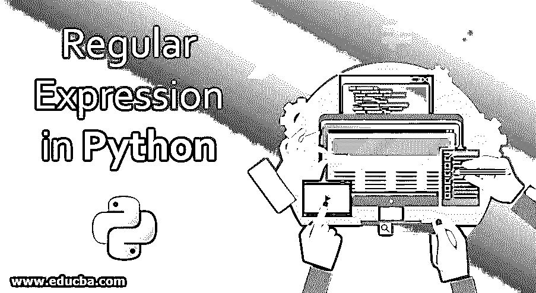
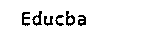
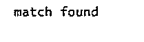
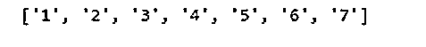

# Python 中的正则表达式

> 原文：<https://www.educba.com/regular-expression-in-python/>




## Python 中正则表达式的介绍

正则表达式是包含字符的表达式，这些字符用于在给定的句子、文件或字符串中查找字符模式序列。一般来说，正则表达式在模式搜索或字符串匹配中起着重要的作用。正则表达式缩写为 regex 或 regexp。除了 Python 之外，许多不同的编程语言 [已经嵌入到这个搜索引擎中](https://www.educba.com/what-is-python/)，使用正则表达式来查找或匹配给定的字符串或字符。

在 Python 中，正则表达式的使用方式与其他语言相同，即使用给定的专门语法作为正则表达式来搜索模式。因为正则表达式[在 UNIX](https://www.educba.com/what-is-unix/) 中使用得更普遍，而在 Python 中，它有 re 作为正则表达式[模块，在 Python 中有 Perl](https://www.educba.com/what-is-perl/) 一样的支持。

<small>网页开发、编程语言、软件测试&其他</small>

本文给出了在 Python 示例中如何以及在哪里使用正则表达式的基本知识。

### Python 中正则表达式的使用

在 Python 中，正则表达式是用于模式匹配的字符序列，它有 **re** 模块，在 Python 中使用正则表达式。在我们开始在任何字符串匹配中使用正则表达式之前，必须导入 Python 中的这个 re 模块。

在 Python 中，正则表达式如下所示:

**语法**:

```
import re
re.match (pattern, string or character)
```

**参数:**

*   **模式:**在这个模式中，给定了一系列字符或正则表达式，它们必须与给定的字符串或字符相匹配。
*   **String or character:** 这包含一个字符串，该字符串必须被搜索，以匹配从字符串的开头到结尾或指定的模式参数中指定的模式。

当我们想要找到字符串或匹配给定的模式时，我们使用正则表达式。在 Python 或任何其他编程语言中，一些字符被专门用作正则表达式，这些字符被称为元字符，支持 Python 正则表达式的实现。

下面的列表给出了元字符的完整列表:

*   这是用来匹配空格的。
*   **\S =** >这用于匹配非空格。
*   **\d =** >这是用来匹配数值或小数位数。
*   **\D =** >用于匹配非数字或非数字字符。
*   **\w =** >这是用来匹配字母和数字，也称为字母数字字符。
*   **\W =** >这用于匹配非字母数字字符。

上面使用的字符具有指定的空格，如“\t \n \r \v \f”，数字字符范围为“0–9”，字母数字字符范围为“A–Za–z0–9”。为了不指定这些字符，我们可以在指定的任何上述范围之前使用“^ ”,例如，如果我们想要指定非数字，那么我们可以将其写为“^0–9 ”,类似地，它适用于所有其他元字符。

在这个正则表达式中，有一些符号与这个字符序列一起使用；它们如下:

**1。**“^”这个象征始于。

**例如:**“^educab”，这个表达式表示匹配以字母“e”开头的字符串。

**2。" $"** 此符号为以结尾的序列。

这表示匹配以 b 结尾的字符串。

**3。"+"** 这象征着字符出现一次或多次。

**Ex:** "ed+u 搜索至少出现一次或多次字母“d”的字符串。

**4。"?"**这表示在该符号后出现零个或一个字符。

**Ex:** “马？这将搜索没有字母“n”或只有一次字母“n”的字符串。

**5。" *"** 这表示字符出现零次或多次。

**Ex:**“ma * n”这将搜索一个不包含或包含任意数量字母“n”的字符串。

**6。" {}"** 这表示字符按照大括号中指定的次数进行匹配。

**例如:** a{2，3}它在字符串中搜索至少 2 个“a”，最多 3 个“a”重复，以匹配给定的模式。

**7。" |"** 这个符号类似于 or 运算符。

**例如:** a|b 这将搜索包含字母‘a’或字母‘b’的字符串。

**8。"()"**这象征着要分组子模式。

**Ex:** (a | b | c)at 在搜索具有这些字母中的任何一个的字符串时，表示任何具有“a”或“b”或“c”后跟字母“at”的字符串。

### Python 中正则表达式的方法

在带 re 模块的 Python 中，它有许多不同的方法，如:

#### 1.重新匹配()

此方法用于将字符序列与给定的字符串进行匹配。假设正则表达式是“(e\w+)\W(e\w+)”,这样，我们可以说我们必须匹配以字母“e”开头，后跟任何字母数字字符，但不以字母“e”结尾的字符串。

下面是 Python 代码:

**语法:**

```
re. match(pattern, string, flag =0)
```

**代码:**

```
lst = "Educab is the best online training portal"
r = re. match( '(E\w+)\w', lst)
if r:
	print( r.group())
else:
	print "No match"
```

**输出:**




#### 2.搜索()

这种方法也类似于匹配方法；这也有两个参数来搜索给定字符串的第一个模式。

**语法:**

```
re.search (pattern, string)
```

**代码:**

```
import re
str = "Educab is the best online training portal"
r = re.search ('^Educab', str)
if r:
    print ("match found")
else:
    print ("match not found")
```

**输出:**




#### 3\. findall()

是返回字符串列表中所有匹配的 re 模块的方法。

**语法:**

```
re.findall (pattern, str)
```

**代码:**

```
import re
str = "Educab 1 is 2 the 3 best 4 online 5 training 6 portal 7"
p = '\d+'
r = re.findall ( p, str)
print (r )
```

**输出:**




### 结论

正则表达式是任何编程语言中用于模式匹配的一小段代码。Python 中的正则表达式扮演着与 Perl 中相同的角色。在 Python 中，它像其他语言一样嵌入了自己的正则表达式模块。有几个 re 模块可以帮助我们快速找到模式。

许多不同的元字符也被用来[创建正则表达式](https://www.educba.com/regular-expression-in-ruby/)以在给定列表中查找字符或字符串。因此 Python 也有正则表达式，它主要用于检查凭证，比如以任何形式重新输入电子邮件 id 等。

### 推荐文章

这是 Python 中正则表达式的指南。在这里，我们讨论介绍，工作，正则表达式方法，各自的例子，以及适当的语法。您也可以浏览我们的其他相关文章，了解更多信息——

1.  [Python 中的算术运算符](https://www.educba.com/arithmetic-operators-in-python/)
2.  [Python 字符串函数](https://www.educba.com/python-string-functions/)
3.  [Python 列表删除()](https://www.educba.com/python-list-remove/)
4.  [Python 范围函数](https://www.educba.com/python-range-function/)


