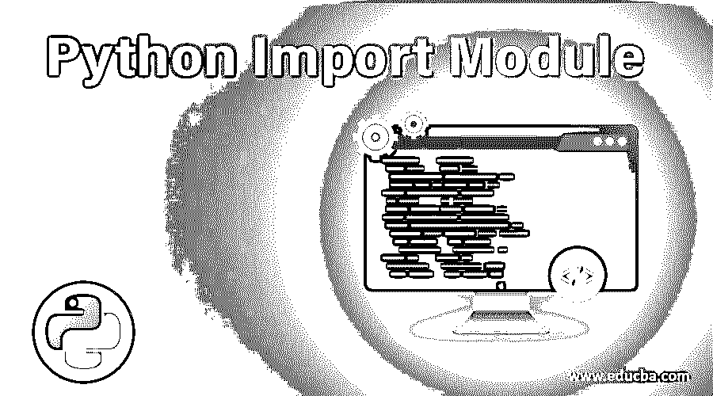
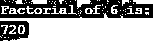
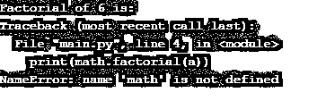

# Python 导入模块

> 原文：<https://www.educba.com/python-import-module/>




## Python 导入模块简介

Python 导入模块非常类似于在 C/C++这样的编程语言中包含文件。它用于包含代码库，以便我们可以在当前项目中使用那些预构建的功能。Python 拥有庞大的代码库和模块库，其中包含预构建的代码。因此，在创建一个项目时，我们需要为每一件事编写代码；我们只需要导入所需的模块，将这些特性继承到我们的项目中。python 中有许多函数不需要任何像 print 函数这样的模块。

### 如何在 Python 中导入-Module？

要将任何模块导入 python，我们需要在代码开始时使用带有模块名称的 import 语句。

<small>网页开发、编程语言、软件测试&其他</small>

****语法:****

`Import module_name`

**举例:**

`import random`

这里 random 是模块名。当我们将任何模块导入到我们的程序中时，该模块的所有特性在我们的程序中都是可用的。要访问模块中的任何方法，我们必须使用点符号来访问函数。我们必须写模块名，然后是点号，然后是方法名。

****例如:****

`random.randint()`

*   ****使用 From:**** 我们也可以使用‘From’关键字导入我们的模块。它的工作原理与导入相同，但为我们提供了额外的功能。现在，我们在从已经导入的模块中调用方法时，不需要使用点符号。现在我们可以直接调用任何方法。

****例如:****

`randint()`

*   ****使用别名:**** 有时候，当我们使用导入我们的模块时，模块名已经在我们的项目中使用了；在这种情况下，模块导入将无法工作，我们的代码也将无法正常工作。因此，为了避免这种情况，我们可以给我们的模块取另一个名字，即别名。现在我们可以使用这个别名来访问模块的所有方法。

`import [module] as [alias_name]`

****例如:****

`import random as rand
rand.randint()`

这里 rand 是我们随机模块的别名。这在我们导入了如此多模块的大项目中非常有用。

****例如:****

`import random
print(random.randint(1,5))`

****输出:****


在上面的例子中，我们使用了 randint 函数。这个函数有两个参数，起始值和结束值。参数应为整数类型；如果我们传递浮点数，那么这个函数将返回一个错误。在上面的函数中，我们将 1 作为起始数，将 5 作为结束数，因此该函数将返回一个介于 1 和 5 之间的随机数。两个参数可以是相同的数字，但第一个数字应该小于第二个数字；否则，它将生成一个错误。

****例如:****

`import random
print(random.randrange(1,10,2))`

****输出:****


在上面的程序中，我们使用了 randrange 函数。假设我们打破这个函数 rand + range。众所周知，range 函数返回依赖于起始值、结束值和步长值的整数值列表。这里 1 是起点，10 是终点，2 是步长值。在内部，将执行一个范围函数，生成 1、3、5、7、9 等数字列表。现在，random 将只从这个列表中选择任意随机值。

### Python 导入模块的示例

下面是 Python 导入模块的不同例子。

#### 示例#1

**代码:**

```
import math
a = 3.4
print("Ceil of 3.4 is: ")
print(math.ceil(a))
print ("The floor of 3.4 is: ")
print (math.floor(a)) 
```

**输出:**


我们在上面的程序中使用了数学模块，并且使用了两个数学模块，ceil 和 floor。Ceil 方法给出下一个舍入数的值。下限法给出的整数值小于该值。如果我们传递整数值，那么两个函数返回相同的值。

#### 实施例 2

**代码:**

```
import math
a = 6
print("Factorial of 6 is: ")
print(math.factorial(a)) 
```

**输出:**




在上面的程序中，我们导入了 math 模块并使用了 math 模块的 factorial 方法。我们只需要提到模块名点方法名。

#### 实施例 3

**代码:**

```
import math as m
a = 6
print("Factorial of 6 is: ")
print(math.factorial(a)) 
```

**输出:**




正如你在上面的程序中所看到的，我们已经导入了 math 模块，但是由于 math 没有被定义，程序给出了一个错误。我们已经为数学模块创建了别名“m”。所以我们只能在调用方法时使用别名。

#### 实施例 4

**代码:**

```
import math as m
a = 6
print("Factorial of 6 is: ")
print(m.factorial(a)) 
```

****输出:****


这一次我们使用了一个别名来调用这个方法，它工作得很好。

### 推荐文章

这是 Python 导入模块的指南。这里我们讨论基本概念和如何用 Python 导入模块，以及不同的例子和代码实现。您也可以看看以下文章，了解更多信息–

1.  [Python 线程池](https://www.educba.com/python-threadpool/)
2.  [Python Docstring](https://www.educba.com/python-docstring/)
3.  [Python if main](https://www.educba.com/python-if-main/)
4.  [Python 列表函数](https://www.educba.com/python-list-functions/)


