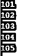

# Python 生成器

> 原文：<https://www.educba.com/python-generators/>


## Python 生成器简介

Python 生成器函数对于生成/创建迭代器非常有帮助，迭代器对于循环函数也很有用。为了在 python 中实现迭代器，需要大量代码，因此生成器通过使用“_next_()”和“_iter_()”方法来帮助实现一个类，这有助于跟踪内部状态，如果没有要返回的值，则我们会引发“StopIteration”。这比直观地编写这么多冗长的代码更容易实现。Python 生成器/生成器函数是唯一容易返回对象/迭代器的概念(迭代器意味着一次一个值)

### 为什么我们需要 Python 生成器？

制作/创建 Python 生成器有几个原因。它们是易于实现、内存效率、无限流表示和生成器流水线。

<small>网页开发、编程语言、软件测试&其他</small>

*   **容易实现:**与迭代器类相比，Python 生成器以一种简单、清晰、简洁的方式实现。
*   **内存效率:**这将是一个内存友好的序列，因为它一次只迭代/产生一个项目，而带有 return 的普通函数将返回该序列，它在提供结果之前在内存中创建整个序列。所以 Python 生成器函数比普通函数创建更受欢迎，因为普通函数的序列内存比许多函数都大。
*   **无限流表示:**表示海量数据的无限流需要一个优秀伟大的介质，而这个介质无非就是函数。
*   **生成器流水线化:** Python 的生成器函数(一个或多个)用于创建与流水线一样的一系列操作的连接，所以称为流水线化生成器/生成器流水线化。就像把数列的级数一个一个连接起来，就像迭代一样。

**语法:**

```
def function():
	List of statements
	Yield statement
Variable= sum(function)
```

**解释:**上面的语法创建了一个函数，其中包含一些语句列表和 yield 语句。在普通函数中使用产出项会使函数成为 Python 生成器函数/Python 生成器。然后创建一个变量，并为其赋以 sum(函数)值。还可以使用打印结果来了解存储在变量中的 sum()函数的值。

### 如何创建 Python 生成器？

借助“yield”语句和普通函数，创建 Python 生成器/生成器函数非常简单。yield 语句用来代替“return”语句。

如果“yield”语句用于普通函数，则该函数称为生成函数。Yield 类似于 return 函数。这些“收益”和“回报”将从函数中提供几乎相同的值。“yield”语句通常通过保存正常函数的所有状态来暂停正常函数，稍后这些函数将从剩余的连续调用中继续执行。根据要求/需要，生成器函数可以包含许多 yield 语句。

### 工作

它通过涉及这两个术语来工作。Python 生成器函数和对象。“收益率”是最重要的项，而不是正常函数中的“回报”项。

*   **函数:**Python 语言的 Generator 函数的定义和普通函数一样，但是当需要产生结果时，会使用术语“yield”代替“return”术语来产生值。如果 def 函数体包含 yield 单词，那么整个函数就变成了 python 编程语言的一个生成器函数。
*   **对象:**通常情况下，生成器函数会返回生成器对象。该对象通常用于调用方法(下一个方法)，或者通过将生成器对象放在“FOR IN”循环中来使用。

### 例子

这里列出了一些 python 编程的例子，以便理解什么是 python 生成器。看看下面的例子:

#### 示例#1

下面的例子是产生/返回从 101 到 105 的 5 个数字。首先，使用 def()函数创建一个函数“EasysimpleGeneratorFun1 ”,它首先产生/返回值“101 ”,然后第二次产生 102，第三次产生 103，第四次产生 104，最后产生 105。以便使用驱动代码(它只不过是“FOR 循环”)来检查上述函数的产出代码。

**代码:**

```
def EasysimpleGeneratorFun1(): 
	yield 101			
	yield 102		
	yield 103			
	yield 104
	yield 105
for value01 in EasysimpleGeneratorFun1(): 
	print(value01)
```

**输出:**




#### 实施例 2

下面的 python 生成器函数代码示例实现起来非常简单。这是带有 Python 生成器的程序，它有助于生成项目，而不是返回列表。为了在这里实现/说明，使用 python 编程语言的预定义库中的 def()预定义函数创建了某个函数“firstnaturalsum(n1)”。“firstnaturalsum()”函数中的“n1”表示/定义最大为 n1 值的非负整数。从值 0 开始。

在实际中，整数实际上甚至不会占用更多的存储空间，但如果整数太大，当我们与正常函数相比时，存储容量会有所减少，正常函数有返回函数来获得结果。Python 编程语言提供了生成器函数，以便在快捷方式中构建迭代器。下面的代码是完全可以接受的，但是在 Python 2 版本中，firstnaturalsum()等价于内置函数 xrange() (function)。同样，在 Python 3 版本中，range()函数是不可变的类型序列。一般来说，内置函数总是比其他函数快。

**代码:**

```
def firstnaturalsum(n1):
	numone = 0
	while numone <= n1:
		yield numone
		numone += 1
sum_of_first_natural = sum(firstnaturalsum(4))
print (sum_of_first_natural);
```

**输出:**


### 推荐文章

这是 Python 生成器的指南。在这里，我们讨论为什么需要 Python 生成器，如何创建，以及如何使用 Python 生成器，并给出一些例子，以便更好地了解这些函数。您也可以浏览我们的其他相关文章，了解更多信息——

1.  [Python 变量](https://www.educba.com/python-variables/)
2.  [Python Docstring](https://www.educba.com/python-docstring/)
3.  [Python 线程定时器](https://www.educba.com/python-threading-timer/)
4.  [Python if main](https://www.educba.com/python-if-main/)


