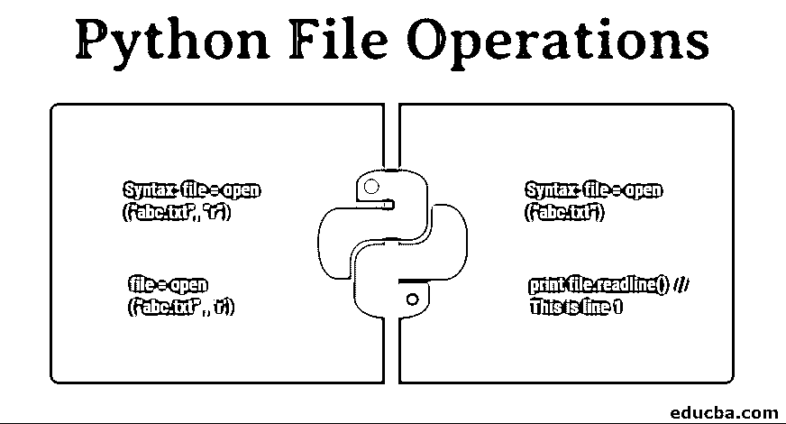

# Python 文件操作

> 原文：<https://www.educba.com/python-file-operations/>




## Python 文件操作简介

Python 是广泛使用的基于 web 或网站开发编程语言，它有助于将任何类型的输入合并到代码中。在 python 中，可以在考虑的同时创建、读取、更新、删除和管理文件。文件的类型有所不同，尤其是二进制文件和文本文件。用户可以设置文件的功能模式，如“r”表示读取模式，“w”表示写入模式，“x”表示如果文件已经存在则返回错误，“t”表示文本模式，“b”表示二进制模式。最常用的 Python 文件操作有 open()、close()、read()、writelines()、remove()、flush()、detach()、tell()、next()等。

### 打开 Python 文件

对文件的第一个操作就是打开它。在 Python 中，open()函数(内置函数)用于以读写模式打开文件。这个函数返回一个文件对象。在 open()函数中，我们定义了两个参数，其中第一个是文件名，第二个是我们希望打开该文件的模式。

<small>网页开发、编程语言、软件测试&其他</small>

**语法:`file = open (“abc.txt”, “r”)`**

在上面的例子中，用户希望以读取模式打开一个名为“abc.txt”的文件。类似地，用户可以用不同的模式打开一个文件，比如“w”代表写模式，“a”代表附加模式。在 Python 中，用户还可以指定打开文件的二进制或文本模式。对于用户来说，指定文件的模式不是强制性的；如果没有指定模式，那么默认情况下 Python 将以“r”模式打开文件。

**语法:`file = open (“abc.txt”)`**

以上两种打开文件的方式将执行相同的操作，即以读取模式打开 Python 文件。让我们了解 Python 中不同的文件模式:

| **模式** | **功能描述** |
| **“r”** | **以读取模式打开文件** |
| **“w”** | **以写模式打开文件** |
| **【a】** | **以追加模式打开文件(在文件末尾添加文本)** |
| **“x”** | **创建一个指定的文件，如果文件已经存在则返回一个错误** |
| **“r+”** | **以读写模式打开文件** |
| **“b”** | **以二进制模式打开文件(如果是图像，。exe 文件)** |
| **【t】** | **它以文本模式打开一个文件** |

**例题**

1.  **读取模式**

```
file = open (“abc.txt”,’r’) for (x in file):
print x                // prints the whole content of each line stored in x one by one
```

2.  **写入模式**

```
file = open(“new.txt”, ‘w’)
file.write (“hello I am learning file operations in Python”)   // write the content in file file.close()
```

3.  **追加模式**

```
 file = open (“test.txt”,’a’)
file.write (“hello this will append content in the file”)    // append content at the end of file.close()
```

### 关闭文件

在完成所需操作后关闭文件是一个很好的做法，因为这将释放该文件中使用的所有资源，并由操作系统分配到其他地方。为了在 Python 中关闭文件，使用了 close()方法。

虽然关闭文件不是强制性的，因为 Python 使用垃圾收集器来清理未引用的对象，但这是一个好的做法，我们必须这样做。

**语法:file.close()**

**举例:**

```
file = open (“abc.txt”,”a”) file.write (“append the text”) file.close()
```

它不像打开文件那样接受任何参数，但是这种方法并不完全安全，因为在出现异常的情况下，它可能会在没有关闭文件的情况下退出代码。为此，最好在 finally 块中使用 close()方法，这样它每次都会运行，即使出现异常也是如此。

**使用 try 和 finally 的示例**

```
try : file = open
(“abc.txt”,’w’) finally:
file.close()
```

### 读取文件

要在 Python 中读取文件，我们需要首先在读取模式下打开它。Python 提供了几种读取文件的方法。

让我们一个一个地了解它们:

1.  **read()方法:**该方法一次读取整个文件。此方法为新行返回\n。一旦整个文件完成，我们得到一个完整的空字符串，所以我们需要使用 seek()和 tell()方法再次设置光标。

**例子**

**文件:**

```
This is line 1
This is line 2
file = open (“abc.txt”, ‘r’) print file.read()  ​// This is line 1
// This is line 2
```

2.  **readline()方法:**该方法用于一次读取文件的一行，直到在文件中找到\n 字符。它在行尾添加\n。

**例子**

```
file = open (“abc.txt” , ‘r’) print file.readline()  ​// This is line 1
```

3.  **readlines()方法:**该方法用于读取整个文件，但是是逐行读取。它通过返回的每一行更新文件。

**例子**

```
file = open (“abc.txt”, ’r’) print file.readlines()    ​//This is line 1
​// This is line 2
```

4.  **read(n)方法:**如果我们想读取文件中指定长度的字符，就使用这个方法。

**例子**

```
File = open (“abc.txt”, ‘r’) print read(5)     ​// ‘This ‘ (including 1 space after s) (read 5 characters of a file)
```

### 编写文件

要用 Python 写一个文件，我们需要首先以写“w”、追加“a”或排除创建“x”模式打开文件。

Python 中的 append 和 write 模式之间有一个微小的区别，需要非常小心，append 方法在文件末尾添加内容，也就是说，如果文件已经创建并且其中有一些数据，它不会影响数据。如果具有一些数据的文件已经存在，写入方法将覆盖文件的内容。此方法不返回任何内容。

**例子**

```
file = open (“abc.txt”, ‘r+’) file.write
(“this is line 1\n”) file.write (“this is
line 2\n”) file.close()
```

**writelines()方法:** writelines()方法也用于将字符串序列写入文件。

**举例:**

```
file = open (“abc.txt”, ‘w’)
lines = [“this is line 1”, “this is line 2”] file.writelines(lines)
file.close()
```

### 删除文件

要在 Python 中删除文件，需要使用 remove()方法。为此，需要将 os 模块导入到程序中。

语法:

```
os.remove(“filename”)
```

**例子**

```
import os; os.remove
(“abc.txt”)
```

#### 其他文件操作

对于不同的操作，有各种其他方法可用于文件对象:

| **方法** | **功能描述** |
| 齐平() | 刷新内部缓冲区。它没有返回值 |
| 分离() | 从缓冲区返回分离的原始流 |
| 可读() | 如果文件流可以读取，则返回 true |
| 搜寻(偏移，从) | 用于将文件对象的当前位置设置为从给定的字节偏移字节 |
| 讲述() | 返回文件的当前位置 |
| 可查找的() | 如果文件流允许随机访问，则返回 true |
| 可写() | 如果文件允许写入，则返回 true |
| fileno() | 返回操作系统用于 I/O 操作的文件号(文件描述符) |
| 下一个() | 返回文件的下一行 |
| 截断([大小]) | 将文件截断到指定的大小(可选)。 |

### 结论

处理文件是 web 开发中的重要概念之一。文件中不同的方法服务于特定的目的。在使用任何方法之前，必须确切地知道需要执行什么，并对所有文件方法有很好的了解。就像读取文件一样，Python 中有几种不同的方法可用于不同的场景。因此，只有具备深厚的知识，你才能在正确的情况下选择正确的方法。

### 推荐文章

这是 Python 文件操作指南。这里我们讨论如何在 python 文件中执行任何操作，然后在操作完成后关闭。您也可以阅读以下文章，了解更多信息——

1.  [Python 中的模式](https://www.educba.com/patterns-in-python/)
2.  [Python 中的构造函数](https://www.educba.com/constructor-in-python/)
3.  [Python 集](https://www.educba.com/python-sets/)
4.  [Python 集合](https://www.educba.com/python-collections/)


