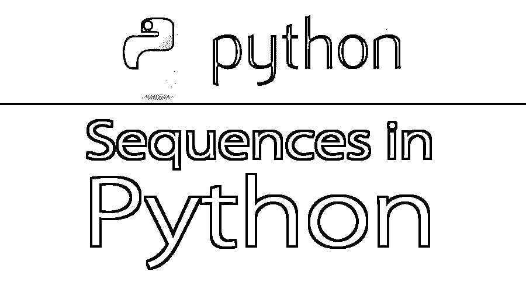

# Python 中的序列

> 原文：<https://www.educba.com/sequences-in-python/>




## Python 中的序列介绍

在 Python 中，序列是有序集合的通称。在 python 文章中的这些序列中，我们将详细讨论每种序列类型，展示如何在 Python 编程中使用它们，并提供相关示例。序列是 python 编程的基本构件，python 开发人员每天都在使用。Python 中有七种类型的序列。

*   Unicode string
*   用线串
*   列表
*   元组
*   字节数组
*   缓冲
*   Xrange 对象

在这七个中，有三个是最受欢迎的。这三个是:-

<small>网页开发、编程语言、软件测试&其他</small>

*   列表
*   元组
*   用线串

这篇文章应该创建基本的学习目标；对于成熟的程序员，这可能是一个修订模块。

### Python 中序列的主要概念

在所有序列类型中，列表是最通用的。列表元素可以是任何对象。列表是可变的，这意味着它们可以被改变。它的元素可以更新、删除，也可以插入元素。

元组也像列表，但是有一点不同，它们是不可变的，这意味着它们在定义后不能改变。

字符串与列表和元组略有不同；字符串只能存储字符。字符串有一个特殊的符号。

以下是可以在序列上执行的操作:–

*   +运算符在一个过程中组合两个序列。也叫串联。例如，[1，2，3，4，5] + [6，7]将计算为[1，2，3，4，5，6，7]。
*   *操作员将一个序列重复规定的次数。例如，[1，22]*3 将计算为[1，22，1，22，1，22]。
*   如果 x 是 NewSeq 的元素，则 NewSeq 中的 x 返回 True，否则返回 False。这个语句可以用 not(NewSeq 中的 x)或 x，not in NewSeq 来否定。
*   NewSeq[i]返回 NewSeq 的第 I 个字符。Python 中的序列从零开始索引，因此第一个元素的索引是 0，第二个元素的索引是 1，依此类推。
*   NewSeq[-i]从 NewSeq 的末尾返回第 I 个元素，因此 NewSeq [-1]将是 NewSeq 的最后一个元素，NewSeq [-2]将是倒数第二个元素。
*   python 中的所有序列都可以切片。

#### 序列上的有用函数

*   **len(NewSeq):** 返回序列 NewSeq 中元素的个数。Len 代表长度。

**在 Python 中搜索序列:** 

*   **index(x):** 将返回 x 第一次出现的索引。如果 NewSeq 索引中没有 x，就会抛出错误。这个错误可以通过 if 语句来处理。可以用来跳过这个。
*   **min(NewSeq)和 max(NewSeq):** 将分别返回 NewSeq 的最小和最大元素。对于字符串，这个顺序将是字典顺序。如果 NewSeq 中的任意两个元素不可比较，例如，一个是字符串，另一个是数字，那么 min 和 max 将抛出错误。
*   **count(x):** 将返回 x 在 NewSeq 中出现的次数。

字符串用单引号或双引号表示:“xyz”，“foo-bar”。

Unicode 字符串类似于字符串，但在语法中使用前面的“u”字符来指定:u'abcd '，u"defg "。

列表用方括号表示/创建，每个项目用逗号分隔。例子:-[a，b，c，d]。

逗号运算符创建元组，但它们不在方括号内。括号在元组中是可选的。但是，空元组必须使用封闭括号。示例:–a、b、c 或()。包含单个项目的元组以尾随逗号结束。ex:–(d，)。

Buffer 对象也没有内置的 Python 语法，通常使用内置函数 buffer()创建。缓冲区不支持串联或重复之类的操作。

Xrange 对象也类似于缓冲区。Xrange 也没有特定的语法。可以使用 xrange()函数创建它们。它们也不支持切片、连接或重复等操作。在 Xrange 上使用 in、not in、min()或 max()也是低效的。

在大多数序列类型支持的运算中，“in”和“not in”运算与比较运算具有相同的优先级，而“+”和“*”运算与相应的数值运算具有相同的优先级。

### Python 中的序列及示例

在本节中，我们将演示 python 中的序列示例:–

#### 1.线

切片、切块、索引字符串。

```
>>> "Hello, world!"[0]
'H'
>>> "Hello, world!"[1]
'e'
>>> "Hello, world!"[2]
'l'
>>> "Hello, world!"[3]
'l'
>>> "Hello, world!"[4]
'o'

>> "Hello, world!"[3:9]
'lo, wo'
>>> string = "Hello, world!"
>>> string[:5]
'Hello'
>>> string[-6:-1]
'world'
>>> string[-9:]
'o, world!'
>>> string[:-8]
'Hello'
>>> string[:]
'Hello, world!' 
```

#### 2.目录

定义一个列表并索引和追加它。

```
>> spam
['bacon', 'chicken', 42]
>>> spam[0]
'bacon'
>>> spam[1]
'chicken'
>>> spam[2]
42
>>> len(spam)
3
>>> spam.append(10)
>>> spam
['bacon', 'chicken', 42, 10]
>>> spam.insert(1, 'and')
>>> spam
['bacon', 'and', 'chicken', 42, 10]
>>> spam
['bacon', 'and', 'chicken', 42, 10]
>>> del spam[1]
>>> spam
['bacon', 'chicken', 42, 10]
>>> spam[0]
'bacon'
>>> spam[1]
'chicken'
>>> spam[2]
42
>>> spam[3]
10 
```

#### 3.元组

元组上的各种操作。

```
>>> var = "me", "you", "them", “Their”
>>> var = ("me", "you", "them", “Their”)
>>> print var 
('me', 'you', 'them', ‘Their’) 
```

除此之外，还有许多其他方法和函数可以在字符串、列表、元组等上实现。

下面给出了字符串的一些这样的方法:-

大写()
·Center(width[，fill char])
·count(sub[，start[，end]])
·decode([encoding[，errors]])
·encode([encoding[，errors]])
·endswith(后缀[，start[，end]])
·expand tabs([tabsize])
·find(sub[，start[，end]])
·index(sub[，start[，end]])
·isalnum()。

关于这些函数的细节将在后续文章中提供。

### 结论

本主题全面介绍了 Python 中的序列。希望学生理解序列的基础，并且必须在 python IDE 或控制台上练习给定的示例。从这里，学生可以开始他们的 python 编程之旅，如果需要，还可以在网上或 python 实践书籍中寻找更多的实践材料。现在非常需要 Python 语言，良好的基础理解可以让学生在未来的工作中受益匪浅。

### 推荐文章:

这是 Python 中序列的指南。这里我们已经讨论了 python 中不同类型的序列，以及它们在 python 编程中是如何使用的，并给出了一些例子。您也可以阅读以下文章，了解更多信息——

1.  [Python 套接字编程](https://www.educba.com/socket-programming-in-python/)
2.  [Java vs Python](https://www.educba.com/java-vs-python/)
3.  [Python 的用途](https://www.educba.com/uses-of-python/)
4.  [Python 框架](https://www.educba.com/python-frameworks/)


