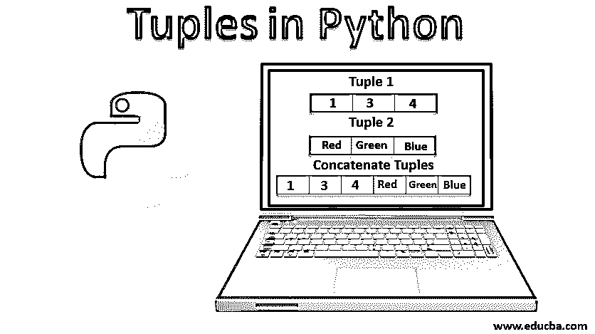
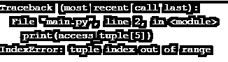
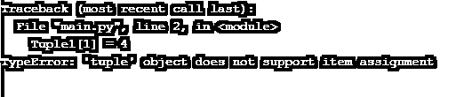
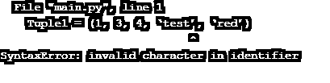
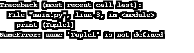
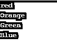

# Python 中的元组

> 原文：<https://www.educba.com/tuples-in-python/>




## Python 中元组的介绍

Python 中的元组可用于定义、声明和对值集合执行操作，用括号()表示。这些元组具有有限的预定义函数集，并且值具有固定长度，一旦创建就不能更新或更改。在 Python 编程中，元组函数本质上是不可变的，并且不允许在程序中使用复制函数。

### **什么是元组？**

让我们来了解一下这个命名元组是从哪里来的:

<small>网页开发、编程语言、软件测试&其他</small>

术语“tuple”基本上源于对序列的抽象，如 1 是单个的，2 是双个的，3 是三个的，4 是四个的，5 是五个的，6 是六个的，7 是七个的，8 是八个的，等等…，*n*tuple，…，这里来自拉丁名称的数字被用作前缀，tuple 被添加作为后缀。所以现在我们知道术语 tuple 是如何产生的。

### Python 中元组是如何使用的？

现在我们来讨论一下元组在 python 中是如何使用的。有趣的事实；0 元组读作空元组:

正如前面在 python 中讨论的，元组和列表类似于两个基本区别。第一个是元组是不可变的，即，一旦创建，我们就不能进行任何更改。你可以说这是基本属性，是 python 中元组存在的原因；否则，元组和列表的所有其他功能都是相同的。第二个括号(我们将在下一节讨论)。

### 元组中什么是不可变的？

以下是元组中不可变的几点:

*   一旦创建了元组，就不能向其添加项目。不能追加或扩展元组。
*   一旦创建了元组，就不能从元组中删除项目。元组没有任何移除方法。
*   人们肯定可以在元组中找到项目，因为找到任何项目都不会改变元组。

### 不变性的意义是什么？

以下几点说明了不变性的意义:

*   **不变性使元组比链表更快:** 例如，如果定义一组常数值。最好是通过元组而不是列表进行迭代。
*   **元组的不变性使一个人的代码更安全:**如果一个人想“写保护”数据，不被更改。应该用元组来代替列表。使用 tuple 意味着断言所提供的数据是不变的，不能被修改。
*   人们可以使用 python 中如何使用元组；不能使用列表作为字典键；原因是列表是可变的。

### 类型和创建元组

相反，我们不能对元组进行分类，我们可以对元组执行许多操作。在本节中，我们将讨论如何创建元组，并且还将讨论可以对元组执行的许多操作:

#### 1.以两种方式定义元组

要创建一个 tuple，可以用圆括号中的逗号分隔多个值来分配一个变量。

**代码:**

```
type1 = (1, 3, 4, 5, 'test')
print (type1)
```

**输出:**


要创建 tuple，请为单个变量分配多个值，这些值用逗号分隔，没有括号。细微差别请参考简介。

**代码:**

```
type2= 1, 4, 6, 'exam', 'rate'
print(type2)
```

**输出:**


我们可以定义一个空元组:

**代码:**

```
a = ( )
print(a)
```

**输出:**


#### 2.访问元组中的项目

人们可以以多种方式访问元组的元素，例如索引、负索引、范围等。

**代码:**

```
access_tuple = ('a', 'b', 1, 3, [5, 'x', 'y', 'z'])
print(access_tuple[0])
print(access_tuple[4][1])
```

**输出:**


在索引值超出元组范围的情况下，它将通过下面的错误。

**代码:**

```
print(access_tuple[5])
```

**输出:**




我们可以在元组上找到负索引的使用。

**代码:**

```
access_tuple = ('a', 'b', 1, 3)
print(access_tuple[-1])
```

**输出:**


我们可以找到一系列的元组。

**代码:**

```
access_tuple = ('a', 'b', 1, 3, 5, 'x', 'y', 'z’)
print(access_tuple[2:5])
```

**输出:**


#### 3.元组上的串联操作

串联仅仅意味着将事物连接在一起。我们可以将元组连接在一起。这里注意一件事，我们可以对元组执行不同的操作，而不改变它自己的定义。

**代码:**

```
Tuple1 = (1, 3, 4)
Tuple2 = ('red', 'green', 'blue')
print (Tuple1 + Tuple2)
```

**输出:**


#### 4.元组上的嵌套操作

嵌套仅仅意味着将一个或多个放置或存储在另一个内部。

**代码:**

```
Tuple1 = (1, 3, 4)
Tuple2 = ('red', 'green', 'blue')
Tuple3 = (Tuple1, Tuple2)
print (Tuple3)
```

**输出:**


#### 5.元组上的切片操作

由于元组是不可变的，我们可以将一个元组的切片放在另一个元组中。

**代码:**

```
Tuple1 = (1, 3, 4, 'test', 'red')
Sliced=(Tuple1[2:])
print (Sliced)
```

**输出:**


#### 6.查找元组的长度

我们可以找到元组的长度，看看一个元组中有多少个值。

**代码:**

```
Tuple1 = (1, 3, 4, 'test', 'red')
print(len(Tuple1))
```

**输出:**


#### 7.更改元组

我们知道元组是不可变的。这意味着一旦创建了元组，就不能更改元组中定义的项。

**代码:**

```
Tuple1 = (1, 3, 4, 'test', 'red')
Tuple1[1] =4
```

**输出:**




这里我们有一个例子，如果元组中的项本身是一个像列表一样的可变数据类型，它的嵌套项是可以改变的。

**代码:**

```
tuple1 = (1, 2, 3, [4, 5])
tuple1[3][0] = 7
print(tuple1)
```

**输出:**


#### 8.删除元组

正如我们前面所讨论的，我们不能改变元组中的条目。这也表明我们不能从元组中移除项目。

**代码:**

```
Tuple1 = (1, 3, 4, 'test', 'red')
del (Tuple1[1])
```

**输出:**




但是可以通过对元组使用关键字 del()来删除元组。

**代码:**

```
Tuple1 = (1, 3, 4, 'test', 'red')
del (Tuple1)
print (Tuple1)
```

**输出:**




#### 9.元组的成员测试

这可以测试一个项目是否存在于元组中；这里的关键词是 in。

**代码:**

```
Tuple1 = (1, 3, 4, 'test', 'red')
print (1 in Tuple1)
print (5 in Tuple1)
```

**输出:**


#### 10.元组的内置函数

[Python 有一些内置函数](https://www.educba.com/python-built-in-functions/)，可以直接在元组上执行。例如，对于 max()、min()、len()、sum()、sorted()等。

*   **max(tuple):** 给出元组中的最大值；这里，元组不应该包含字符串值。

**代码:**

```
tuple1 = (1, 2, 3, 6)
print(max(tuple1))
```

**输出:**


*   **min(tuple):** 给出元组中的最小值；这里的条件是元组不应该包含字符串值。

**代码:**

```
tuple1 = (1, 2, 3, 6)
print(max(tuple1))
```

**输出:**


*   **sum(tuple):** 一个 tuple 中的元素只应该是整数才能进行这个操作。总和将提供元组中所有元素的总和。

**代码:**

```
tuple1 = (1, 2, 3, 6)
print(sum(tuple1))
```

**输出:**


*   **sorted(tuple):** 如果元素没有按顺序排列，我们可以使用 sorted 内置函数。

**代码:**

```
tuple2= (1, 4, 3, 2, 1, 7, 6)
print(sorted(tuple2))
```

**输出:**


#### 11.使用元组作为字典中的键

我们知道元组是可散列的(在其整个生命周期中保持不变)，而列表不是。我们应该使用元组作为键[来创建一个复合键](https://www.educba.com/composite-key-in-sql/)并且[在字典](https://www.educba.com/dictionary-in-python/)中使用相同的键。

**代码:**

```
tuplekey = {}
tuplekey[('blue', 'sky')] = 'Good'
tuplekey[('red','blood')] = 'Bad'
print(tuplekey)
```

**输出:**


#### 12.元组打包和解包

在打包时，我们将值分配到一个新的元组中。

**代码:**

```
person = ("Salman", '5 ft', "Actor")
print(person)
```

在解包时，我们将元组中可用的值提取回变量中。这里，在提取时必须记住一件事，即解包变量的数量必须等于元组中项的数量。

**代码:**

```
person = ("Salman", '5 ft', "Actor")
(name, height, profession) = person
print(name)
print(height)
print(profession)
```

#### 13.遍历一个元组

我们可以用元组形成一个迭代循环。

**代码:**

```
my_tuple = ("red", "Orange", "Green", "Blue")
# iterating over tuple elements
for colour in my_tuple:
    print(colour)
```

**输出:**




#### 14.元组()构造函数

可以使用元组构造函数创建元组。这里有一点需要注意，为了定义，我们需要双括号。

**代码:**

```
Constructortuple = tuple((1, 5, 8, 10))
print (Constructortuple)
```

**输出:**


### Python 中的结论元组

简而言之，我们可以说元组基本上是一种[类型的数据结构](https://www.educba.com/arrays-in-data-structure/)，它是一个有序的集合，一旦创建就不能更改。除了不变性和括号之外，元组的行为与 python 中数据结构的列表类型相同。本文涵盖了与元组相关的不同操作，它们是如何创建的，以及可以对元组执行哪些操作。元组肯定比列表更快，并且使代码更安全。

### 推荐文章

这是 Python 中元组的指南。这里我们讨论各种元组操作，它们是如何形成的，以及可以对元组做什么。您也可以浏览我们的其他相关文章，了解更多信息——

1.  [Python 中的指针](https://www.educba.com/pointers-in-python/)
2.  [Python 编辑器](https://www.educba.com/python-editors/)
3.  [Python 中的抽象类](https://www.educba.com/abstract-class-in-python/)
4.  [Python 文件操作](https://www.educba.com/python-file-operations/)


