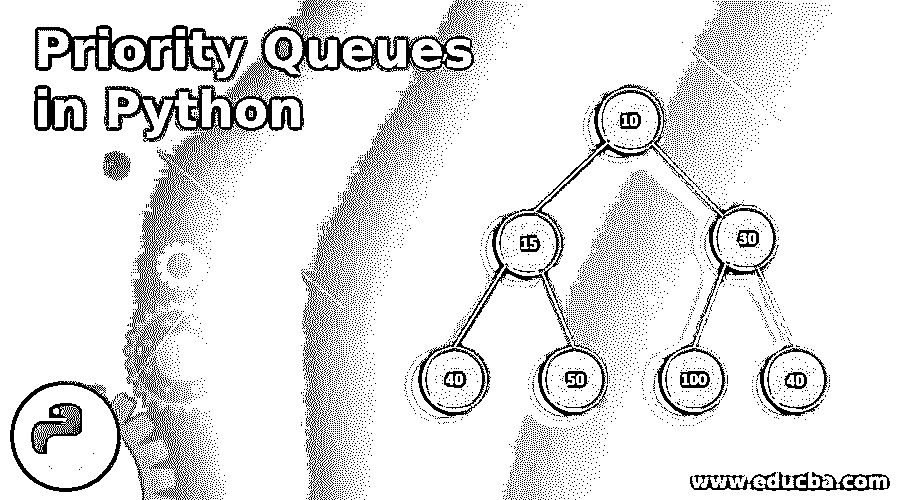
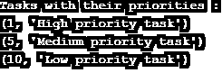
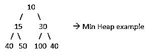
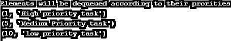
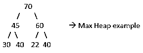
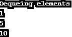
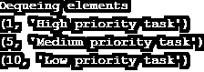

# Python 中的优先级队列

> 原文：<https://www.educba.com/priority-queues-in-python/>




## Python 中优先级队列的介绍

一般来说，队列可以定义为使用“先进先出”(FIFO)原则的数据/元素的排列或存储顺序。在 python 中，优先级排队是 FIFO 方法的扩展，其中数据/元素按优先顺序排列。优先级队列应该遵守一些行为约束，例如系统中的每个数据/元素都应该具有分配给它的优先级，具有较高优先级的数据/元素被放置在具有较低优先级的数据/元素之前，并且如果一个以上的数据/元素持有相同的优先级，则遵循 FIFO 来放置它。在 python 中，这是使用堆排序或列表函数来实现的。

### 实现优先级队列的示例

以下是 python 中优先级队列的一些示例，如下所示:

<small>网页开发、编程语言、软件测试&其他</small>

#### 示例#1

这是一个使用 python 排序列表的优先级队列的例子。

**代码:**

```
#Implementing Priority Queues with Sorted list
#declaring empty list
que=[]
#adding elements to the list
que.append((5,'Medium priority task'))
que.append((1,'High priority task'))
que.append((10,'Low priority task'))
#list is sorted evertime a new element is inserted
que.sort(reverse=True)
print("Tasks with their priorities :")
#looping through sorted list
while que:
    queue_item=que.pop()
    print(queue_item)
```

**输出:**




**解释:**首先，我们声明了一个空列表，使用 list 类的 append()方法向其中插入元素。然后列表按升序排序。而循环用于使用 pop()方法从列表中检索元素。这是一种手动实现优先级队列的方法。

**这种方法的利弊:**最适合快速识别和删除最小或最大的元素。主要缺点是向列表中插入新元素是一个缓慢的操作。因此，排序列表只适用于插入很少的情况。

#### 实施例 2

这是一个使用 heapq 模块的优先级队列的例子。二进制堆通常用于实现优先级队列。这个 Python 提供了一个 heapq 库。但是 heapq 只提供了一个最小堆实现。

**最小堆:**一棵完整的二叉树，其中根处的键必须是二进制堆中所有键中最小的。




**代码:**

```
# Implementing Priority queue using heapq module
# Importing heapq module
import heapq
# declaring empty list
que = []
# adding elements to the list
heapq.heappush(que, (5, 'Medium Priority task'))
heapq.heappush(que, (1, 'High priority task'))
heapq.heappush(que, (10, 'low priority task'))
# dequeuing elements
print("Elements will be dequeued according to their prorities")
while que:
    deque_item = heapq.heappop(que)
    print(deque_item)
```

**输出:**




**解释:**首先，我们导入了 heapq 模块，然后创建了一个空列表。使用 heapq 模块的 heappush()方法，我们将元素插入到列表中。然后使用 While 循环将元素弹出列表。在输出中可以清楚地看到，输入元素的顺序(5 - > 1 - > 10)不同于出队顺序(1 - > 5 - > 10)。

#### 实施例 3

这是一个使用队列的优先级队列的例子。优先级队列类。Python 提供了优先级队列数据结构的内置实现。Python 使用二进制堆来实现优先级队列。

**最小堆:**一棵完整的二叉树，其中根处的键必须是二进制堆中所有键中最小的。


**最大堆:**一棵完整的二叉树，其中根处的键必须是二进制堆中所有键中最大的。




1.这是使用队列实现优先级队列的基本示例。优先级队列类。

**代码:**

```
# Implementing priority queue using queue.PriorityQueue class 
import queue as PQ 
q = PQ.PriorityQueue() 
q.put(10) 
q.put(1) 
q.put(5) 
print("Dequeing elements") 
while not q.empty(): 
    print (q.get())
```

**输出:**




**说明:**队列模块导入。然后创建 PriorityQueue()的对象“q”。使用 put()方法将元素插入该队列。之后，使用 get()方法，使用 while 循环来检索元素或使元素出队。[队列按照优先级(1 - > 5 - > 10)存储](https://www.educba.com/c-plus-plus-queue/)元素，而不是按照元素创建/插入的顺序(10 - > 1 - > 5)存储，如上面的输出所示。

2.下面是一个优先级队列的例子，除了一个基本的内置原语之外，它还可以存储任何对象。

**代码:**

```
# Implementing priority queue using Queue.PriorityQueue class
import queue as PQ
q = PQ.PriorityQueue()
q.put((10,'Low priority task'))
q.put((1,'High priority task'))
q.put((5,'Medium priority task'))
print("Dequeing elements")
while not q.empty():
    print (q.get())
```

**输出:**




这里，我们插入了一个 tuple-> task 名称及其优先级。

**使用队列的时间复杂度。优先级队列类** 

| **操作** | **最坏情况时间复杂度** |
| 插入 | o(登录) |
| 删除 | o(登录) |

### 为什么使用优先级队列？

优先级队列有许多应用。下面列出了一些:

*   **图形算法:**优先级队列用于 Dijkstra 最短路径和 Prim 最小生成树等图形算法中。
*   **数据压缩:**用于压缩数据的霍夫曼码。
*   **人工智能:** A*搜索算法寻找加权图的两个顶点之间的最短路径，首先尝试最有希望的路线。优先级队列用于跟踪未探测的路由；具有最小总长度下限的那个被给予最高优先级。
*   **操作系统:**在操作系统中也用于负载平衡和中断处理。优先级队列也用在进程调度中，高优先级任务在低优先级任务之前被分配给 CPU。

### 结论

优先级队列是基本队列的修改版本，它考虑的是任务的优先级，而不是它们的插入顺序。如上所述，python 中有多种实现优先级队列的方法。每一种都有稍微不同的用例。但是 PriorityQueue 是一个很好的默认选择，因为它有一个很好的面向对象的接口。

### 推荐文章

这是 Python 中优先级队列的指南。这里我们讨论 python 中优先级队列的基本概念、例子及其详细解释，以及优先级队列的用途。您也可以阅读以下文章，了解更多信息——

1.  [Python 中的迭代器](https://www.educba.com/iterators-in-python/)
2.  [Python 的版本](https://www.educba.com/versions-of-python/)
3.  [Python 正则表达式](https://www.educba.com/python-regex/)
4.  [Java 中的优先级队列](https://www.educba.com/priorityqueue-in-java/)


