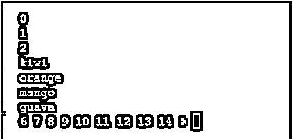
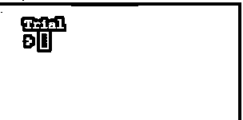
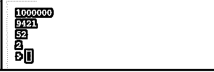

# Python 中的下划线

> 原文：<https://www.educba.com/underscore-in-python/>


## Python 下划线的定义

Python 下划线在整个 python 编程语言中扮演着重要的角色。它向另一个程序员提供了使用下划线来引用其他类或类本身的意图的线索或提示。Python 下划线单下划线和双下划线在任何实现中使用时都有一定的意图。单下划线和双下划线与变量和方法名最相关。Python 解释器在某种程度上与单个下划线相关，它要求在操作时不发生冲突的情况下重写变量。

**语法:**

<small>网页开发、编程语言、软件测试&其他</small>

Python 中的下划线根据需要有语法表示和用法，如果它想解决名称、关键字、变量等冲突的话。

与解释器一起使用时的表示

`>>> _30
>>>_*6
>>>180`

与变量和函数一起使用时的表示

`_internal_nme = ‘one_nod’
_internal_vrsion = ‘1.05’
Representation with for loop
for_inrange (50)
Representation using init& self
_ _init_ _ (self)
Normal illicitation
_ = 2` 

### Python 中下划线是如何工作的？

*   Python 中的下划线有一种不同的工作模式，根据需要相应地使用和激发。
*   下划线是 python 中的一个独特变量，它在整个编程语言中有自己的意义和重要性，在各种用例中需要检查。
*   一般来说，下划线与解释器一起使用，在定义变量的地方进行操作，然后基于它像将来一样进行存储和检索。如果不需要该变量，但在特定情况下需要，那么这种类型的下划线完全满足这种情况，使其更加健壮和通用。
*   接下来是另一种情况，在解包特定值不需要的变量时，忽略这些值，然后对这些值进行赋值。
*   这里忽略变量意味着实际上被忽略的值可以在下一次作为变量提供给将来需要的其他变量。
*   那么它也可以在循环概念中使用，因为 python 语言支持循环，它通过在变量中定义下划线来满足这一要求。
*   然后是单下划线、双下划线和后下划线，用于定义许多内容。
*   最常见的是在结构内部使用单个前下划线，以使其相应地工作。

### Python 中下划线的示例

下面是一些例子:

#### 示例#1

这个例子代表了一般情况下给解释器的各种操作条件，如下面的输出所示。

```
5+3
8
> _
8
> _+4
12
> _
12
> a=_
> a
12
>
```

**输出:**

**T2】**


 ****解释:**由于下划线是在整个 python 中使用的唯一表示，因此它用于执行许多选项，其中加法和下划线具有不同的意义，就像它表示要输入到确切值中的前一个值，然后相应地检索这些值。大多数情况下，它支持通用解释器。

#### 实施例 2

这个例子展示了下划线在 Python 中的用法，其中定义的值在不需要时被忽略，甚至在将来的代码中作为参考，如下面的输出所示。

```
p, _, q = (5, 8, 9)
print(p, q)
p, *_, q = (1, 7, 5, 6, 9, 2, 3)
print(p, q)
```

**输出:**

**T2】**


 ****解释:**在这种情况下，最初初始化的值被忽略，然后指向确切变量的变量被取消放置，以进行任何类型的操作，使整个过程引发同样的操作，而且这种情况仅受 Python 3.x 及更高版本的支持，并对扩展变量进行解包。

#### 实施例 3

这个程序演示了在变量上应用循环进行任何操作时变量的行为，以及下划线在这种情况下的行为，如下面的输出所示。

```
for _ in range(3):
print(_)
fruits = ["kiwi", "orange", "mango", "guava"]
for _ in fruits:
print(_)
_ = 6
while _ < 15:
print(_, end = ' ')
_ += 1 
```

**输出:**




**解释:**这个程序演示了 for 循环的循环变化，以产生不同的变化，因此在这里循环最初被执行，然后给出一个带有定义的结果的显示列表，打印出变量标记到工作空间。列表显示和变化可以是任何东西，不需要特别的迭代目的。

#### 实施例 4

这个程序演示了命名约定的变化和改变，以使整个程序在使用单个前置下划线定义变量名时没有冲突，如输出所示。

```
class TestVar:
def __init__(self):
self.identity = "name as identity"
self._uidnty = 800
obj = TestVar()
print(obj.identity)
print(obj._uidnty)
```

**输出:**

**T2】**


 ****例#5**

这个程序用一些 magic 方法和 dunder 方法演示了双下划线，如下面的输出所示。

```
_One_Ex_Class__name = "Trial"
class One_Ex_Class:
defreturn_name(self):
return __name
obj = One_Ex_Class()
print(obj.return_name())
```

**输出:**




**解释:**python 中带有悬空指针的双下划线和许多其他东西可以以多种方式使用，其中之一是通过如下所示的显式定义变量来处理和解决方法。

#### 实施例 6

这个程序演示了一些数字的分离，当涉及到按照特定的要求使所有的数字或数字分离时，所有的东西都在一个格式中，如下所示。

```
one_million = 1_000_000
hexa_operations = 0x_24_cd
octa_operations = 0o_64
binary_operations = 0b_0010
print(one_million)
print(hexa_operations)
print(octa_operations)
print(binary_operations)
```

**输出:**




**解释:**这里几乎所有声明的变量都可以保留一些二进制、八进制或六进制表示的值，以使数字的位数与一些值分开，从而将所有的表示转换成一种或另一种形式，因此，简化了整个事情。

### 结论

python 中的下划线是独一无二的，Python 版本 3 以上才有，但现在几乎所有版本都有下划线。这个唯一的变量具有许多优点和缺点，在某种程度上，参考和相对于未来参考的资源利用也被简化。

### 推荐文章

这是 Python 中下划线的指南。在这里，我们还将讨论下划线的定义以及它在 python 中是如何工作的？并附有示例。您也可以看看以下文章，了解更多信息–

1.  [Python 中的 Deque](https://www.educba.com/deque-in-python/)
2.  [Python 中的线性搜索](https://www.educba.com/linear-search-in-python/)
3.  [Python 中的插入排序](https://www.educba.com/insertion-sort-in-python/)
4.  [桶排序 Python](https://www.educba.com/bucket-sort-python/)


******