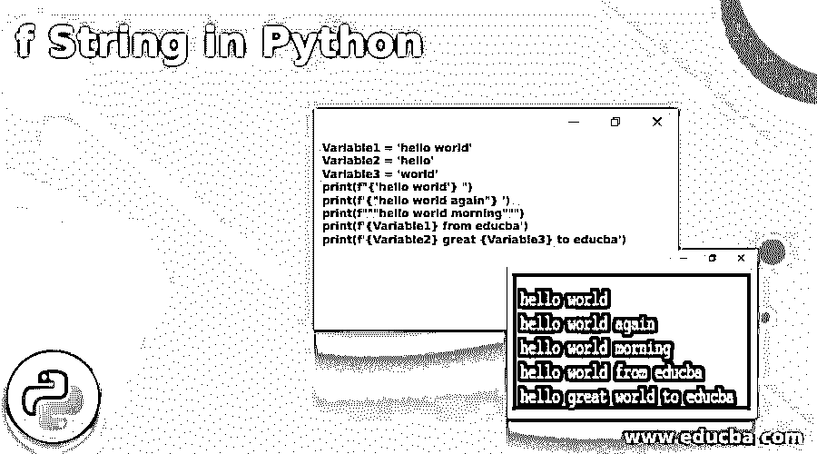

# Python 中的 f 字符串

> 原文：<https://www.educba.com/f-string-in-python/>




## Python 中的 f 字符串介绍

下面的文章提供了 Python 中 f 字符串的概要。f 弦是 PEP498 推出的。PEP498 代表文字字符串插值。字符串有不同的格式化方式，f 字符串就是其中的一种。这些不同的技术包括百分比格式化，使用 format()方法格式化字符串等。与此类似，PEP498 也引入了格式化机制。f 字符串实际上扩展为格式化字符串。PEP 类技术允许使用较少的语法复杂地将新表达式插入到现有的字符串文字中。这是 f 弦的一个关键优势。

只有在字符串执行的运行时，才会计算字符串表达式。在这里，将表达式插入到现有的字符串中非常容易，不需要大量的编码。格式化字符串的基本原理方法很容易出错，更重要的是，rational 技术是忙乱而繁琐的。使用字符串处理的格式化字符串技术可以大大减少这些困难。

<small>网页开发、编程语言、软件测试&其他</small>

**Python 中 f 字符串的语法**

下面给出了提到的语法:

```
F’actaual_string_Expression#1 . . . {embedded expression} . . . actaual_string_Expression#n’
```

在上面的语法中，表达了在真实表达式中引入这些嵌入表达式的方法。这个过程包括开始字符串表达式，它应该被嵌入到下面的项 f ' '中。因此，实际的字符串应该放在其中。使用 PEP498 的字符串格式只能通过 f”字符串值激活。这是 f 弦过程的关键表示。那么期望嵌入的表达式将需要放在左大括号和右大括号内。大多数情况下，这些嵌入值应该作为变量。

因此，变量名应该放在左大括号和右大括号中。在这种情况下，代替变量名，如果期望嵌入的表达式，那么嵌入的表达式也期望被放置在表达式内。因此，在任何需要改变字符串格式的地方，都可以用这种语法来维护，这样就足以获得所需的结果。这是 PEP498 中引入的 python f 字符串的关键优势。

### f 弦的要点

*   在 f 字符串中，字符串的字面值可以以小写 f 和大写 f 作为前缀。这两种前缀都按预期工作。
*   当多于一行(这意味着字符串表达式的几行)被期望嵌入 f 字符串公式时，f 字符串的前缀值需要被放置在字符串表达式中的每一行的前面。因此，为多行只放置一个特定的 f 前缀不会以预期的方式工作。当仅放置单个 f 前缀时，系统将直接转储嵌入控制台的表达式。然而，当嵌入所涉及的每一行时，将获得预期的输出。
*   与其他合理的格式化方式(如基于百分比的字符串格式化或使用 format()方法进行字符串格式化)相比，需要注意的是，这种基于字符串的字符串格式化技术是格式化给定字符串的最快方式。因此，当考虑格式化的速度时，这种技术需要被认为是最好的。这使得 f 字符串格式成为格式化字符串值的最佳方法。f 字符串处理速度更快的主要原因之一是因为能够在运行时执行操作。
*   在 s 字符串中可以使用多种类型的引号，可以使用双引号，可以使用单引号，甚至可以在表达式中使用三引号。所有这些引语与 f 弦配合得非常完美。唯一需要确保的是，无论何时打开一个特定的引号，然后在字符串的另一端关闭相同类型的引号，这是需要考虑的一个关键因素。所以每一个打开的引用都需要确保被关闭，否则在执行时会抛出一个错误。只要进一步保持这个条件，任何类型的引用都可以在。
*   只有在代码运行时执行期间，f 字符串才会被求值。所以，这提供了在 f 字符串中嵌入复杂表达式的可能性。此外，python 中的任何类型的表达式都可以灵活地嵌入到 f 字符串语法值中。

### Python 中 f 字符串的示例

下面是提到的例子:

**代码:**

```
Variable1 = 'hello world'
Variable2 = 'hello'
Variable3 = 'world'
print(f"{'hello world'} ")
print(f'{"hello world again"} ')
print(f"""hello world morning""")
print(f'{Variable1} from educba')
print(f'{Variable2} great {Variable3} to educba')
```

**输出:**


**说明:**

*   在上面给出的例子中，解释了不止一种形式的字符串格式。首先，f 字符串格式是通过单引号组合中的双引号来执行的。此外，嵌入的字符串放在外面的单引号和里面的双引号中。从那以后，一个使用 hello world 的示例使用了三重引号并将嵌入的值放在其中。
*   接下来，一个嵌入变量被用于 f 字符串格式化。嵌入变量放在现有的字符串表达式中。最后，多个 f 字符串表达式放在一起。所以在上面的例子中表达了执行这个 f 字符串操作的五种不同的方法。

### 结论

f 字符串最显著的优点是在减少传统字符串格式化方法中出现的错误数量方面起着至关重要的作用。更重要的是，这些 f 字符串格式化技术允许在很大程度上减少执行时间，并且代码解释非常顺利，不会抛出任何大规模的错误。这些特征使得 f 字符串格式选项成为字符串格式的最佳选项。

### 推荐文章

这是 Python 中 f 字符串的指南。这里我们讨论一下 python 中 f 字符串的介绍和例子，以便更好的理解。您也可以看看以下文章，了解更多信息–

1.  [Python 中的 Shell 排序](https://www.educba.com/shell-sort-in-python/)
2.  [Python 中的插入排序](https://www.educba.com/insertion-sort-in-python/)
3.  [Python 中的烧瓶](https://www.educba.com/flask-in-python/)
4.  [Python 列表扩展](https://www.educba.com/python-list-extend/)


