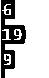
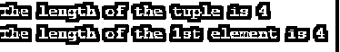
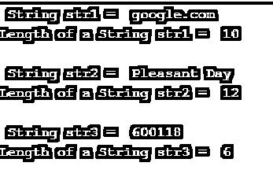
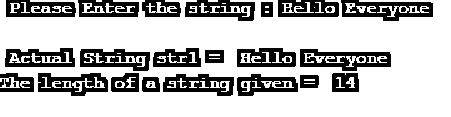

# 字符串长度 Python

> 原文：<https://www.educba.com/string-length-python/>


## 字符串长度 Python 的定义

Python 有一种独特的不可变数据类型，称为字符串，它包含通常包含在引号中的字母数字值，字符串长度是一个函数，它有助于识别 python 中的特征数量，从数字、字母、特殊字符到中间的空格都将被视为字符串中的一个字符或值，长度函数用于计算字符串中的总值。len()函数给出了给定字符串中的总长度或字符数。

**语法:**

<small>网页开发、编程语言、软件测试&其他</small>

python length 函数的基本结构是一个字符“len ”,后跟一个字符串或一个数据类型为字符串的变量(在圆括号内)。

```
len(string)
```

### 字符串长度 Python 的示例

下面是一些例子:

#### 示例#1

```
x = 'EDUCBA'
y = 'Its a Beautiful Day'
z= '__Hello__'
print(len(x))
print(len(y))
print(len(z))
```

**输出:**




变量“x”中的字符总数为 6 个字母，“y”包括空格在内共有 19 个字符，“z”包括下划线特殊字符在内共有 9 个字符，因此 python 中的长度函数包括字母数字字符、空格以及特殊字符。

我们可以将 python 中的 length 函数用于任何列表、数组、字典、元组等。因为它是 python 中的内置函数，所以有多种用途。长度函数在优化代码以及如何有效地使用存储在变量或对象中的字符方面起着重要作用。

#### 实施例 2

```
# len of a statement
statm = "Dostoevsky is a legendary writer"
print("The length of the statement is :", len(statm))
```

**输出:**


我们将一个简单的语句声明为对象 statm 的字符串格式，并使用 len()函数检查整个语句的长度。

#### 实施例 3

我们可以使用 len()函数检查列表的总长度以及列表中的每个值或字符串。

```
### Length of a List #####
list1 = ["Horse","Shoe","Turtle"]
print("The length of the list is", len(list1))
print("The length of the 1st element is", len(list1[0]))
```

**输出:**


在第一个输出中，我们打印了整个 list1 的长度，其中包含三个字符串值，输出显示为 3。在第二个输出中，我们打印了 list1 中第一个元素的长度，即“Horse ”,它包含 5 个字母，因此我们将输出打印为 5。

#### 实施例 4

与前面的示例类似，我们已经讨论了列表中的长度函数，这里我们声明了元组，这是 python 中的另一种数据结构，我们在元组中声明了字符串值，并打印了整个元组的长度以及元组中第二个值的长度。

```
### Length of a Tuple #####
tup1 = ("Horse","Shoe","Turtle","Purple")
print("The length of the tuple is", len(tup1))
print("The length of the 1st element is", len(tup1[1]))
```

**输出:**




#### 实施例 5

在这个例子中，我们在变量“Dict1”中声明了一个 python 字典，其中声明了人和他们的年龄。

```
### Length of a Dictionary #####
Dict1 = {'Sam': 21,'Jacob':19,'Alex':26,'Rob':33}
print("The length of the Dictionary is", len(Dict1))
```

**输出:**


我们的字典 Dict1 有 4 个键值对，因此我们将输出打印为 4。Python 字典不能通过索引进行分片，因为字典是无序的，不像列表、元组等。

#### 实施例 6

在这个例子中，我们讨论了在 python 中查找数组数据结构的长度。

```
### Length of an Array #####
array1 = ['Sam','Jacob','Alex','Rob']
print("The length of the Array is", len(array1))
print("The length of the Array is", len(array1[3]))
```

**输出:**


数组数据类型类似于 python 中的列表，是有序的。这里我们用四个人的名字声明了 array1，并打印了数组的总长度和数组中第三个元素“Rob”的长度，因此我们的输出是 4 & 3。

#### 实施例 7

让我们用代码讨论更多的例子，看看 python 中字符串的长度。

```
str1 = 'google.com'
print("\n String str1 = ", str1)
print("Length of a String str1 = ", len(str1))
str2 = 'Pleasant Day'
print("\n String str2 = ", str2)
print("Length of a String str2 = ", len(str2))
str3 = '600118'
print("\n String str3 = ", str3)
print("Length of a String str3 = ", len(str3))
```

**输出:**




在本例中，我们在引号中声明了数字和单词格式的三字符串，因此 python string 不考虑值格式之间的差异，它打印了三个变量 str1、str2 和 str3 的输出。为了更好地理解，我们打印了实际的字符串值和特定字符串的长度。

#### 实施例 8

在这个例子中，我们从用户那里获得了输入字符串，并打印出给定字符串的长度。

```
str1 = input(" Please Enter the string : ")
print("\n Actual String str1 = ", str1)
print("The length of a string given = ", len(str1))
```

**输出:**




在本例中，我们使用 python 中的 input()函数将用户的语句作为 str1 变量中的字符串格式的输入。我们已经编写了代码来打印输入语句以及语句的长度，其中我们给出的语句有 42 个字符，根据输入，我们的字符串长度会有所不同。通过检查我们声明的字符串的长度和值，这个方法对于优化我们的代码非常有用。

### 结论

在本文中，我们使用各种示例详细讨论了 python 字符串长度。我们还讨论了如何在 python 的不同数据结构中找到字符串的长度，比如列表、元组、字典和数组。我们还通过分割数据结构检查了长度，并打印了输出。python 字符串长度函数被认为在我们的代码优化中非常重要，因为它被用于各种实时场景。当在一个项目中处理不同的字符串时，python 的 length 函数将提供一个有用的帮手。

### 推荐文章

这是一个字符串长度 Python 的指南。在这里，我们还讨论了字符串长度 python 的介绍和语法，以及不同的例子和它的代码实现。您也可以看看以下文章，了解更多信息–

1.  [Python 写 CSV 文件](https://www.educba.com/python-write-csv-file/)
2.  [Python 事件循环](https://www.educba.com/python-event-loop/)
3.  [Python 导入 CSV](https://www.educba.com/python-import-csv/)
4.  [Python 导入错误](https://www.educba.com/python-importerror/)


