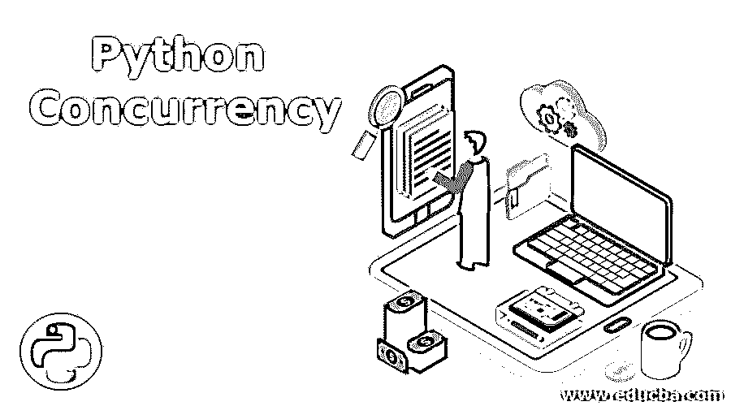
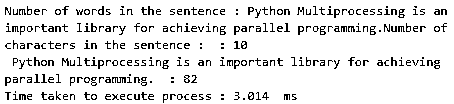

# Python 并发

> 原文：<https://www.educba.com/python-concurrency/>




## Python 并发性介绍

在当今世界，数据是新的石油。与十年前相比，每秒生成的数据量呈指数级增长。因此，一个程序的效率取决于它能在如此巨大的数据上操作和工作得有多好。如此庞大的数据量带来了一个问题；它增加了程序的执行时间，从而影响了它的效率。因此，出于在大量数据上更快执行程序的需要，Python 中并发性的概念应运而生。并发这个词的字面意思是同时发生。同样，并发的概念是关于并行计算的，因此它增加了程序的执行时间。

### 什么是 Python 并发？

在 Python 中，主要有三个同时发生的事情，即线程、任务和进程。从高层次来看，这三者都完成了同样的事情:减少程序的执行时间，但在分钟的层次上，它们都互不相同。尽管所有三种形式的并发(即进程、任务、线程)都旨在实现并发执行，但只有多重处理才能实现真正意义上的并发执行。它在多个处理器上并行执行多个进程。线程和异步都运行在一个处理器上。然而，它们被认为是并发进程，因为它们加速了执行过程。

<small>网页开发、编程语言、软件测试&其他</small>

#### 并发的类型

**1。线程化:**线程化也被称为抢占式多任务处理，因为操作系统知道每一个线程，并且可以随时中断以开始在另一个线程上执行。

**2。Asyncio:** 它也被称为合作多任务，因为任务相互合作并决定何时放弃控制权。

**3。多处理:**它实现了真正意义上的并发执行，因为进程在不同的处理器上同时运行。

### 并发是如何工作的？

下面我们将了解并发是如何工作的:

#### 1.穿线

线程的基本单元是一个线程，多个线程可以驻留在一个父进程中，每个线程完成一个单独的任务。首先需要通过传递函数名和参数来创建和初始化线程对象。自请求以来，每个线程都需要其单独的会话来执行。会话()不是线程安全的；一个线程一次可以访问一段代码或内存，这是通过 threading.Lock 实现的。

**语法:**

```
import threading
def func_name(arguement):
   // function definition
if__name__ == "__main__" :
  # Thread creation
  t1 = threading.Thread(target=func_name,args=( arguement,))
  # Staring Thread t1
  t1.start()
  # Waiting until Thread t1 is completely executed.
  t1.join() 
```

#### 2\. Asyncio

asyncio 的基本概念是，一个称为事件循环的 Python 对象控制每个任务的运行方式和时间。事件循环知道每个任务及其状态。就绪状态表示任务已准备好运行，等待阶段表示任务正在等待某个外部任务完成。在 asyncio 任务中，永远不要放弃控制，也不要在执行过程中被中断，所以对象共享在其中比线程化更安全，也是线程安全的。

**语法:**

```
import asyncio
async def func_name(arguements..):
// function definition
async def main ():
  # Creating n number of tasks
  task1 = loop.create_task(func_name(arguement1))
  task2 = loop.create_task(func_name(arguement2))
  .
  .
  .
  taskn = loop.create_task(func_name(arguementn))
  await asyncio.wait([task1, task2,.., taskn])
if__name__ =='__main__':
  loop = asyncio.get_event_loop()
  loop.run_until_complete(main())
  loop.close() 
```

#### 3.多重处理

多重处理实现了真正意义上的并发，因为它在不同的 CPU 内核上跨不同的进程执行代码。它创建一个新的 Python 解释器实例，在每个 CPU 上运行。不同的进程驻留在不同的内存位置，因此它们之间的对象共享并不容易。

**语法:**

```
import multiprocessing
def func_name(parameters):
  // function definition
if __name__ == "__main__":
  # Creating process p1
  p1 = multiprocessing.Process(target=func_name,args=(arguement1,))
  # Creating process p2
  p2 = multiprocessing.Process(target=func_name,args=(arguement2,))
  # Starting process p1
  p1.start()
  # Starting process p2
  p2.start()
  # Waiting for process p1 to be completely executed
  p1.join()
  # Waiting for process p2 to be completely executed
  p2.join() 
```

### 用 Python 实现并发的例子

以下是 Python 中并发性的示例:

#### 示例 1–线程

**代码:**

```
import threading
from datetime import datetime
def count_number_of_words(sentence):
  number_of_words = len (sentence.split())
  print("Number of words in the sentence :" ,sentence," : {}".format(number_of_words))
def count_number_of_characters(sentence):
  number_of_characters = len (sentence)
  print("Number of characters in the sentence :" ,sentence, " : {}".format(number_of_characters))
if__name__=="__main__":
sentence = "Python Multiprocessing is an important library for achieving parallel programming."
start = datetime.now().microsecond
t1 = threading.Thread(target=count_number_of_words,args=(sentence,))
t2 = threading.Thread(target=count_number_of_characters,args=(sentence,))
t1.start()
t2.start()
t1.join()
t2.join()
end = datetime.now().microsecond
print("Time taken to execute process : {}".format((end - start)/1000)," ms") 
```

**输出:**




#### 示例 2–Asyncio

**代码:**

```
import asyncio
#from datetime import datetime
async def count_number_of_words(sentence):
  print("Counting number of words in sentence : {}".format(sentence))
  number_of_words = len(sentence.split())
  located = [] 
  for i in range(3):
   located.append (i)
  print("Done with counting number of words in sentence : {}".format(number_of_words))
  return located 
async def main ():
  task1 = loop1.create_task(count_number_of_words("Asyncio is a way of achieving Concurrency in Python."))
  task2 = loop1.create_task(count_number_of_words("It is not concurrency in true sense."))
  task3 = loop1.create_task(count_number_of_words("It uses only one processor at a time."))
await asyncio.wait([task1, task2, task3])
if __name__ == ' __main__ ' :
   loop1 = asyncio.get_event_loop()
   loop1.run_until_complete(main())
   loop1.close() 
```

**输出:**

**T2】**


 **#### 示例 3–多重处理

**代码:**

```
import multiprocessing
from datetime import datetime
def count_number_of_words(sentence):
  number_of_words = len(sentence.split())
  print("Number of words in the sentence :",sentence," : {}".format(number_of_words))
def count_number_of_characters(sentence):
  number_of_characters = len(sentence)
  print("Number of characters in the sentence :",sentence," : {}".format(number_of_characters))
if__name__=="__main__":
  sentence = "Python Multiprocessing is an important library for achieving parallel programming."
  start = datetime.now().microsecond
  p1 = multiprocessing.Process(target=count_number_of_words,args=(sentence,))
  p2 = multiprocessing.Process(target=count_number_of_characters,args=(sentence,))
  p1.start()
  p2.start()
  p1.join()
  p2.join()
  end = datetime.now().microsecond
  print("Time taken to execute process : {}".format((end-start)/1000),"ms") 
```

**输出:**


### 结论

在本文中，我们讨论了并发的基本原理和类型，以及实现并发的不同方法。我们已经看了所有方法的语法和例子。既然我们已经讨论了所有这些，是时候将这些知识付诸实践，并开始在您的代码中实现它了。抓住一个用例，实现概念，看看性能的差异。

### 推荐文章

这是 Python 并发性的指南。在这里，我们讨论并发是如何工作的及其各种类型，以及示例和代码实现。您也可以浏览我们推荐的其他文章，了解更多信息——

1.  [Python 范围函数](https://www.educba.com/python-range-function/)
2.  [Python 设置函数](https://www.educba.com/python-set-function/)
3.  [蟒龟](https://www.educba.com/python-turtle/)
4.  [Python 计数器](https://www.educba.com/python-counter/)


**