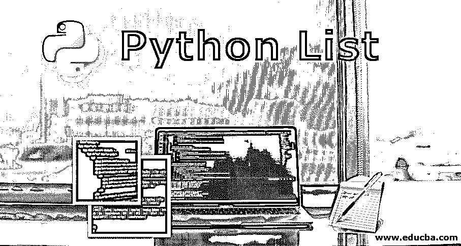
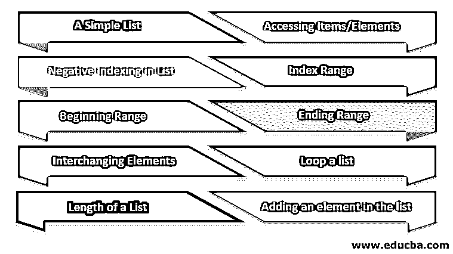
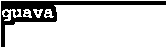
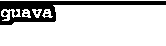
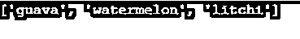
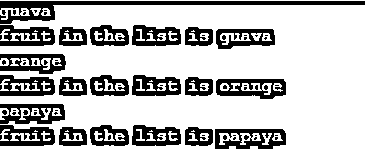
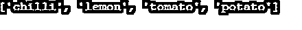

# Python 列表

> 原文：<https://www.educba.com/python-list/>




## Python 列表简介

Python 列表是在一个地方收集的许多元素/数据，可以是任何数据类型，包括整数、字符、浮点等等。列表允许数据重复，Python 提供了许多可应用于列表元素的操作选项。python 中有许多类型的列表，如负索引、索引范围、开始范围、结束范围、交换元素、列表长度、列表循环和添加元素。

### Python 列表的类型及示例

在 Python 中，当项目序列必须是有序形式或者需要为某些操作而改变时，使用列表数据结构。它很容易修改，并且在许多情况下还允许重复记录集。它是用左右方括号声明的。

<small>网页开发、编程语言、软件测试&其他</small>

让我们简单地了解一下它们的每一种类型。




#### 1.一份简单的清单

列表和其中的元素总是用方括号括起来。可以使用下面给出的例子来打印它。
**代号:**

```
listnew = ["papaya", "watermelon", "guava"]
print(listnew[2])
```

**输出:**




在上面的代码中，list new 是列表的名称，listnew[2]意味着必须在控制台输出中打印列表中的第二个元素。

#### 2.访问项目/元素

此类型将允许您访问列表中引用项目对应索引号的数据元素/项目。

**代码:**

```
ABC = ["guava", "papaya", "banana"]
print(ABC[0])
```

**输出:**


在上面的代码中，ABC 是列表的名称，控制台中打印的元素位于列表的第一个位置。ABC [0]将打印列表的第一个元素。

#### 3.列表中的负索引

这种类型将以相反的顺序打印元素，也就是说，它将以相反的方式而不是直接的方式开始遍历列表。在这种情况下，列表索引将具有负整数，即-1、-2 等。

**代码:**

```
listabc = ["papaya", "watermelon", "guava"]
print (listabc[-1])
```

**输出:**




在上面的代码中，listabc 是列表的名称，控制台中打印的输出是列表的最后一个元素。listabc[-1]将打印列表的最后一个元素。listabc [-2]将打印列表的倒数第二个元素，并继续下去。当用户想要反转列表时，这种类型适用于这种情况。

#### 4.指数范围

这种类型是列表中的用户类型之一，因为我们可以打印索引之间指定的数据。这将根据指定的索引打印列表的元素。

**代码:**

```
listnew = ["papaya", "banana", "guava", "watermelon", "litchi", "apple", "cherry"]
print(listnew[2:5])
```

**输出:**




在上面的代码中，控制台输出中打印的元素位于上述索引之间的范围内。listnew[2:5]将打印索引范围从 2 到 5 中出现的元素。

#### 5.开始范围

这种类型将打印列表中存在的元素，直到提到的索引，即元素的索引号。

**代码:**

```
listfruits = ["apple", "banana", "cherry", "orange", "kiwi”, "lemon"]
print(listfruits[:4])
```

**输出:**


输出控制台中打印的元素是出现在上述代码中提到的索引之前的元素。在本例中，list fruits 是列表的名称，list fruits [:4]将打印从第 1 <sup>个</sup>到第 4 <sup>个</sup>索引中出现的元素。

#### 6.结束范围

这种类型将从提到的索引打印列表中存在的元素，即从提到的数字到列表的末尾。

**代码:**

```
fruits = ["apple", "melon", "cherry", "custardapple", "kiwi", "dragonfruit"]
print(fruits[3:])
```

**输出:**


在上面的代码中，水果是列表的名称，输出控制台中打印的元素是列表中指定索引之后出现的元素。fruits [3:]将打印从第 3 个<sup>元素到列表末尾的元素。</sup>

#### 7.互换元素

当列表中的元素必须与其他元素互换时，使用这种类型的列表。此类型将使用新的元素修改现有元素。

**代码:**

```
fruitsinterchange = ["cherry", "apple", "guava"]
fruitsinterchange[1] = "orange"
print(fruitsinterchange)
```

**输出:**


在上面的示例中，输出控制台中打印的元素是元素的互换顺序，而原始的元素列表集没有“orange”元素。它已被替换为“苹果”。

#### 8.循环列表

当您想要查看列表中的元素时，可以使用这种类型。我们可以使用循环语句来检查列表中元素的数量。我们可以用 if，while，for 等。，循环语句来打印元素。

**代码:**

```
fruits = ["guava", "orange", "papaya"]
for items in fruits:
    print(items)
    print("fruit in the list is", items)
```

**输出:**




在上面的例子中，输出控制台中打印的元素列表是列表中元素的数量。在 if 循环中运行的清单 id，其中的元素在 print 语句之后被一个接一个地打印出来。

#### 9.列表的长度

这将打印上述列表的长度，并在输出控制台中打印。

**代码:**

```
vegetables = ["chilli", "tomato", "potato"]
print(len(vegetables))
```

**输出:**


在上面的代码中，蔬菜是列表的名称，整个列表的长度是 3，因为它包含三个元素。

#### 10.在列表中添加元素

这将向列表中添加/追加数据。它将被添加到列表**的末尾。**

**代码:**

```
vegetables = ["chilli", "lemon", "tomato"]
vegetables.append("potato")
print(vegetables)
```

**输出:**




### 结论–Python 列表

在本文中，我们讨论了 Python 中列表的一些特征和特性。当我们有一组需要来回遍历的元素时，我们通常使用这种方法。它还讨论了不同类型的列表及其功能。它在许多商业目的/场景中都是有用的。

### 推荐文章

这是一个 Python 列表的指南。在这里，我们讨论了一个简单的概述，以及 10 大 Python 列表类型的例子。您也可以浏览我们推荐的其他文章，了解更多信息——

1.  [Python 列表理解](https://www.educba.com/list-comprehensions-python/)
2.  [Python 中的排序](https://www.educba.com/sorting-in-python/)
3.  [Python 正则表达式](https://www.educba.com/python-regex/)
4.  [Python list remove()示例指南](https://www.educba.com/python-list-remove/)


