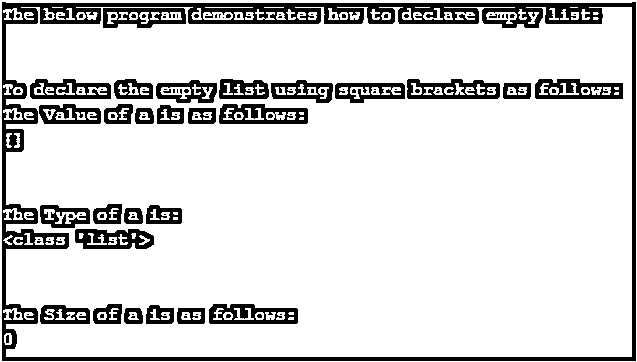
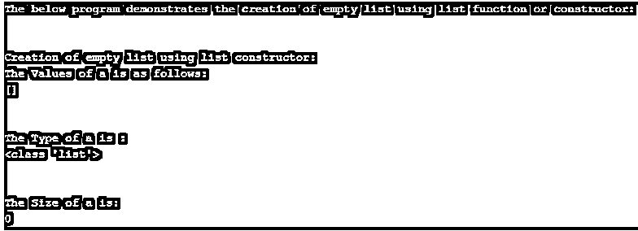
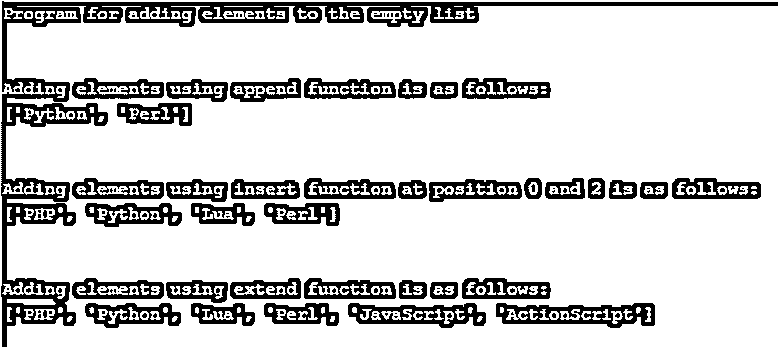

# Python 空列表

> 原文：<https://www.educba.com/python-empty-list/>


## Python 空列表简介

在本文中，我们将讨论如何在 Python 中创建空列表的概念。在 Python 中，列表类似于数组，数组是一种数据结构，是方括号内已定义元素的有序序列。在这里，我们将看到什么是空列表以及如何在 Python 中声明它。在 python 中，空列表被定义为列表中没有元素或项目的列表。要在 Python 中定义一个空列表，有两种方法，要么使用方括号[]要么使用 list()之类的列表构造函数。

### 如何声明空单？

在本文中，通过声明方括号[]创建了一个空列表，在赋值语句的括号中没有任何元素。也可以用内置函数 list()创建，也可以说是构造函数。下面让我们用例子详细介绍这两种方式，演示如何在 Python 中创建一个空列表。

<small>网页开发、编程语言、软件测试&其他</small>

#### 1.使用方括号[]

在这个方法中，可以使用方括号[]创建一个空列表，方法是将元素序列放在方括号中。这可以通过用方括号[]给变量赋值来实现。

##### 例子

**代码:**

```
print("The below program demonstrates how to declare empty list:")
print("\n")
print("To declare the empty list using square brackets as follows:")
a = []
print("The Value of a is as follows:")
print(a)
print("\n")
print("The Type of a is:")
print(type(a))
print("\n")
print("The Size of a is as follows:")
print(len(a))
```

**输出:**




**说明:**在上面的程序中，我们可以看到变量“a”被赋予了空白方括号[]。因此，我们可以看到，要将变量“a”声明为空列表，我们只需将它赋给一个空方括号[]，我们可以看到变量“a”的类型是什么，它导致的类型是“list ”,我们还可以找到所声明变量的大小，它是一个列表，结果为 0。所以上面的截图可以看到上面程序的输出。

#### 2.使用 list()函数或 list()构造函数

Python 的 list()构造函数或内置函数用于在 Python 中创建列表。这个构造函数也用于创建一个空列表。现在让我们看一个例子和语法，说明如何使用 list 构造函数来创建一个空列表。

**语法:**

`list(iterable)`

其中参数是可迭代的，可以是列表、集合、元组、字典等。但是对于创建空列表，没有传递参数；然后它返回一个空列表。如果传递了任何参数，那么它将返回传递给参数的那些元素的列表。

##### 例子

现在让我们看一个使用 list()函数或构造函数创建空列表的例子。

**代码:**

```
print("The below program demonstrates the creation of empty list using list function or constructor:")
print("\n")
print("Creation of empty list using list constructor:")
a = list()
print("The Values of a is as follows:")
print(a)
print("\n")
print("The Type of a is :")
print(type(a))
print("\n")
print("The Size of a is:")
print(len(a))
```

**输出:**




**说明:**在上面的程序中，我们可以看到我们声明了一个变量“a”，我们把它赋给了一个 list()函数，没有给这个函数传递任何参数。然后，我们打印变量“a”的类型，以了解它是否是一个列表，并且列表的大小也打印为“0”，这表明已经创建了一个空列表。

##### 例子

现在让我们看看如何在 Python 中向空列表添加元素。有 3 种方法可以做到这一点，比如使用 Python 中的 append()、insert()和 extend()函数。让我们考虑下面一个向空列表添加元素的例子。

**代码:**

```
print("Program for adding elements to the empty list")
print("\n")
l = []
print("Adding elements using append function is as follows:")
l.append("Python")
l.append("Perl")
print(l)
print("\n")
print("Adding elements using insert function at position 0 and 2 is as follows:")
l.insert(0, "PHP")
l.insert(2, "Lua")
print(l)
print("\n")
print("Adding elements using extend function is as follows:")
l.extend(("JavaScript", "ActionScript"))
print(l)
```

**输出:**




**解释:**在上面的程序中，我们看到我们首先使用变量为“l”的方括号创建了一个空列表，然后我们使用 append()函数、insert()函数添加了元素，该函数在列表的第 0 和第 2 个位置添加了元素，如程序中所述，最后我们使用 extend()函数添加了元素，该函数在创建的列表的末尾添加了元素。

正如我们所见，在 Python 中有两种创建空列表的方法，比如使用方括号[]和使用 list 构造函数或 list()函数。但这两种方法的主要区别在于，使用方括号[]比使用 list()函数或构造函数更可取，因为使用方括号比使用 list()函数更快，因为 list()需要符号查找，它可能会将 list()作为额外的函数调用，因为它可能会将其作为构造函数调用，如果它是构造函数调用，那么它将检查参数中的 iterable，如果没有参数，那么只有它会创建一个空列表。方括号[]只是一个文字，它总是给出相同的输出，它总是返回一个空列表。

### 结论

在本文中，我们看到了如何用 Python 创建一个空列表。我们看到有两种方法，比如使用方括号[]和使用 list()构造函数或 list()函数来创建一个空的带有例子的列表。我们也看到了这两种方式之间，哪个更快，为什么。我们还看到了如何使用 append()、insert()和 extend()函数向 Python 中的空列表添加元素。因此，我们得出结论，在 Python 中创建空列表非常简单，使用方括号[]比使用 list()构造函数或 list()函数更快。

### 推荐文章

这是一个 Python 空列表的指南。在这里，我们还讨论了简介和如何声明一个空列表，以及不同的例子和它的代码实现。您也可以看看以下文章，了解更多信息–

1.  [Python 计数器](https://www.educba.com/python-counter/)
2.  [Python 并发](https://www.educba.com/python-concurrency/)
3.  [Python argparse](https://www.educba.com/python-argparse/)
4.  [Python 中的控制语句](https://www.educba.com/control-statements-in-python/)


