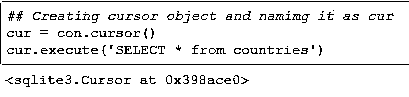
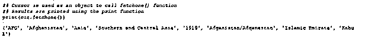
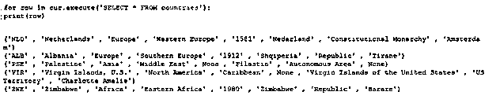
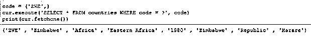
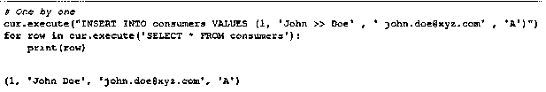

# Python SQLite

> 原文：<https://www.educba.com/python-sqlite/>


## Python SQLite 简介

Python SQLite 可以定义为一个 C 库，它提供了基于轻量级磁盘的数据库的功能。这不需要任何额外的或任何其他单独的服务器进程。

我们还可以在 Python SQLite 的帮助下构建应用程序原型，然后最终将核心移植到 Oracle、Teradata 等可扩展数据库。而有些应用程序也使用 Python SQLite 来满足内部数据存储需求。

<small>网页开发、编程语言、软件测试&其他</small>

它基本上是一个轻量级的紧凑数据库，能够处理 RDBMS 小型数据集。

要使用 Python SQLite 模块，您必须使用 connect()函数创建一个连接请求以及要连接到的目录的路径。

**语法:**

演示 Python SQLite 方法用法的 Python 程序

```
import sqlite3
con = sqlite3.connect('EDUCBA.db')
```

在与数据库成功连接之后，您需要做的就是创建一个 cursor()对象并调用它的 execute()方法来执行 SQL 查询。

### 实现 Python SQLite 的示例

下面是提到的例子:

#### 示例#1

**代码:**

```
## Creating cursor object and namimg it as cur
cur = con.cursor()
cur.execute('SELECT * from countries')
```

**输出:**




#### 实施例 2

现在，如果您想获取刚才运行的 Select *语句的结果，可以使用 fetchone()方法只显示一行，或者使用 fetchall()函数以 python 列表的形式显示所有行。

**代码:**

```
## Cursor is used as an object to call fetchone() function
## Results are printed using the print function
print(cur.fetchone())
```

**输出:**




#### 实施例 3

让我们用 fetchall()函数做同样的尝试

**代码:**

```
## Cursor is used as an object to call fetchall() function
## Results are printed using the print function
print(cur.fetchall())
```

**输出:**


#### 实施例 4

fetchall()函数的输出可以以不同的格式使用，以提高返回记录的可读性。让我们举个例子来说明这是怎么做到的。

**代码:**

```
for row in cur.execute('SELECT * FROM countries'):
print(row)
```

这里我们使用 for 循环逐行迭代，因此输出如下所示:

**输出:**




#### 实施例 5

如果我们想根据某些条件只检索某些特定的记录呢？是的，我们当然可以使用 where 子句来实现这个条件。让我们举个例子来理解同样的道理:

**代码:**

```
code = ('ZWE',)
cur.execute('SELECT * FROM countries WHERE code = ?', code)
print(cur.fetchone())
```

这个 Python 程序将只返回那些符合 where 子句条件的记录。输出将是:

**输出:**




#### 实施例 6

即使我们想在表中插入新的记录，我们希望；使用 Insert 语句也可以做到这一点。

一个接一个

**代码:**

```
cur.execute("INSERT INTO consumers VALUES (1, 'John >> Doe' , ' john.doe@xyz.com' , 'A')")
for row in cur.execute('SELECT * FROM consumers'):
print(row)
```

**输出:**




耶，我们已经成功地在空的消费者表中插入了一条记录。

#### 实施例 7

插入多条记录

**代码:**

```
# Prepare a list of records to be inserted
purchases = [(2 , 'John >> Paul' , 'john.paul@xyz.com' , 'B') ,
(3 , 'Chris Paul' , 'john.paul@xyz.com' , 'A'), ]
# Use executemany() to insert multiple records at a time
cur.executemany('INSERT INTO consumers VALUES (?,?,?,?)', purchases)
for row in cur.execute('SELECT * FROM consumers'):
print(row)
```

**Output:** 您可以通过调用您创建的连接对象的 commit()方法来提交/保存它。

```
conn.commit()
```

您现在应该可以看到条目了——

但在此之前，需要使更改永久化，这是使用如上所示的 commit()方法实现的。

```
# Closing the DB connection
conn.close()
```

### 结论

如果您拥有 SQL 方面的专业知识，并且希望在 Python 中利用这些知识。那么同样可以集成到 Python 中。在此之前，您需要使用 SQLite3 中的 connect()函数连接到数据库。市场上存在各种 RDBMS，如 IBM DB2、My SQL 等。这种 RDBMS 可以称为 SQLite，由于多种原因，它们非常有名。

*   轻量级和完全事务性
*   无服务器且不复杂的设置

然而，任何事物都有一些限制 Python SQLite 也是如此。

例如，它不支持某种特定类型的连接，即完全外/右连接。

### 推荐文章

这是 Python SQLite 的指南。这里我们讨论 Python SQLite 的介绍，语法，用代码和输出实现它的例子。您也可以浏览我们的其他相关文章，了解更多信息——

1.  [Python 框架](https://www.educba.com/python-frameworks/)
2.  [Python 数据库连接](https://www.educba.com/python-database-connection/)
3.  [Python 中的装饰器](https://www.educba.com/decorator-in-python/)
4.  [Python 标识符](https://www.educba.com/python-identifiers/)


