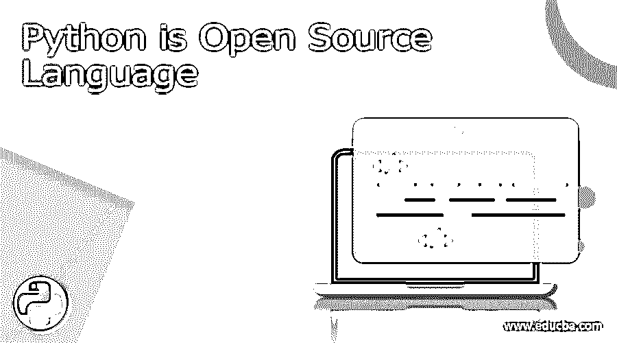

# Python 是开源语言

> 原文：<https://www.educba.com/python-is-open-source-language/>

## Python 简介

Python 是一种高级的、解释性的、交互式的和面向对象的编程语言。Python 被设计成具有高度可读性。与其他编程语言相比，它像英语一样具有较少的语法结构。

### Python 是开源的吗？

是的，Python 是一种开源语言，这意味着它是免费的，任何人都可以出于任何目的使用。python 软件基金会管理 python 语言。它是在 OSI 批准的开源许可下开发的，使它可以免费获得、使用和分发。

<small>网页开发、编程语言、软件测试&其他</small>

开源计划(OSI)成立于 1998 年，是一家拥有 501(c)3 免税地位的加州公共福利公司。 吉多·范·罗苏姆于八十年代末九十年代初在荷兰国家数学和计算机科学研究所开发了 Python。

关于 Python 历史和许可证的更多信息，请参考下面的链接。

[https://docs.python.org/3/license.html](https://docs.python.org/3/license.html)

### Python 开源语言的特点

*   **解释:** Python 是由解释器在运行时处理的。执行程序前无需编译程序。
*   **交互:** Python 可以以交互模式运行，即程序可以编写在命令行 shell 中，对每条语句给出即时输出。
*   **跨平台语言:** Python 在 Windows、Linux、Mac 等不同平台上工作。
*   **易学:** Python 易学易用；它是开发者友好的。
*   富有表现力:Python 易于阅读和理解。python 的语法就像英语语句。
*   **大型库集合:** Python 提供了大型库、模块和函数集合，支持应用的快速开发。
*   **GUI 支持:** Python 支持开发一个[图形用户界面](https://www.educba.com/user-interface-design-principles/)。
*   **集成:** Python 可以很容易地与其他语言如 Java、C/C++等集成。
*   **数据库:** Python 为大型数据库集提供接口。
*   **免费开源:** Python 在官网免费提供。任何人都可以使用它，修改它，重新发布它。但是 Python 语言是有版权的。
*   **面向对象:** Python 支持面向对象风格的编程，将代码封装在对象内。
*   **数据类型:** Python 有各种基本的数据类型，如整数、浮点数、字符串(ASCII 和 Unicode)、列表、字典等。
*   **模块和包:** 代码可以分组为包和模块。
*   错误处理:它支持抛出和捕获异常，这使得错误处理更加干净。
*   **内存管理:** 自动内存管理将内存解除分配，而不是在代码中手工处理。
*   **动态类型:** 数据类型是强动态类型；将任何变量从一种数据类型转换为另一种数据类型都会导致异常，因此错误会在最早被捕获。
*   **高级特性:** Python 包含了生成器、列表理解等高级特性。

### Python 开源语言用在哪里？

由于 Python 是一种开源语言，它也是一种通用语言，广泛应用于软件开发的各个领域。下面是几个可以使用 Python 的例子。

*   **基于控制台的应用:** Python 可以用来开发基于控制台的应用。
*   **Web 应用:** Web 应用可以使用 Python 开发。它提供了处理 HTML、XML、JSON 和请求等协议的库。它提供了各种框架，如 Django、Pyramid 等。，用于 web 应用程序开发。
*   **桌面 GUI 应用:** Python 提供了类似 Kivy、PyQt、Tkinter PyGUI 等框架。，用于开发桌面 GUI 应用程序。
*   **科学与数值计算应用:** Python 提供了像 SciPy、Pandas、IPython 等各种库和包。，用于使用 Python 开发数值和科学计算。
*   **业务应用:** Python 用于构建 ERP、电子商务等业务应用。
*   **基于音频或视频的应用:** Python 可以用来开发包括图像、音频、视频在内的多媒体应用，制作漫画等。一些实时应用是 TimPlayer、play 等。
*   **机器学习应用:** Python 包含了机器学习的专用库，分别是 scipy 和 numpy，对于线性代数和学习内核机器学习方法非常棒。

**Python 的实时例子**

不同的公司广泛使用 Python 作为开发他们的应用程序或产品的代码基础。下面提到几个例子。

谷歌、DropBox、网飞、Instagram、Splunk BuzzFeed、FaceBook、Spotify 以及更多的公司都使用 Python 进行开发。

**Python 版本**

Python 的第一个版本是在 1994 年发布的 Python 1.0。现在最新版本是 Python 3.10.6，2022 年 8 月发布。从 Python 1.0 到 3.10，各种新功能和对现有功能的增强正在形成。

### 你如何为 Python 做贡献？

由于 python 是开源的，你可以通过提交任何模块或应用程序来为 Python 做贡献，或者你甚至可以提出任何错误，甚至为它们提供修复。要投稿，您可以将您的作品提交到官方 python 站点。下面提到了其中的一些。

*   要报告 bug，请使用链接 https://bugs.python.org/
*   向 Python 官方文档投稿，加入文档 SIG，写信给，或者使用 Issue Tracker 贡献一个文档补丁。
*   要向 Python 社区发布您的模块或应用，请参考本指南发布指南。有关更多信息，请参考 Python 邮件列表指南。
*   阅读 Python 开发者指南，了解更多关于 Python 开发过程的信息，为 Python 核心的 bug 修复或其他补丁做出贡献。
*   要对 Python 核心提出修改建议，请参考本指南 CompLangPython 发表您的想法。如果您有实现，请遵循 python 补丁指南。

### 结论

我们现在知道 Python 是一种广泛使用的健壮的编程语言。Python 易于学习和实现，并提供了代码行的简单使用。它可以用于开发各种各样的应用程序。有各种各样的教程可以用来学习 Python，你可以跟随其中任何一个来精通 Python 语言。

### 推荐文章

这是一个关于 Python 是开源语言的指南。这里我们讨论一下 python 的介绍，python 语言的特点，以及如何为 python 做贡献。您也可以看看以下文章，了解更多信息–

1.  [Python 的用途](https://www.educba.com/uses-of-python/)
2.  [Ruby vs Python 性能](https://www.educba.com/ruby-vs-python-performance/)
3.  [使用 Python 的好处和局限性是什么？](https://www.educba.com/benefits-and-limitations-of-using-python/)
4.  [Python 检查文件是否存在](https://www.educba.com/python-check-if-file-exists/)

