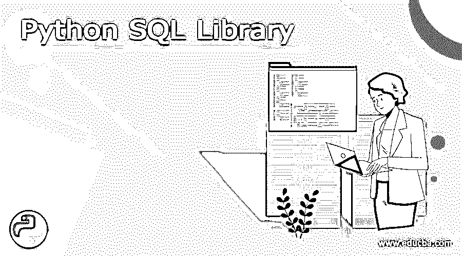
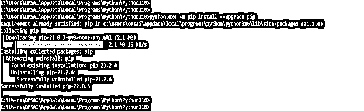

# Python SQL 库

> 原文：<https://www.educba.com/python-sql-library/>




## Python SQL 库的定义

所有软件应用程序都与 Python SQL 库数据进行交互，最典型的是通过 DBMS。一些编程语言有与数据库管理系统交互的模块，而另一些需要使用第三方软件。Python SQL 库用于连接数据库。为了连接到 MySQL 数据库，我们需要使用 MySQL-connector 依赖，同样为了连接到 SQLite 数据库，我们需要使用 sqlite3 依赖。

### Python SQL 库

*   在 python 中，我们需要根据我们用来连接的数据库来使用 python SQL 库。下面是我们用来连接 python 的数据库。

#### 1) SQLite

*   使用 SQLite 数据库时，我们不需要安装任何 python SQL 模块来连接 SQLite 数据库。
*   我们可以使用 Python 安装中附带的 sqlite3 Python SQL 包来连接 SQLite 数据库。
*   此外，因为 SQLite 数据库读写文件中的数据，所以它们是无服务器和独立的。这意味着，与 MySQL 不同，我们不需要安装或运行 SQLite 服务器来执行数据库操作。

**代码:**

<small>网页开发、编程语言、软件测试&其他</small>

```
import sqlite3
py_con = sqlite3.connect("py_sql.db")
py_csr = py_con.cursor()
print ("Connected SQLite database using python")
```


*   下面是上面代码的工作原理。
*   模块的错误类和 sqlite3 在第 1 行和第 2 行被导入。程序的第 3 行定义了一个函数。Create connection 将 SQLite 数据库路径作为参数。
*   第 2 行调用 sqlite3 模块。connect 函数，它接受 SQLite DB 路径作为参数。
*   如果数据库位于提供的位置，则建立数据库连接。否则，在 DB 指定的位置建立连接。
*   数据库连接状态打印在第 4 行。如果. connect 无法创建连接，第 4 行捕获可能发出的任何异常。
*   创建连接正在从 sqlite3 返回连接对象。连接(路径)。可以使用这个连接对象查询 SQLite 数据库。

#### 2) MySQL

*   与 SQLite 不同，它没有用于连接 MySQL 数据库的内置 Python SQL 库。为了在 Python 程序中连接 MySQL 数据库，我们需要为 MySQL 安装 Python 的 SQL 驱动程序。Mysql-connector-python 就是这些驱动之一。python SQL 的模块可以通过 pip 下载。
*   下面是使用 pip 命令安装 MySQL 连接的例子。




*   MySQL 是托管在服务器上的 DBMS。一个 MySQL 服务器上可以存在多个数据库。与 SQLite 相反，在 SQLite 中建立连接与构建 MySQL 数据库是一样的。
*   要连接到 MySQL 服务器，首先要创建一个连接。要构建数据库，请运行单独的查询。
*   创建一个连接到 MySQL 并返回连接对象的函数。要创建连接，我们需要给出主机名、用户名和密码。

**代码:**

```
import mysql.connector
py_my = mysql.connector.connect (
host = "localhost",
user = "root",
password = "Mysql@123"
)
print ("Connected to MySQL DB")
```


*   python SQL 模块中的 python 连接器将包含连接方法，这是我们在代码中使用的方法。建立到数据库服务器的连接后，连接对象将返回调用函数。
*   connection 对象将表示到我们想要与之交互的 DB 服务器的连接。生成数据库的查询称为查询。
*   游标对象用于运行查询。游标接收要执行的查询。Execute 是一个返回字符串的函数。
*   在下面的例子中，我们使用 execute 在 MySQL 数据库中创建数据库，方法如下。

**代码:**

```
import mysql.connector
py_my = mysql.connector.connect(
host = "localhost",
user = "root",
password = "Mysql@123"
)
py_cur = py_my.cursor ()
py_cur.execute ("CREATE DATABASE sql_lib ")
print ("Database created.")
```


*   在上面的例子中，我们在 MySQL 数据库服务器上创建了名为 sql_lib 的数据库。

#### 3)PostgreSQL–

*   将模块导入 python 代码后，我们使用 connect 方法，在与数据库建立连接时，我们需要用户名和密码，还需要我们需要访问的数据库名称。
*   在调用 connect 方法并指定数据库名称之后。为了对数据库服务器执行任何查询，我们需要创建一个游标对象。游标对象用于在数据库服务器上执行命令。
*   PostgreSQL 是用于与 python 代码交互的最流行的 RDBMS 数据库。
*   使用 PostgreSQL，我们可以通过使用 connect 方法连接数据库来执行任何查询，如 DML 和 DDL。
*   没有默认的 python 库来与 PostgreSQL 数据库交互，就像没有默认的 MySQL 库一样。
*   为了与 PostgreSQL 接口，我们必须安装第三方的驱动程序。psycopg2 是一个 PostgreSQL Python SQL 驱动程序。要安装 psycopg2 模块，请在我们的终端中键入以下命令。

```
pip install psycopg2
```


*   对于连接到 MySQL 数据库，我们使用与连接到 PostgreSQL 数据库服务器相同的连接方法。
*   为了连接到 PostgreSQL 数据库服务器，python 程序使用 psycopg2。连接方法。
*   之后，我们可以使用 create connection 连接到 PostgreSQL 的数据库。首先，我们将连接到默认数据库 Postgres。


*   在下面的示例中，我们在 PostgreSQL 数据库中创建了数据库名称 py_sql。

**代码:**

```
import psycopg2
py_my = psycopg2.connect(
host = "localhost",
user = "postgres",
password = "postgres"
)
print ("Connected to PostgreSQL DB")
py_cur = py_my.cursor ()
cr_db = "CREATE DATABASE py_sql"
create_database (py_my, cr_db)
```


### 结论

我们可以使用 sqlite3 Python SQL 包连接 SQLite 数据库。所有软件应用程序都与 Python SQL 库数据进行交互，最典型的是通过 DBMS。一些编程语言有与数据库管理系统交互的模块，而另一些需要使用第三方软件。

### 推荐文章

这是一个 Python SQL 库的指南。在这里，我们讨论的定义，各种 Python SQL 库，与实现的例子。您也可以看看以下文章，了解更多信息–

1.  [Python 中的 f 字符串](https://www.educba.com/f-string-in-python/)
2.  [Python 中的稀疏矩阵](https://www.educba.com/sparse-matrix-in-python/)
3.  [Python 中的二叉树](https://www.educba.com/binary-tree-in-python/)
4.  [Python Reduce](https://www.educba.com/python-reduce/)


