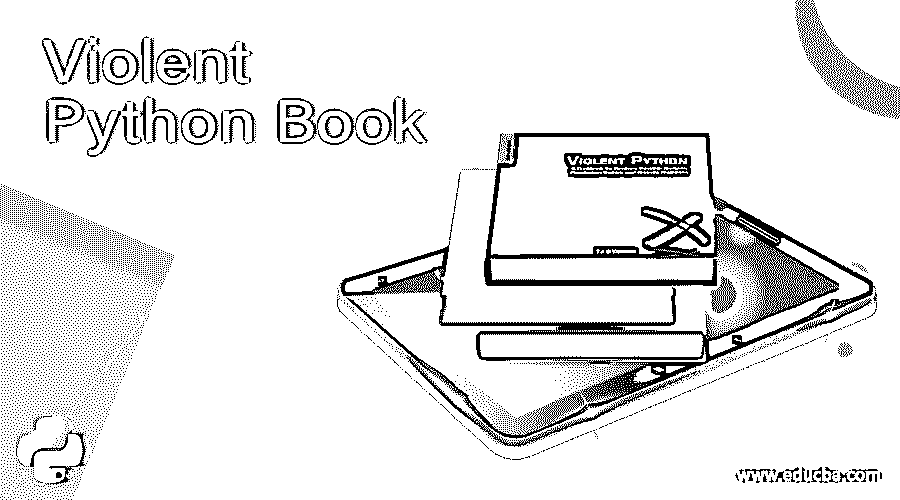

# 暴力巨蟒书

> 原文：<https://www.educba.com/violent-python-book/>

## 暴力巨蟒

希望扩展您在 [Python](https://www.educba.com/python-programming-for-the-absolute-beginner/) 方面的专业知识，或者只是想了解这种编程语言的巨大潜力？《暴力巨蟒》是最值得推荐给你的读物之一。正如它的标语所暗示的，暴力 python 是黑客、渗透测试人员、法医分析师和安全工程师的食谱。

正如你所料，这本书的目标读者群非常广泛。它展示了如何使用这种语言来帮助和自动化跨几个信息安全学科的任务。这本书也没有为了广度而牺牲深度。虽然涉及的科目范围很广，但每个科目的高级练习也相当深入。

<small>网页开发、编程语言、软件测试&其他</small>

### 暴力巨蟒书

以下是一些暴力的 python 书籍:

#### 作者

这本书主要由 TJ·奥康纳撰写，马克·巴格特担任技术编辑，罗布·弗罗斯特撰写了关于网络侦察的一章。以下是每位投稿人/作者的背景介绍:

*   TJ 奥康纳

美国陆军前伞兵，国防部信息安全专家。他在美国军事学院担任助理教授时，教授有关剥削、取证和信息保障的本科课程。他还两次在国家安全局的年度网络防御演习中担任获胜团队的共同教练。他毕业于北卡罗来纳州立大学，获得计算机科学理学硕士学位，并从 SANS 技术学院获得信息安全工程理学硕士学位。

*   **劫霜**

罗伯特·弗罗斯特 2011 年从美国军事学院毕业后，被任命为陆军通信兵。他拥有计算机科学荣誉学士学位，他的论文主要关注开源信息收集。在 2011 年的网络防御演习中，他因其规避规则的能力而成为全国冠军队中获得个人认可的成员。

*   马克·巴格特

作为一名经过认证的 SANS 讲师，Mark Baggett 教授渗透测试课程中的几门课程。他是提供渗透测试和事件响应服务的深度防御的主要顾问和创始人。他还是国防部的 SANS 技术顾问，主要研究 SANS 资源在军事能力发展中的实际应用。

### 暴力蟒蛇——背景

Python 是一种高级语言，对于作者和许多程序员来说，它也是一种黑客语言。它提供了更高的效率、更低的复杂性、无限的第三方库和更低的入门门槛。这使得它成为构建攻击性工具的绝佳开发平台。如果你运行的是 Linux 或者 Mac OS X，那么你的系统中很可能已经安装了这个软件。通过这本书学习 Python 可以帮助你在其他进攻工具失败的时候取得成功。

暴力 Python 一书面向所有年龄和熟练程度的程序员，甚至是希望开始编写 Python 的非程序员。暴力 Python 甚至可以适用于想要学习在渗透测试中应用自己[技能的高级程序员。正如书名《暴力的 Python》可能暗示的那样，这本书关注的是如何挖掘 Python 的进攻方面以提高防守。它涵盖了渗透测试、网络分析、web 分析和无线设备开发的“配方”。](https://www.educba.com/penetration-testing/)

对于那些不熟悉烹饪书类型资源的人来说，这种暴力 Python 的内容是黑客的烹饪书，由几个专注于特定任务的简短自定进度脚本组成。它最终展示了几行 Python 代码有多么强大。说真的，这本暴力的 Python 书籍中最长的食谱很少超过 100 行。

请记住，这本书主要集中在 Python 的“黑暗艺术”上，你不会找到用这种语言进行一般编程的直接材料。然而，你肯定可以通过练习学到一些技巧和窍门。配方是以代码可重用性的模块化设计制作的，代码可以用于更大的项目。

### 暴力巨蟒书细看

在我们仔细研究暴力 Python 之前，应该注意的是，食谱的源代码文件位于它的 Syngress 主页上。但是，为了更好地学习和记忆，建议您从顶部开始编写代码。在任何情况下，如果您希望快速、轻松地获得代码，您知道在哪里可以找到它。

以下是《暴力巨蟒》每一章的内容:

#### 1.介绍

第一章从语言本身的背景信息开始，给你一个关于 Python 的总体介绍。它很快进入主题，向您介绍变量、数据类型、迭代、选择、函数等等。它还向您展示了如何使用模块，并带您浏览一些简单的程序。

如果你已经熟悉 Python 的基础，并且是一个中级或有经验的程序员，你可以跳过整个章节。暴力 Python 这本书最棒的一点就是大部分章节都是相互独立的。所以你可以简单地选择你想要的那一章，然后独自学习，而不是浏览前面所有的章节。

#### 2.使用 Python 进行渗透测试

本章向您介绍了使用 Python 为渗透测试编写攻击脚本的想法。这些例子包括构建 SSH 僵尸网络、构建端口扫描器、编写漏洞利用程序、复制 Conficker 和通过 FTP 进行大规模攻击。

#### 3.使用 Python 进行法医调查

本章重点介绍如何使用 Python 进行数字取证调查。它举例说明了如何恢复已删除的项目、对个人进行地理定位、从 Windows 注册表中提取工件、检查文档元数据以及调查移动设备和应用程序工件。

#### 4.用 Python 进行网络流量分析

本章教你使用 Python 分析网络流量。这里给出的脚本侧重于从数据包捕获中地理定位 IP 地址，[分析僵尸网络流量](https://www.educba.com/what-is-botnet/)，调查流行的 DDoS 工具包，发现诱饵扫描，以及挫败入侵检测系统。

#### 5.Python 的无线伤害

本章重点介绍蓝牙和无线设备。它提供了如何解析和嗅探无线流量的示例，识别隐藏的无线网络，构建无线键盘记录器，远程命令无人驾驶飞行器，识别正在使用的恶意无线工具包，利用蓝牙的漏洞并跟踪蓝牙无线电。

#### 6.使用 Python 进行网络侦察

本章探讨了如何使用 Python 来废弃互联网上的信息，并举例说明了如何通过 Python 匿名浏览网页、抓取流行的社交媒体网站、使用开发人员 API 以及创建鱼叉式网络钓鱼电子邮件。

#### 7.利用 Python 规避防病毒

这最后一章告诉你如何建立恶意软件，规避反病毒程序。它还向您展示了如何针对在线防病毒扫描程序构建一个上传恶意软件的脚本。它使用 Metasploit 框架中的恶意代码来生成一些 C 风格的外壳代码。一个简单的 Windows bandshell 用于将 cmd.exe 进程绑定到您选择的 TCP 端口，使您能够远程连接到一台机器并发出与 cmd.exe 进程交互的命令。

### 更多关于暴力巨蟒的书

正如您所看到的，暴力 Python 涵盖了黑客和对信息安全感兴趣的人感兴趣的一些主题。它的 288 页中包含了几十种食谱，使用 Python 可以轻松获得这种结果，您可能会对此感到惊讶。

不幸的是，食谱是详细列举的，所以你必须自己做一些研究来找出一些编码是如何工作的以及为什么工作。然而，这是一个很好的起点，可以让你更多地了解 Python 的信息安全能力，并对这种语言的深度感到惊讶。以下是《暴力巨蟒》一书中一些更有趣的食谱:

1.  开发离线和在线密码破解程序
2.  再造 Conficker
3.  与 Metasploit 和 [Nmap](https://www.educba.com/what-is-nmap/) 交互
4.  利用基于堆栈的[缓冲区溢出](https://www.educba.com/what-is-buffer-overflow/)
5.  利用 SQLite 数据库、Windows 注册表和 iTunes 备份
6.  将网络流量与物理位置相关联，并开发基于 Google Earth 的地图
7.  构建 SSH 僵尸网络
8.  躲避反病毒系统和入侵检测系统
9.  解析网站、推文和元数据
10.  创建社会工程电子邮件活动
11.  劫持无人机
12.  执行基于蓝牙的攻击
13.  解析和记录无线流量

简介展示了如何设置 Python 开发环境，并作为该语言的一个很好的速成班。它可以帮助您启动并运行开发环境，如果您已经学习了这门语言，但最近又失去了这种感觉，它甚至可以作为一种复习。然而，对于那些完全不熟悉 Python 并且以前从未接触过这种语言的人来说，这可能会超出你的理解范围。当然，任何一本书都很难在不到 300 页的篇幅内从基础知识开始讲述 Python，然后深入到像黑客无人机和利用该语言开发无线网络这样的内容。

此外，书中给出的几个利用讨论了特定代码阻塞的可能操作，而不是给出代码的逐行解释。对于那些能够阅读 Python 中常见语句的人来说，理解和实现核心材料会更容易更快。然而，如果您对这种语言没有什么经验，您可能会觉得这本暴力的 Python 书籍有点让人不知所措。如果你想有更好的体验，最好去谷歌的免费两天课程，或者选择其他关于 Python 基础的短期实践课程(一般是免费的)。

现在，从目前给出的内容来看，您可能会认为暴力 Python 是为更高级别的程序员编写的，但需要注意的是，您不需要专家级的语言技能就能理解这本书的内容。如果你喜欢投身其中，通过反复试验来学习，并且想亲自动手，那么这绝对值得一试。事实上，您可以学习 Python 的一般用法，同时学习本书中给出的信息安全材料。至于代码，尽量简单干净。代码写得很好，结构也很好，为了使事情更容易，叙述保持随意，术语的使用保持在最低限度。

大多数内容应该是容易理解的，即使是对专业术语理解不深和缺乏经验的新手也可以理解。与此同时，本书中呈现的这种材料太独特、太有趣了，即使对于有经验的 Python 开发人员来说也不能忽视。

作者还对食谱进行了相当多的思考和照顾，使它们变得有意义，而不仅仅是使它们过于华丽。此外，虽然脚本已经被结构化为模块，但这本书不仅仅是复制和粘贴脚本的集合。相反，大部分食谱之前都有有趣的、通常是娱乐性的背景信息，这使得这本书更加有趣。

《暴力 Python》一书也是为了设置场景和明确目标而写的，从解决调查问题到重现恶意攻击，甚至只是为了攻击而攻击。所展示的历史琐事也可以与食谱本身的价值相媲美。

虽然所有的食谱都很有趣，但从表面价值来看，有些似乎不切实际。例如，大多数信息安全专业人士可能不需要击落无人机或运行 SSN 僵尸网络。尽管如此，从根本上说，这些方法有一些非常有用的核心概念，比如能够通过 SSH 与许多主机交互，以及将数据包注入无线流量。这些概念可以应用于信息安全活动，如渗透测试。

专门关注 Python 对读者来说也有点不利，因为有些食谱需要外部知识才能真正了解幕后发生的事情。让我们来看看漏洞利用方法，它展示了如何通过 Python 实现漏洞利用。就其本身而言，这种方法可以成为开发基于网络的概念验证利用的绝佳模板。这一章还从简单介绍基于堆栈的缓冲区溢出开始。然而，它没有讨论漏洞的识别、创建外壳代码、x86 内存管理或[汇编语言](https://www.educba.com/what-is-assembly-language/)，所有这些都超出了本书的范围，但与利用本身相关。

### 暴力 Python 书籍的一个结论

你可以理解，这本书做了很多，但也省略了很多，这是可以理解的。很难满足每个读者和每个知识和技能水平的需求。侧栏有常见的错误和技巧，提示和其他信息，以帮助解决一些知识上的差距。每一章也有几个进一步学习的参考，如果你看了这本暴力 Python 的书，强烈推荐。

### 推荐文章

这里有一些文章可以帮助你获得更多关于暴力 Python 书评的细节，所以只要浏览一下链接就可以了。

1.  [Python 面试问题](https://www.educba.com/python-interview-questions/)
2.  用于 Web 开发的 Python 和 Django
3.  [使用 Python 的好处和局限性](https://www.educba.com/benefits-and-limitations-of-using-python/)
4.  [Python vs Ruby 性能](https://www.educba.com/python-vs-ruby-performance/)

