# Python 中的 NLP

> 原文：<https://www.educba.com/nlp-in-python/>

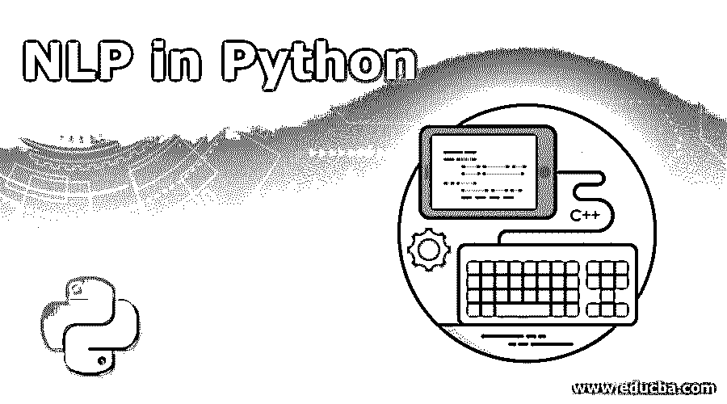

## Python 中的 NLP 是什么？

计算机科学和工程居住的一个技术分支，也是语言学的一个分支，它利用人工智能，并在编程和处理大量自然语言数据的情况下简化人类和计算机系统之间的交互，Python 编程语言提供了处理自然语言数据的健壮机制，并通过其各种功能(包括各种库和函数)容易地实现自然语言处理，这在 Python 中被称为 NLP(自然语言处理)。 **T2】**

### Python 中 NLP 是如何工作的？

阅读和理解英语是非常复杂的。

<small>网页开发、编程语言、软件测试&其他</small>

下面的句子是计算机理解句子实际思想的困难的一个例子。

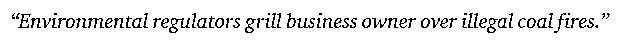

在机器学习中，为每个问题建立一个管道，其中问题的每个部分都使用 ML 单独解决。最终的结果将是[几个机器学习模型](https://www.educba.com/machine-learning-models/)链接在一起的组合。自然语言处理的工作原理与此类似，将英语句子分成几个组块。

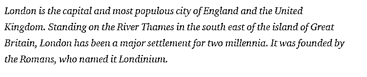

这一段中有几个事实。首先，如果计算机本身能够理解伦敦是什么，事情就会变得简单，但要做到这一点，计算机需要接受书面语言基本概念的训练。

**1。句子分割**–语料库被分成如下几个句子。

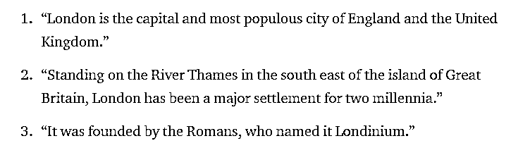

这将使我们的生活更容易，因为处理单个句子比处理整个段落更好。拆分可以基于标点符号或其他几种对未清理数据有效的复杂技术来完成。

**2。单词标记化**–一个句子可以进一步分解成单词标记，如下所示。

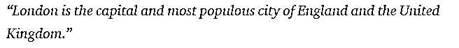

标记化后，上面的句子被拆分成–

**3。词性预测**——这个过程是为每个单词生成词性。这将使我们能够理解句子的意思和句子中谈论的话题。

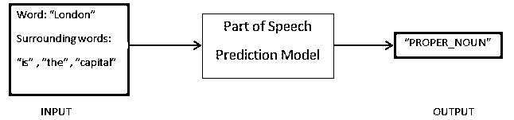

**4。词汇化**–一个句子中的一个单词可能会以不同的形式出现。词汇化将一个单词追溯到它的词根，即每个单词的词汇。

**5。停用词识别**——一个句子中有很多像‘the’、‘a’这样的填充词。这些词就像文本中的噪音，我们试图从中提取其含义。因此，有必要过滤掉这些停用词，以建立一个更好的模型。

基于应用，停用词可能会有所不同。但是，有一个预定义的停工清单可供参考。

**6。命名实体识别**–NER 是查找名称、地点、人员、组织等实体的过程。，出自一句话。

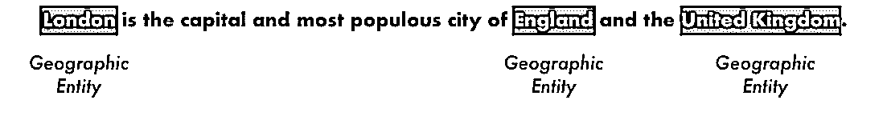

这里使用的是单词在句子中出现的上下文。为了从文本中获取结构化数据，NER 系统有很多用途。

### Python 中的 NLP 示例

大多数公司现在都愿意处理非结构化数据，以满足业务增长的需要。因此，NLP 有广泛的用途，最常见的用例是文本分类。将文本自动分类为不同的类别被称为文本分类。检测电子邮件中的垃圾邮件和新闻文章的分类是文本分类的常见示例。用于此目的的数据需要标记。

文本分类流程中需要遵循的几个步骤是:

*   数据的加载和预处理是第一步，然后它将被分成训练集和验证集。
*   特征工程步骤包括提取有用的特征或创建附加的有意义的特征，以开发更好的预测模型。
*   为了构建模型，已标记的数据集用于训练模型。

Pandas、Scikit-learn、XGBoost、TextBlog、Keras 是我们需要安装的几个必要的库。然后，我们将导入用于数据集准备、特征工程等的库。

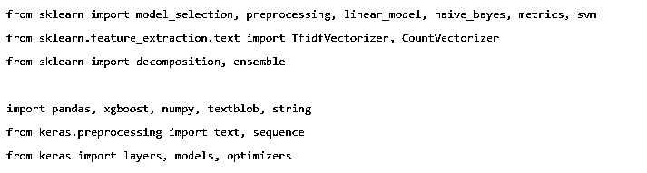

数据是巨大的，几乎有 360 万条评论可以从这里下载。使用了一部分数据。它被下载并读入熊猫数据帧。

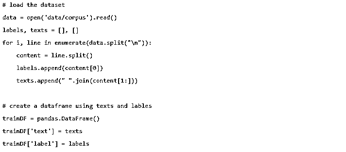

对目标变量进行编码，并将数据分成训练集和测试集。

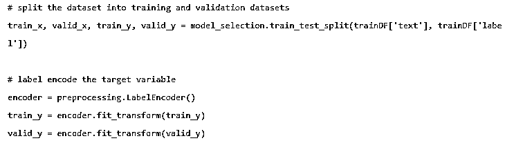

使用以下不同方法进行特征工程。

#### 1.计数向量

计数向量实现了来自语料库的文档、术语及其频率的表示。

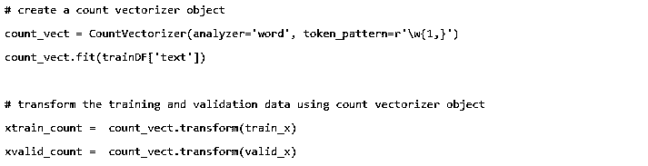

#### 2.TF-IDF 载体

在文档中，术语的相对重要性由术语频率(TF)和逆文档频率(IDF)分数来表示。

TF-IDF 可由下式计算:

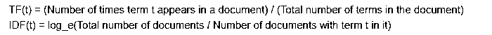

TF-IDF 向量可以由单词级和 N-gram 级生成，单词级表示每个术语的得分，N-gram 级是 N 个术语的组合。

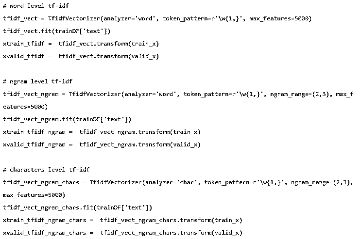

#### 3.单词嵌入

以密集向量的形式表示文档和单词被称为单词嵌入。可以使用预先训练的嵌入，例如 Glove、Word2Vec，或者也可以对其进行训练。

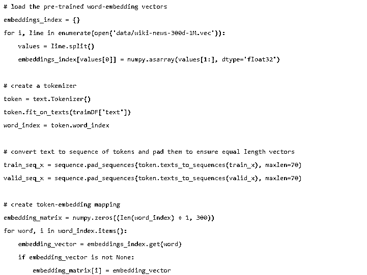

#### 4.主题模型

文档中的一组单词携带了最多的信息。潜在的狄利克雷分配在这里用于主题建模。

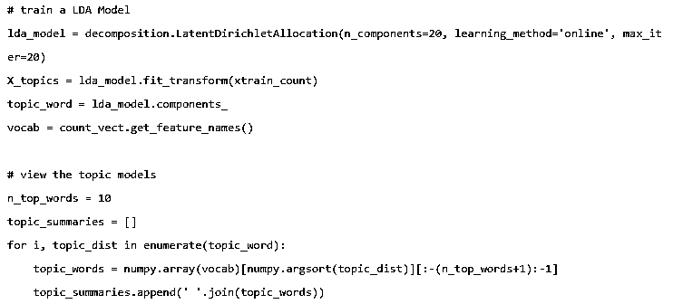

在特征工程完成并且相关特征已经被提取之后，模型被建立。

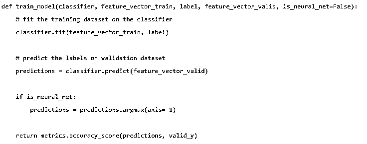

#### 5.朴素贝叶斯

它基于[贝叶斯定理](https://www.educba.com/bayes-theorem/)，算法认为一个数据集中的特征之间没有关系。

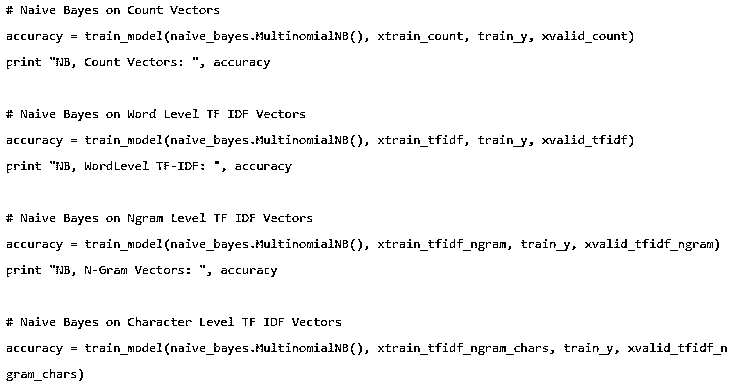

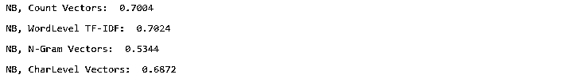

#### 6.逻辑回归

它测量特征之间的线性关系，并且基于估计概率的 sigmoid 函数来测量目标变量。

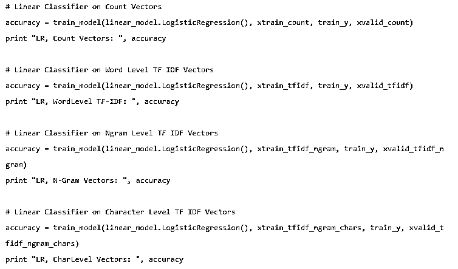

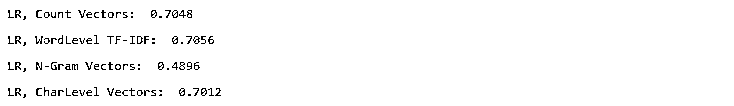

#### 7.支持向量机

超平面将 SVM 中的两个类分开。

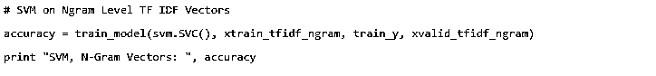

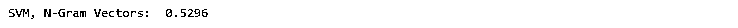

#### 8.随机森林模型

一种集成模型，其中减少了方差并将多个决策树打包在一起。

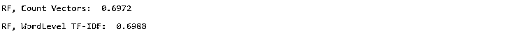

#### 9.X G 升压

偏见减少，弱学习者转化为强学习者。

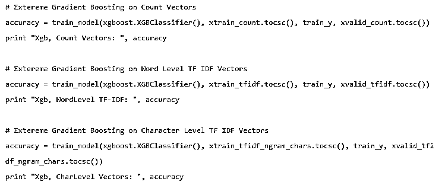

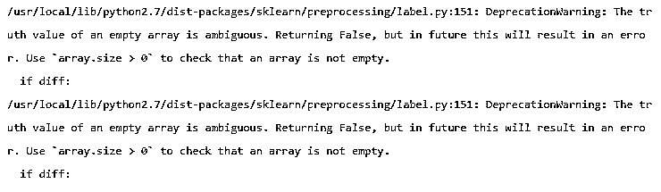

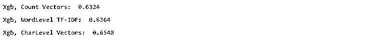

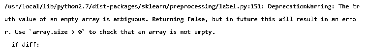

### NLP 对你的职业生涯有什么帮助？

自然语言处理是市场上一个蓬勃发展的领域，几乎每个组织都需要一名 NLP 工程师来帮助他们处理原始数据。因此，当务之急是掌握所需的技能，因为市场上不会缺少工作。

### 结论

在本文中，我们首先介绍了 Python 中的 NLP，然后用 Python 实现了一个用例来展示如何在 Python 中使用 NLP。

### 推荐文章

这是 Python 中 NLP 的指南。在这里，我们讨论了示例、用例以及如何在 Python 中使用 NLP。您也可以浏览我们推荐的其他文章，了解更多信息——

1.  [Python 的用途](https://www.educba.com/uses-of-python/)
2.  [Python vs Scala](https://www.educba.com/python-vs-scala/)
3.  [Python 文件读取线](https://www.educba.com/python-file-readline/)
4.  [Python 中的标记化](https://www.educba.com/tokenization-in-python/)

