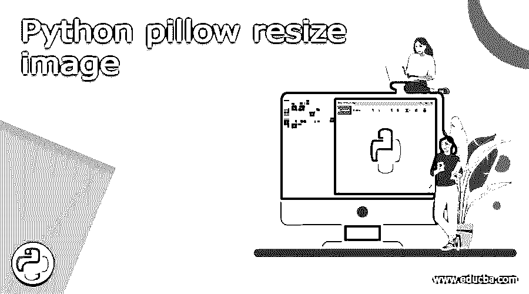
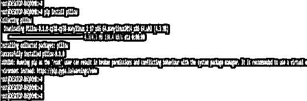
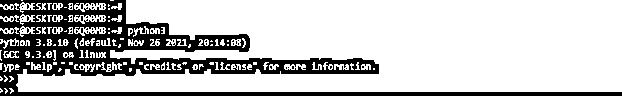
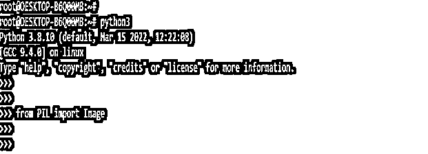
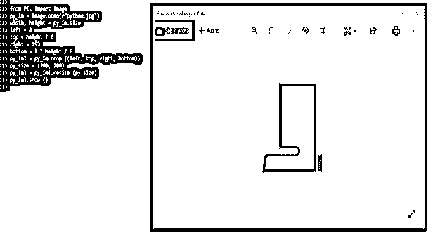
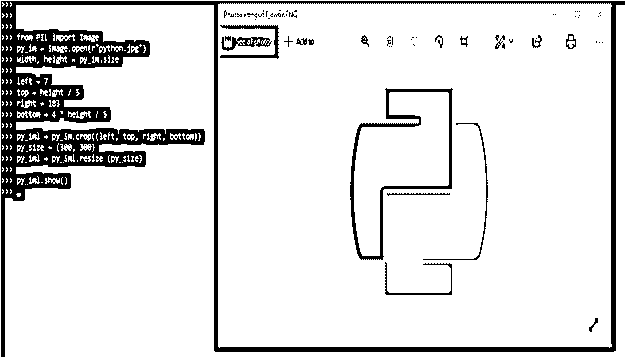
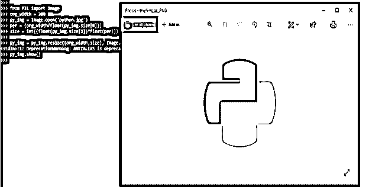
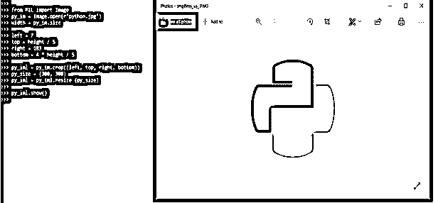

# Python 枕头调整图像大小

> 原文：<https://www.educba.com/python-pillow-resize-image/>




## python 枕头大小调整图像的定义

Python pillow resize image 方法用于在 Python 中改变图像的大小。PIL 代表 Python 图像库，它为 Python 解释器提供了图像编辑功能。图像模块包括一个表示 PIL 图像的类。该模块还包括一些功能，例如从文件中加载图像和创建新图像的功能。Python 枕头调整图像大小在 python 中非常有用和重要。

### python 枕头大小调整图像概述

*   大多数数字图像是具有宽度和高度的二维像素平面。尺寸是枕头库中图像模块的属性。
*   像它的元素一样，这个元组包含图像的宽度和高度。要调整图像的大小，在 pillow 的 image 类中使用 resize，将宽度和高度作为参数传递。
*   下面是 python 枕头大小调整图像的语法如下。

**语法:**

<small>网页开发、编程语言、软件测试&其他</small>

```
Image.resize (size, resample=0)
```

*   图像模块包括一个与 PIL 同名的类。该模块还包括几个工厂函数，例如从文件加载图像和创建新图像的函数。
*   为了调整图像的大小，python 中使用了 resize 方法。该函数不改变原始图像，而是返回图像的尺寸。
*   大小是枕头等级的一个属性。作为元素，这个元组包含图像的宽度和高度。
*   使用 Pillow 的 Image 类 resize 方法，我们可以将图像调整到特定的宽度和高度。对所有可能影响结果的像素执行重采样。
*   Pillow 将提供两种调整图像大小的方法，即调整大小和缩略图。我们可以通过提供特定的尺寸来使用这种方法，我们可以放大和缩小图像。
*   即使长宽比与原始图像不匹配，也要调整其大小。假设我们想要按原始大小的百分比来调整图像的大小。这可以通过使用自定义函数计算元组大小来实现。
*   python-resize-image 的第一个参数是 PIL。两个整数的大小参数元组后跟图像。
*   在调整大小之前，python-image-resize 会检查操作是否可行。如果调整大小不需要增加其中一个尺寸，它被认为是有效的。添加 validate=False 作为参数以避免测试。
*   我们还可以创建一个两步验证过程，然后通过将验证函数附加到调整大小的函数来进行处理。
*   每个 resize 函数(如 resize cover.validate)都有一个 validate 选项，可以使用点运算符访问该选项。

### 如何使用 python 枕头调整图像大小？

*   正如我们所知，在我们的系统中安装 python 包时，python pillow 模块或 PIL 并不是默认提供的。要使用 python pillow resize image，我们需要使用 pip 命令安装 pillow 模块。下面的步骤显示了如何使用 python 枕头调整图像大小如下。
*   第一步，我们使用 pip 命令安装 pillow 模块。我们可以在任何安装了 python 的操作系统中安装 pillow 模块。在下面的例子中，我们在 UNIX 类系统上安装 pillow 模块。

```
pip install pillow
```




*   安装完所有模块后，我们使用 python3 命令打开 python shell。

```
python3
```




*   在这一步登录到 python shell 后，我们检查系统中是否安装了 pillow 包。

```
from PIL import Image
```




*   在下面的例子中，我们首先从 PIL 包中导入图像模块，然后使用 Image.open 方法打开原始图像。然后我们定义图像的宽度和高度。在定义了宽度和高度之后，我们开始定义图像的左、上、右和下参数。然后，我们将图像的新大小定义为(200，200)。

**代码:**

```
from PIL import Image
py_im = Image.open(r"python.jpg")
width, height = py_im.size
left = 8
top = height / 6
right = 153
bottom = 2 * height / 6
py_iml = py_im.crop ((left, top, right, bottom))
py_size = (200, 200)
py_iml = py_iml.resize (py_size)
py_iml.show ()
```




*   以下示例显示了如何通过使用 python pillow 调整图像大小来使用不同的新大小值，如下所示。在下面的例子中，我们将左边的图像参数定义为 7，顶部的图像参数定义为 height/5，右边的图像参数定义为 183，图像的新尺寸也定义为(300，300)。

**代码:**

```
from PIL import Image
py_im = Image.open(r"python.jpg")
width, height = py_im.size
left = 7
top = height / 5
right = 183
bottom = 4 * height / 5
py_iml = py_im.crop((left, top, right, bottom))
py_size = (300, 300)
py_iml = py_iml.resize (py_size)
py_iml.show()
```




### Python pillow 按宽度缩放调整图像大小

*   它只不过是图像宽度的比例。以下示例显示了 python pillow 按宽度缩放图像，如下所示。
*   在下面的例子中，我们可以看到，我们已经声明图像的原始大小为 300，在声明大小后，我们使用 Image.open 方法打开图像。然后，我们将宽度尺寸定义为百分比。在定义了所有的参数之后，我们正在打开调整过大小的图像。

**代码:**

```
from PIL import Image
org_width = 300
py_img = Image.open ('python.jpg')
per = (org_width/float(py_img.size[0]))
size = int((float(py_img.size[1])*float(per)))
py_img = py_img.resize ((org_width,size), Image.ANTIALIAS)
py_img.show()
```




*   在下面的例子中，我们只使用宽度参数来调整图像的大小，如下所示。

**代码:**

```
from PIL import Image
py_im = Image.open (r"python.jpg")
width = py_im.size
left = 7
top = height / 5
right = 183
bottom = 4 * height / 5
py_iml = py_im.crop ((left, top, right, bottom))
py_size = (300, 300)
py_iml = py_iml.resize (py_size)
py_iml.show()
```




### 结论

为了调整图像的大小，python 中使用了 resize 方法。该函数不改变原始图像，而是返回图像的尺寸。PIL 代表 Python 图像库，它为 Python 解释器提供了图像编辑功能。

### 推荐文章

这是一个 Python 枕头大小调整图像的指南。在这里，我们讨论定义，概述，如何使用 python 枕头调整图像大小，以及代码实现和输出的例子。您也可以看看以下文章，了解更多信息–

1.  [Python 3 For 循环](https://www.educba.com/python-3-for-loop/)
2.  [Python 3 打印](https://www.educba.com/python-3-print/)
3.  [Python 3 数学模块](https://www.educba.com/python-3-math-module/)
4.  [Python 连接列表](https://www.educba.com/python-join-list/)


