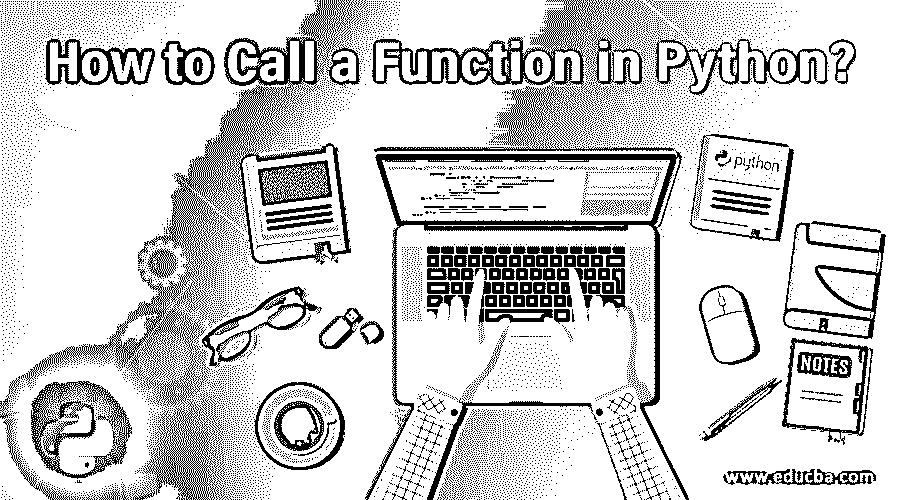
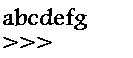
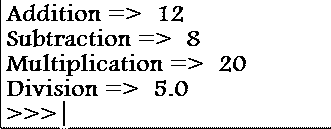
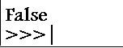
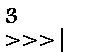

# 如何在 Python 中调用函数？

> 原文：<https://www.educba.com/how-to-call-a-function-in-python/>




## Python 函数介绍

函数是编程语言的基本构件。假设您正在处理一个大项目，并且您可能想要一次又一次地执行相同的操作；在这种情况下，我们创建函数并在函数中编写特定的代码。

现在我们可以任意多次使用这个函数并执行特定的操作。举个例子:在一个电商网站，你想为你购买的一件商品做一次支付；在这种情况下，我们可以在函数中编写支付代码。该功能将在所有采购中反复使用。让我们看看如何在 Python 中调用函数的几个阶段。

<small>网页开发、编程语言、软件测试&其他</small>

### 如何创建函数？

函数有两个部分，第一，定义函数，第二，调用函数。我们手动创建的函数称为用户自定义函数。

无参数的函数声明

**输入:**

`def makePayment():
print("hello")
print("hi")
print("abcdefg")`

**输出:**




这就是我们如何声明一个函数，def 是用于定义的关键字，“makePayment”是函数名，末尾是冒号；现在，您可以在函数中写入多行代码。此函数没有任何参数；向函数传递参数不是强制性的。冒号表示这个函数中有一段代码。

`=> def makePayment(argument1, argument2, ...):`

带参数的函数声明。参数是将在函数下编写的代码中使用的值或数据。

### Python 中的函数是如何工作的？

函数是一段在你不调用它之前不会自动执行的代码。要调用函数，只需写出函数的名字。每当执行一个函数时，都会在内存内部创建一个新的符号表。传递给函数的所有参数都将值存储到一个局部符号表中。参考变量首先查看局部符号表；然后，它试图找到函数中定义的函数，然后，它试图找到全局符号表，最后是内置名称。全局变量不能在函数内部赋值，因为它不能在整个系统中被访问，但是你可以引用它。每当在另一个函数内部调用一个新函数时，就会创建一个新的符号表。

每当在函数中定义一个只能在函数内部访问的变量时，就不能在函数外部访问该变量。如果变量是在外部定义的，那么函数可以在任何地方使用，也可以用在许多函数中。

`=> makePayment()`

调用不带参数的函数。

`=> makePayment(arg1, arg2, ...)`

使用参数调用函数。

如果在定义函数时传递了实参，那么在调用函数时必须传递形参；否则，将会导致错误。定义和调用时的参数数量应该相同。如果您执行任何计算或将业务登录写入函数，您还必须从函数返回最终值。

我们还可以创建一个带有参数的函数，但带有可选参数，并为这些参数定义默认值。

`def exampleFunction(a, b=1, c=”abcd”): print(c)
print(a+b)`

现在我们可以用两种方式调用这个函数。

`=> exampleFunction(5)`

在这种情况下，我们为参数“a”传递一个值，“b”传递一个值，“c”将采用默认参数。

`=> exampleFunction(1,2,”efgh”)`

在本例中，我们传递了三个输入参数。

用函数写的逻辑容易理解，容易调试；你知道哪个函数没有正常工作或者产生了错误，所以你不需要遍历整个页面的代码；您可以调试这些函数。

**变长参数:**假设我们有一个函数，但是我们不知道在调用那个函数的时候需要多少个参数；每次都可能改变。在这种情况下，我们可以定义变长参数函数。

`def exampleFunction(*args): for value in args:
print(value) exampleFunction(a,b,c)`

这个函数将接受 n 个参数，就像我们在参数中有*一样，它将打印所有传入的参数。

### Python 函数的示例

下面是一些例子:

#### 示例#1

函数打印消息。

**代码:**

```
=> def printMessage():
        print(“Hello”)
        print(“How are you”)
printMessage() 
```

**输出:**


这是一个没有任何参数的基本用户定义函数。所以在调用时，我们没有传递任何参数。

#### 实施例 2

让我们创建一个可以执行基本计算的函数。

**代码:**

```
=> ​def peformCalcuation(a,b):
       print(‘Addition => ’, a+b)
       print(‘Subtraction => ’, a-b)
       print(Multiplication => ’, a*b)
       print(Division => ’, a/b)
performCalculation(10,2) 
```

**输出:**




在这个例子中，我们传递了两个参数 a 和 b，并打印了它们的结果。所以在调用这个函数时，我们必须传递参数的确切数目。

#### 实施例 3

让我们创建一个函数来寻找奇数或偶数，并返回最终结果。

**代码:**

```
=> ​def oddEven(a):
      if a%2 == 0:
             return True
else:
             return False
result = oddEven(15)
print(result) 
```

这里我们已经创建了函数，但是这个函数将打印任何结果。我们只是返回结果。所以现在，在调用函数时，我们必须将函数的结果捕获到另一个变量中。

现在所需的将被打印。

**输出:**




我们在 python 中还有一个匿名函数，叫做 Lambda 函数。它们是一个单行函数，不是使用“def”关键字定义的，它们只返回 expression。我们利用“lambda”关键字来定义这些函数。

这类函数没有任何特定的名字，但是我们可以把这个函数赋给任何变量。

#### 实施例 4

**代码:**

```
lambda args: expression
sum = (lambda a,b:a+b)
print(sum(1,2)) 
```

**输出:**




当我们需要执行单行操作时，这些函数非常有用。

### 结论——如何在 Python 中调用函数

利用函数对应用程序进行编程可以创建健壮的应用程序，并且更容易管理代码和代码的可重用性。尽量限制函数的长度，如果你的函数越来越大，那么就把它们分成更小的函数。如果要向函数传递任何值，请始终保留默认值以防止出错。

### 推荐文章

这是一个如何在 Python 中调用函数的指南。在这里，我们还将讨论 python 中函数的介绍和工作原理，以及不同的例子和代码实现。您也可以看看以下文章，了解更多信息–

1.  [Python 并发](https://www.educba.com/python-concurrency/)
2.  [Python argparse](https://www.educba.com/python-argparse/)
3.  [蟒蛇熊猫加入](https://www.educba.com/python-pandas-join/)
4.  [Python eval()](https://www.educba.com/python-eval/)


