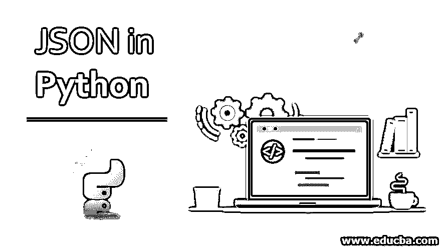
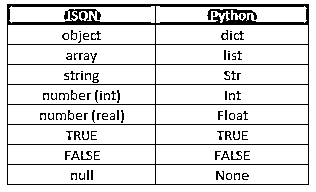
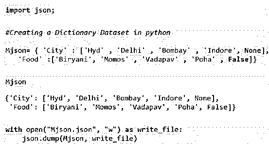
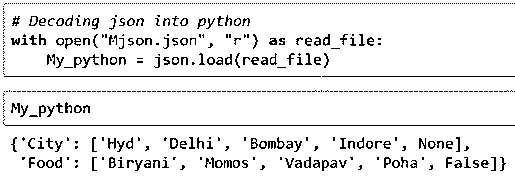
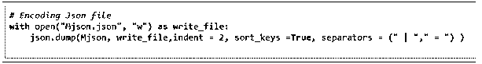
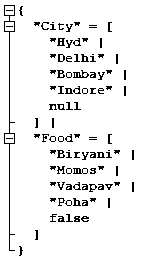

# Python 中的 JSON

> 原文：<https://www.educba.com/json-in-python/>

## Python 中的 JSON 简介

Python 中的 JSON 是一种存储数据的格式。它被称为 JavaScript 对象符号。与 XML 或 HTML 格式相比，它是一种轻量级的数据帧。它很容易理解，看起来和 Python 中的字典一样，只是有一些小的不同，比如(布尔符号和空符号)。这是用于存储数据/提取的标准数据格式[

来自 API 和配置文件的数据。这种格式是独立于语言的，也适用于 python。在 Python 的例子中，它有一个单独的库，叫做 [JavaScript 对象符号](https://www.educba.com/javascript-objects/)。

<small>网页开发、编程语言、软件测试&其他</small>

### 它是如何工作的？

我们知道，Jason 基本上是以文件格式来存储数据的；现在，我们可以使用现有文件或创建一个新的 python 数据集，并按格式分配它。每个操作的语法将在下面讨论。

**1。在 Python 中导入 JSON 库**

Python 使用 JavaScript 对象符号库。要安装该库，语法如下。

**语法:**

`Pip install jsonlib ;
pip install demjson`

一旦有了 python 中的库，编写下面的命令将其导入代码。

`Import json;`

**2。获取或加载 JSON 格式数据集**

要加载 JSON 格式的数据，使用下面给出的语法。

**语法:**

`My_json = json.load( Mason )`

在括号中，写下您想要加载的文件的名称。

**3。对其进行操作**

JSON 格式就像 python 的字典，只是有一些小的不同。我们可以执行一些可以在 python 字典上执行的操作，如查看数据集、使用循环、更改值、聚合不同的键以创建新键等。

**4。从 Python 返回 JSON 格式**

当我们将 JSON 文件加载到 python 中时，它被转换成 python 可读的格式，并且正在被处理。一旦文件准备好了，它再次被转换成原来的 JSON 格式。

为此，我们使用下面给出的语法:

**语法:**

`My_json_output = json.dump( Mjson )`

在括号中，写下您想要转储的文件名。

### 如何将 JSON 转换成 Python，Python 转换成 JSON？

这是本文最重要的部分。为了将 JSON 文档转换成 [python，我们执行反序列化](https://www.educba.com/deserialization-in-c-sharp/)或解码。为了将 python 文档转换成 json 字符串，我们执行序列化或编码。为了执行这两个操作，我们需要一个名为 demjson 的库。

序列化和反序列化提供了一个对格式进行编码和解码的转换器。下表显示了 python 和 JSON 之间的关系。

这里可以看到一些我们可以明确识别的区别:JSON 中的数字被当作 int 和 float，JSON 中的 null 在 python 中被当作 None，JSON 中的对象在 Python 中是字典，等等。我们将在示例部分详细了解这种转换。

### 例子

以下是一些例子:

#### 编码/序列化为 JSON 文件

任务是[创建一个标准的 python 字典](https://www.educba.com/python-dictionary-methods/)，然后将其编码成一个文件。这里我们将从 python 中取出 None 和 false 类型，并观察它们在文件中是如何被改变的。

**代码:**

`import json
#Creating a Dictionary Dataset in python
Mjson= { 'City' : ['Hyd' , 'Delhi' , 'Bombay' , 'Indore', None],
'Food' :['Biryani', 'Momos' , 'Vadapav' , 'Poha' , False]}
# Encoding to json file.
with open("Mjson.json", "w") as write_file:
json.dump(Mjson, write_file)`

在 python 代码目录中执行代码检查之后，Mjson.json 文件应该已经创建好了。

**输出:**

观察 None 变为 null，false 变为 False。

#### 解码/反序列化为 Python

我们刚刚创建的 Mjson 文件，我们将再次解码为 python。我们将再次观察前面的观察。

**代码:**

`import json;
# Decoding json into python
Import json
with open("Mjson.json", "r") as read_file:
My_python = json.load(read_file)
My_python`

上面的输出将是我们的 python 字典。再次观察 null 被转换为 None。

**输出:**

#### 使用 Python 编码器格式化 JSON 字符串

在对 JSON 进行编码时，我们可以使用一些特定的格式来保持数据的清晰性和格式。这里我们将使用分隔符、缩进和排序键。由于我们已经有了一个 JSON 文件，我们将修改现有的文件。

**代码:**

`with open("Mjson.json", "w") as write_file:
json.dump(Mjson, write_file, indent= 4, sort_keys =True, separators = (" | " , " = " ) )`

**输出:**

如何要求 JSON 格式纯粹是编码器的选择。

### 优势

让我们来看看下面详细给出的一些优势:

*   JSON 是一种从服务器到客户端传输数据的格式，反之亦然。 [HTML 和 XML](https://www.educba.com/html-vs-xml/) 提供的是静态数据，而我们需要的大部分数据是动态的；在这种情况下，它会有所帮助。
*   当异步请求通过浏览器或应用程序发送到服务器时，服务器接收请求并返回数据(无论什么格式都可以接受，客户端需要数据 oIfow，如果格式是 Html 格式，它将给出设计以及数据，但客户端已经设计好了；它只需要数据。
*   在服务器中，数据将以具有属性的对象的形式出现，使得数据成为复杂的数据类型对象。对此，我们有 JavaScript 对象符号。JavaScript 对象符号使得处理包含多个类和对象的复杂数据变得简单。
*   在 DS 和 ML 研究中最需要使用 JSON 类型；python 为此提供了解决方案。服务器序列化对象，客户端反序列化并读取它们。

### 结论–Python 中的 JSON

javaScript 对象符号是一种通常由不同的 Java 脚本和 API 产生的格式。使用 python，人们可以交流 JSON 文件。在 python 中，反序列化或解码用于将 json 对象转换为 python 字典。序列化或编码用于将 python 文档转换成 json 对象。本文涵盖了这两种格式。

### 推荐文章

这是一个关于 Python 中 JSON 的指南。在这里，我们讨论了它在 Python 中是如何工作的，以及各种例子和它的优点。你也可以看看下面的文章来了解更多-

1.  [JSON 对象](https://www.educba.com/what-is-json/)
2.  [jQuery serialize()方法](https://www.educba.com/jquery-serialize/)
3.  [JSON vs. AJAX](https://www.educba.com/json-vs-ajax/)
4.  [Java 中的 JSON](https://www.educba.com/json-in-java/)

