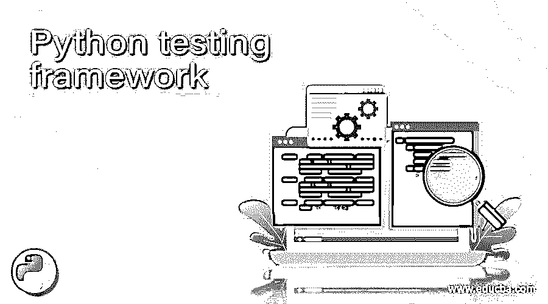

# Python 测试框架

> 原文：<https://www.educba.com/python-testing-framework/>

## Python 测试框架简介

Python 于 1991 年首次发布，为这项工作提供了一种简单、清晰、人类可读、优雅且不太拥挤的编程语言。在测试中，这样的品质是必须的，特别是如果你的团队中有不一定具有编程技能的手动测试人员，他们现在正在向自动化过渡，并且可以很容易地使用 Python 的快速训练曲线。Python 为什么在测试自动化领域越来越普遍，为什么它被认为是最好的测试自动化选择之一，有很多原因。对于初学者来说，Python 的禅既是面向对象的又是功能性的，它有一个丰富的包库、一个巨大的世界范围的社区等等。在这个主题中，我们将学习 Python 测试框架。

### Python 测试的框架

让我们来看看 Python 测试框架

<small>网页开发、编程语言、软件测试&其他</small>

#### 1.测试项目

TestProject 是一个 100%免费的全云报告自动化平台。借助 Python 开源 SDK，还可以使用 TestProject 为移动、web 或一般用途轻松构建测试自动化。它支持 Python 和 Unittest 框架，版本 3.6 或更高。TestProject 包含运行单一平台代理所需的所有依赖项。包含移动、web 和一般测试自动化所需的所有第三方库的单一代理可执行文件。代理将进行一次测试，因此您可以使用 Docker 代理进行并行测试。

#### 2\. PyUnit

PyUnit (Unittest)是一个受 Python 启发的 JUnit 单元测试应用程序。它是来自 Python 软件包的默认 Python 测试框架，也是大多数开发公司开始测试的框架。不需要安装任何额外的模块，因为它是标准 Python 库的一部分——它附带了 Python 工具箱。通常测试代码的目的是不确定的，因为它支持抽象。大量样板代码是合适的。

#### 3.机器人框架(RF)

机器人平台(RF)是一个用于开源测试自动化、测试开发(ATDD)验收和机器人流程自动化(RPA)的框架。它的中心在 Python，但是 Jython (Java Python 实现)和 IronPython 也可以实现(Python for。NET 框架)。您必须拥有 Python 2 . 7 . 14 或更高版本才能执行它。基于关键字测试(KDT ),还可以使用人类可读的关键字轻松构建测试用例，并行测试不支持，但可以通过使用 Selenium Grid 或 Pabot 来完成。

#### 4.Pytest

Pytest 是一个开源测试框架，可以用在最流行的 Python 测试框架中。此外，Pytest 支持单元测试、功能测试和 API 测试。您需要 Python 3.5 或更高版本才能运行它。可以用插件扩展，包括 pytest-Django、pytest-cov 和 pytest-bdd。兼容性不是 Pytest 的秘密，因为虽然您可以很容易地用 Pytest 编写测试用例，但由于使用了 Pytest 的特殊例程，您将无法在任何其他测试系统中使用它们。

#### 5.鼻子 2

Nose2 是 Nose 的继承者，主要是 PyUnit (Unittest ),但基于插件。Nose2 通过使用许多插件扩展了 PyUnit，这些插件提供了对测试、参数、装饰器、测试发现、夹具等的支持。由于 PyUnit (Unittest)框架是从 Python 库盒子中扩展出来的，所以入门很简单。缺乏详细的文档可能会阻止您开始。

#### 6.莴苣框架

它是一个易于使用的行为驱动自动化工具，在 BDD 测试中非常流行。巨蟒和黄瓜是基于。它简化了 BDD 方法，并使之变得有趣。需要 Python 包管理器或 Pip、Python 或任何 IDE，如 Pycharm 或其他。Python 2.7.14 或以上任何版本。

#### 7.茉莉框架

Jasmine 是一个 BDD 框架。Jasmine 是一个 BDD 框架。它支持 Python、Ruby 和 JavaScript 的测试自动化。服务器-客户端单元测试是混合的。为了运行 Jasmine，您必须运行 karma 测试。它支持异步和没有 DOM 的异步测试用例。比技术信息更强调具有商业意义的应用。

#### 8.仪表框架

Gauge 是由同一个 Selenium 团队打造的完美仪器。由于 Gauge 是一个开源系统，因此有几种不同的使用方法。如果您想要在 CI/CD 管道中整合持续测试，Gauge 是最佳选择之一。多亏了它们的跨浏览器测试特性，Gauge 现在获得了很大的推动力。

### 推荐文章

这是一个 Python 测试框架指南。在这里，我们讨论 Python 对于自动化测试有多棒，但是测试 Python 有多容易。您也可以看看以下文章，了解更多信息–

1.  [Python 断言错误](https://www.educba.com/python-assertionerror/)
2.  [Python IOError](https://www.educba.com/python-ioerror/)
3.  [Python 流](https://www.educba.com/python-stream/)
4.  [Python 结束于](https://www.educba.com/python-endswith/)

