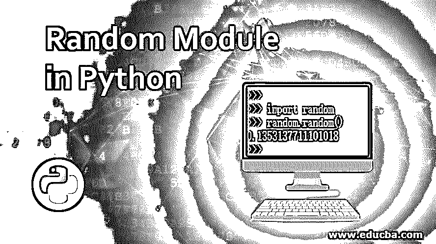
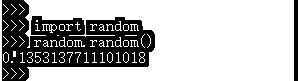
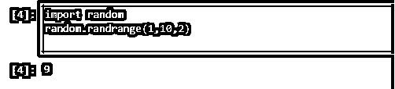
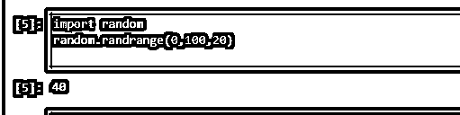
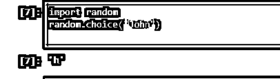
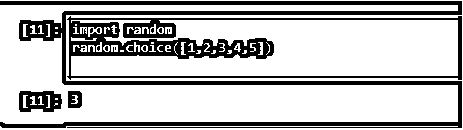
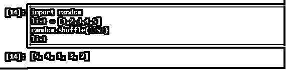
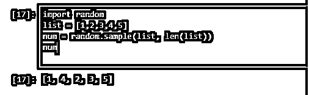
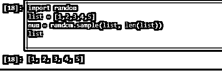
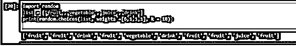

# Python 中的随机模块

> 原文：<https://www.educba.com/random-module-in-python/>

## Python 随机模块介绍

Python 随机模块是 [python 的内置模块，用于在 python 中生成](https://www.educba.com/python-pep8/)随机数。模块是代码或类的集合，或者是 python 中预定义的一组规则。我们只需要使用导入关键字就可以使用所有这些类或代码。一旦我们导入了一个随机模块，我们就可以访问其中定义的所有函数或类。模块也称为库。

随机模块中有许多内置函数可用。我们可以根据自己的需求和想要生成的随机数类型来使用这些函数。

<small>网页开发、编程语言、软件测试&其他</small>

**语法:**

`random.function_name(attr*)`

*   **function_name** **:模块中可用的**功能
*   **attr** *** :** 该参数是函数所取的，在一些随机函数中可能是可选的。

### Python 中随机模块的示例

让我们讨论一些例子:

#### 示例#1

`import random
random.random()`
**输出:

** 

这是一个非常基本的随机模块函数的例子。我们用过随机函数，函数里没有参数。Random()生成 0.0 到 1.0 之间的随机浮点数。这个函数不带任何参数。

#### 实施例 2

`import random
random.randint(1,5)`

**输出:**
T3】

在上面的例子中，我们使用了 randint 函数。这个函数有两个参数，起始值和结束值。参数应为整数类型；如果我们传递浮点数，那么这个函数将返回一个错误。在上面的函数中，我们将 1 作为起始数，将 5 作为结束数，因此该函数将返回一个介于 1 和 5 之间的随机数。两个参数可以是相同的数字，但第一个数字应该小于第二个数字；否则，它将生成一个错误。

#### 实施例 3

`import random
random.randrange(1,10,2)`

**输出:**

在上面的程序中，我们使用了 randrange 函数。如果我们打破这个函数 rand + range。众所周知，range 函数返回依赖于起始值、结束值和步长值的整数值列表。这里 1 是起点，10 是终点，2 是步长值。在内部，将执行一个范围函数，生成 1、3、5、7、9 等数字列表。现在，random 将只从这个列表中选择任意随机值。

#### 实施例 4

`import random
random.randrange(0,100,20)`

**输出:**

在本例中，我们将开始指定为 0，结束指定为 100，步骤指定为 20。因此，randrange 函数将从这些开始、结束和步进的范围中随机选取。

#### 实施例 5

`import random
random.choice("John")`

**输出:

** 

在上面的程序中，我们使用了随机模块的选择方法。这个函数只接受一个参数。这个参数也可以是字符串、列表或字典，它将从这个参数中返回一个随机值。我们在方法中传递了一个字符串，它将从字符串中随机抽取一个字符，并将其作为输出返回。

#### 实施例 6

`import random
random.choice([1,2,3,4,5])`

**输出:**

在上面的程序中，我们在 choice 方法中传递了一个列表，输出将是这些列表值中的一个值。

#### 实施例 7

`import random
list = [1,2,3,4,5] random.shuffle(list)
list`

**输出:**

在上面的程序中，我们使用了随机模块的 shuffle 方法。这个方法对我们传递给它的序列进行洗牌。它有两个参数，其中一个参数是可选的。这种方法的缺点是我们丢失了序列或列表的原始顺序。

#### **例#8**

`import random
list = [1,2,3,4,5] num=random sample(list,len(list))
num`

**输出:**

`import random
list = [1,2,3,4,5] num = random.sample(list,len(list))
list`

**输出:**

我们在上面的程序中使用了随机抽样的方法。这个方法有两个参数:第一个参数是一个序列，第二个参数是我们希望返回输出的序列的长度。第二个参数也是强制的；它可以等于列表长度或小于列表长度，但不能大于列表长度。此方法保留原始序列并创建一个新序列。我们可以将随机序列存储到另一个变量中，同时保持原始序列不变。

#### 实施例 9

`random.choices(population, weights=None, *,cum_weights=None, k=1)
import random
list = [fruit","vegetable","juice","drink] print random.choices(list, weights = None, k = 10))`

**输出:**

这个方法有 3 个参数；所有参数都是必需的。第一个参数是我们的序列，它可能是一个值范围或列表。第二个参数是需要累加的值的权重，第三个参数是要返回的项数。

`print(random.choices="auto">(list, weights =[6,1,1,1], k = 10))`

**输出:**

如果重量被视为无，则随机生成项目。如果我们传递了权重，那么权重项应该与列表项的计数相匹配。

### 结论

Python 随机模块是一个非常有用的模块；它提供了如此多的内置函数，可用于生成随机列表，主要用于随机生成安全令牌和列表范围。

### 推荐文章

这是一个关于 python 中随机模块的指南。在这里，我们讨论介绍以及不同的例子和它的代码实现。您也可以看看以下文章，了解更多信息–

1.  [Python 拆分字符串](https://www.educba.com/python-split-string/)
2.  [Python 压缩函数](https://www.educba.com/python-zip-function/)
3.  [Python 返回值](https://www.educba.com/python-return-value/)
4.  [Python 比较字符串](https://www.educba.com/python-compare-strings/)

