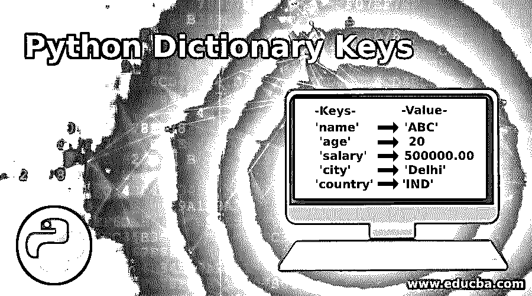
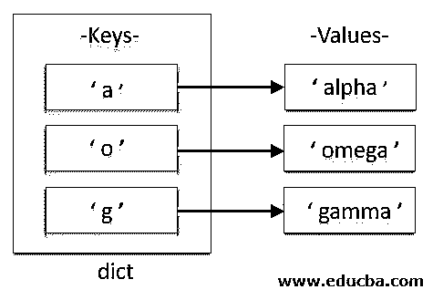
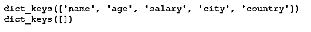
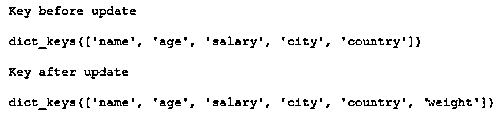
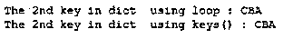

# Python 字典键

> 原文：<https://www.educba.com/python-dictionary-keys/>




## Python 字典键介绍

与 Python 字典相关联的 dictionary.keys()以其返回的视图对象的形式显示所有键的列表。无论何时字典发生变化，视图对象都会显示这些变化。Python 的 dictionary.keys()不需要任何变量或参数来传递这个函数。keys()函数返回一个视图对象，该对象显示与字典相关的所有键的列表。

**语法:**

<small>网页开发、编程语言、软件测试&其他</small>

Python 的 keys()函数的语法如下所述:

```
dictionary.keys()
```

*   keys()是在字典下声明的属性或函数
*   如上所述，它在被调用时不需要任何参数。

### Python 字典键是如何工作的？

Pythons 内置的高效表结构(包含键或哈希值)被称为 dict。这个字典的内容被写成一系列的键和值，如键:值对被括在花括号{}中。空字典只是一对空的花括号。

假设我们正在创建一个 a，o，g 的字典，其值为 alpha，beta & gamma，名为 dict，那么在这种情况下，可以使用下面的语句检索关键字:

```
dict.keys()
```

输出将是:

dict_keys(['a '，' o '，' g'])

关键字([])




### 实现 Python 字典键的示例

以下是 Python 字典键的示例:

#### 示例#1

**代码:**

```
## Python program to understand the usage of dictionary keys() function
per = { 'name' : 'A' , 'age' : 20 , 'salary' : 500000.00 , 'city' : 'Delhi' , 'country' : 'IND' }
print(per.keys())
emp_dict = {}
print(emp_dict.keys())
```

**输出:**




#### 实施例 2

**代码:**

```
## Python program to understand the usage of dictionary keys() function, after updating the dictionary
per = { 'name' : 'A' , 'age' : 20 , 'salary' : 500000.00 , 'city' : 'Delhi' , 'country' : 'IND' }
print('Key before update \n')
print(per.keys())
print('\nKey after update \n')
per["weight"] = 70
print(per.keys())
```

**输出:**


这里，我们向字典中添加了一个 key:value 对，并使用 dict.keys()函数验证了视图:

使用下面的语句声明字典。

```
per = { 'name' : 'A' , 'age' : 20 , 'salary' : 500000.00 , 'city' : 'Delhi' , 'country' : 'IND' }
```

在更新 key:value 对之前，使用 keys()函数打印该字典的键。

```
print(per.keys())
```

使用下面的语句在名为“per”的字典中插入一个新的键:值对。

```
per["Weight"] = 70
```

在更新 key:value 对之后，使用 keys()函数打印该字典的键。

```
print(per.keys())
```

#### 实施例 3

还有另一种方法可以使用另一种语法更新字典，并在同一语法上使用 dictionary.keys()函数:

**代码:**

```
## Python program to understand the usage of dictionary keys() function, after updating the dictionary
per = { 'name' : 'A' , 'age' : 20 , 'salary' : 500000.00 , 'city' : 'Delhi' , 'country' : 'IND'  }
print('Key before update \n')
print(per.keys())
print('\nKey after update \n')
per.update({'weight' : 70})
print(per.keys())
```

**输出:**




#### 实施例 4

Keys()可以用来访问类似字典的元素——就像我们在列表和元组中迭代一样。让我们再举一个例子来实际讨论一下如何使用 dictionary.keys()。

**代码:**

```
## Practical usage of the keys() function to iterate through dictionary object
# initializing dictionary
dict = { "EDU" : 7, "CBA" : 1, ".COM" : 2 }
# If we try to access the 2nd element using naive method
# By utilizing loops
k = 0
for j in dict:
    if(k==1):
        print ('The 2nd key in dict using loop : ' + j)
k = k + 1
# If we try to access the 2nd element using keys()
print ('The 2nd key in dict using keys() : ' + dict.keys()[1])
```

**输出:**




这里我们使用了两种方法来遍历字典:

*   第一种方法是使用循环的本地方法，其中我们使用了两个变量 j 和 k 来迭代循环
*   变量 j 用于保存字典对象，同样用于逐个对象地遍历字典对象
*   其中，as k == 1 用于从字典中取出第二个键，否则跳过 print 语句。
*   而在第二种方法中，我们直接利用 keys()函数从字典 dict 中打印出第二个键。

### 结论

*   dict.keys()用于显示与 Python 字典相关联的键。它确实显示了与该特定字典相关联的所有键。
*   Keys()函数不带任何参数，既不是必需的也不是可选的。
*   这个字典的内容被写成一系列的键和值，即一个用花括号{}括起来的键:值对
*   keys()函数返回一个视图对象，该对象显示与字典相关的所有键的列表。
*   对于空字典，不返回任何键。原因是它没有任何元素。

### 推荐文章

这是一个 Python 字典键的指南。在这里，我们讨论 Python 字典键及其示例和代码实现的简要概述。您也可以浏览我们推荐的其他文章，了解更多信息——

1.  [Python 设置函数](https://www.educba.com/python-set-function/)
2.  [Python 压缩函数](https://www.educba.com/python-zip-function/)
3.  [Python 字符串操作](https://www.educba.com/python-string-operations/)
4.  [Python 逆向列表](https://www.educba.com/python-reverse-list/)


