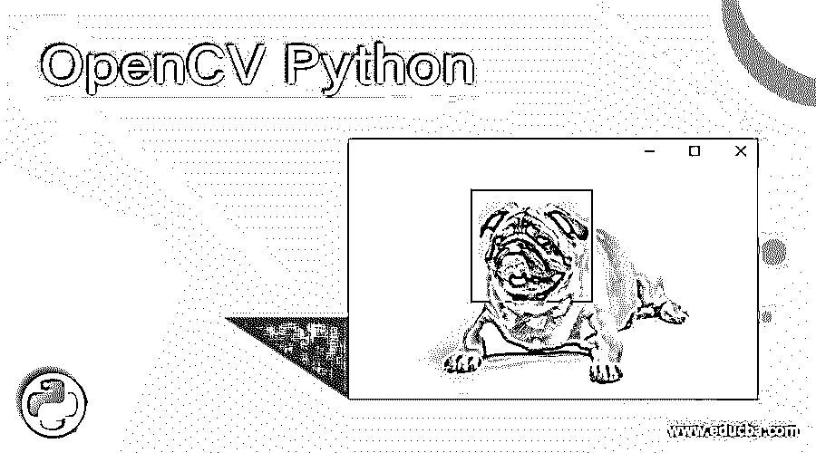

# OpenCV Python

> 原文：<https://www.educba.com/opencv-python/>

## OpenCV Python 简介

OpenCV 的 Python 应用编程接口叫做 OpenCV Python，集合了 Guido Van Rossum 开创的 OpenCv C++应用编程接口和 Python 编程语言的所有优秀品质，Python 编程语言可以很容易地用 C 或 C++编程语言进行扩展。它支持创建可以用作 Python 模块的 Python 包装器，这个围绕 C 或 C++实现创建的 Python 包装器演示了 OpenCV 的工作原理，在 NumPy 的支持下，围绕 C 或 C++的原始实现创建 Python 包装器变得更加容易。

### OpenCV Python 的使用

*   Python 编程语言与像 [C 和 C++](https://www.educba.com/c-vs-c-plus-plus/) 这样的编程语言相比要慢一些。
*   但是 Python 编程语言可以很容易地用 C 或 C++编程语言进行扩展。
*   使用 C 或 C++编程语言对 Python 编程语言进行扩展，可以创建 Python 包装器，这些包装器可以用作 Python 模块。
*   可以用作 Python 模块的 Python 包装器的创建使得它与原始的 C 或 C++实现一样快，并且用 Python 编码非常容易。
*   NumPy 的支持使得 OpenCV 的工作更加容易。

### 需要 OpenCV Python

*   各种各样的编程语言，如 Java、Python、C++等。OpenCV 支持。
*   OpenCV 可在多种平台上使用，如 Linux、Windows、OS X、iOS、Android 等。
*   很多算法涉及到机器学习，计算机视觉等。OpenCV 支持。
*   OpenCV 对趋势技术的支持日益扩大。
*   OpenCV 是免费的开源软件，我们所有人都可以为 OpenCV 的开发做出贡献。
*   OpenCV 对 RAM 的使用真的少了。
*   它是可移植的，因为它可以在所有能运行 C 或 C++程序的设备上运行。
*   Python 编程语言可以很容易地用 C 或 C++编程语言进行扩展。
*   使用 C 或 C++编程语言对 Python 编程语言进行扩展，可以创建 Python 包装器，这些包装器可以用作 Python 模块。
*   可以用作 Python 模块的 Python 包装器的创建使得它与原始的 C 或 C++实现一样快，并且用 Python 编码非常容易。
*   NumPy 的支持使得 OpenCV 的工作更加容易。
*   可以使用 NumPy 执行的所有操作都可以与 OpenCV 结合使用。

### OpenCV Python 的优势

*   各种各样的编程语言，如 Java、Python、C++等。OpenCV 支持。
*   OpenCV 可在多种平台上使用，如 Linux、Windows、OS X、iOS、Android 等。
*   很多算法涉及到机器学习，计算机视觉等。OpenCV 支持。
*   OpenCV 对趋势技术的支持日益扩大。
*   OpenCV 是免费的开源软件，我们所有人都可以为 OpenCV 的开发做出贡献。
*   OpenCV 对 RAM 的使用真的少了。
*   它是可移植的，因为它可以在所有能运行 C 或 C++程序的设备上运行。
*   Python 编程语言可以很容易地用 C 或 C++编程语言进行扩展。
*   使用 C 或 C++编程语言对 Python 编程语言进行扩展，可以创建 Python 包装器，这些包装器可以用作 Python 模块。
*   可以用作 Python 模块的 Python 包装器的创建使得它与原始的 C 或 C++实现一样快，并且用 Python 编码非常容易。
*   NumPy 的支持使得 OpenCV 的工作更加容易。
*   可以使用 NumPy 执行的所有操作都可以与 OpenCV 结合使用。

### OpenCV Python 的缺点

*   如果要比较 OpenCV 和 MATLAB，MATLAB 要好用得多。
*   OpenCV Python 有自己的库，称为 Flann 库，当我们试图将 OpenCV 库与点云库一起使用时，会出现冲突问题。

### 应用程序

*   OpenCV 和 Python 可以在几个方面应用于处理图像和视频，以提取有用的信息。
*   一些常见的应用领域是图像处理、人脸识别、人脸检测、对象检测等。
*   在图像处理领域，可以使用 OpenCV Python 来读取、写入、显示或处理图像。
*   在图像处理领域，通过改变给定图像的颜色、形状或从给定图像中提取一些有用的信息，可以从给定图像中创建新图像。
*   在人脸检测领域，可以使用 OpenCV Python 通过网络摄像头从直播视频中检测人脸。
*   在人脸检测领域，可以使用 OpenCV 从本地存储的图像或视频中检测人脸。
*   人脸检测通过在人脸周围绘制包围盒，然后使用机器学习算法训练模型，可以在人脸识别领域中识别人脸。
*   当 OpenCV 与 YOLO 结合时，可以使用对象检测中的对象检测算法从图像和视频中检测对象，这些对象可以是静态的或运动的。

### 职业道路

*   OpenCV Python 的未来范围在商业和政府组织中都是巨大的。
*   交通领域对 OpenCV Python 开发者的需求，用于开发自动驾驶辅助系统中的自动驾驶、交通标志检测、行人检测、驾驶员疲劳检测等。，是巨大的。
*   医学成像领域对 OpenCV Python 开发者的需求，用于分析显微图像、心血管图像、乳房 x 线照相术等。，是巨大的。
*   制造业领域对 OpenCV Python 开发者开发旋转不变检测器的需求是巨大的。
*   公共部门和行人检测、未来事件预测等安全领域对 OpenCV Python 开发人员的需求。，是巨大的。

### 推荐文章

这是一个 OpenCV Python 的指南。这里我们通过定义、工作、必要性、优点、缺点、应用、未来范围等讨论了 OpenCV Python 的概念。您也可以阅读以下文章，了解更多信息——

<small>网页开发、编程语言、软件测试&其他</small>

1.  [Python wait()](https://www.educba.com/python-wait/)
2.  [Python 转储](https://www.educba.com/python-dump/)
3.  [Python 缓冲器](https://www.educba.com/python-bufferedreader/)
4.  [Python 异步](https://www.educba.com/python-async/)

