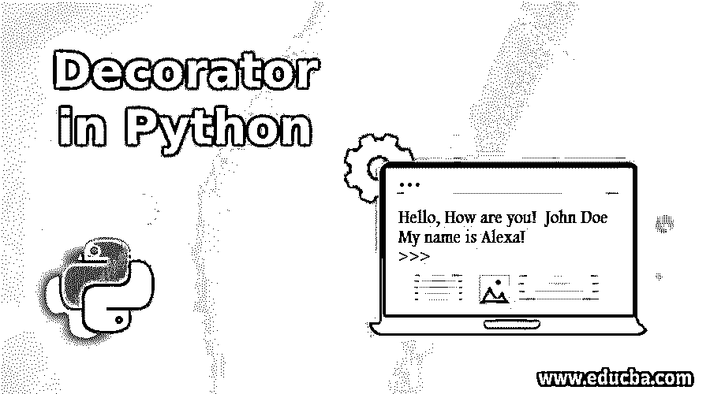
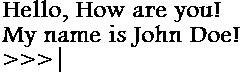
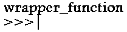
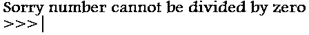
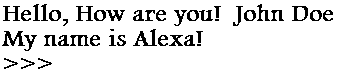

# Python 中的装饰器

> 原文：<https://www.educba.com/decorator-in-python/>




## Python 中的装饰器简介

Python decorators 是 Python 中非常有用的工具，用于增强函数和类的功能和行为。如果我们想修改现有函数的行为，而不修改原始函数，那么我们可以使用 decorators 来改变它的行为，我们也可以包装另一个函数。该函数在装饰器中用作参数，然后我们可以使用包装器函数调用它，它返回包装器函数作为结果。所以我们在不修改原始函数的情况下修改或增强了函数的行为。

我们使用@符号来表示 decorator 被定义，python 将在调用原始函数之前首先调用 decorator。Decorators 致力于四个概念:

<small>网页开发、编程语言、软件测试&其他</small>

*   嵌套函数:这意味着我们可以将一个函数放在另一个函数中，依此类推。
*   Python 函数能够返回另一个函数作为输出。
*   Python 函数只不过是对另一个内存位置的引用。
*   Python 函数也可以用作函数的输入参数。

**语法:**

```
def decorator_name(function_name):
     def wrapper_function():
          ....
     return wrapper_function
     @decorator_name
     def function_name(): 
```

### Python 中装饰器的例子

以下是 python 中装饰器的示例:

#### 示例#1

**代码:**

```
def decorator(func):
    def wrapper_function():
        print("Hello, How are you!")
        func()
    return wrapper_function
@decorator
def printMessage():
    print("My name is John Doe!")
printMessage() 
```

**输出:**




在上面的程序中，我们定义了一个打印消息的函数 printMessage。如果我们想在这条消息之前添加另一条消息，但又不想对原来的函数做任何修改，我们就必须定义装饰函数。

我们定义了一个名为 decorator 的装饰函数，将函数作为输入参数。现在我们还定义了一个包装器函数，它将打印我们想要的消息，然后它将调用我们的原始函数。我们已经编写了消息，然后返回了包装函数。现在我们必须使用@在原始函数之前调用装饰函数。当 python 读取@ symbol 时，它首先调用 decorator 函数，然后调用原始函数。你可以注意到我们正在返回不带括号的 wrapper _ function 这意味着我们只返回内存引用。

`print(printMessage.__name__)`

**输出:**




现在我们要检查正在执行的函数的名称。它将输出为“wrapper_function”。装饰器从不显示原始函数的信息，如函数名、参数列表和文档字符串。

#### 示例 2——装饰器使用参数

**代码:**

```
def decorator(func):
    def wrapper_function(x,y):
        if(y==0):
            return "Sorry number cannot be divided by zero"
        return func(x,y)
        return wrapper_function
@decorator
def divideNumber(x,y):
    return x/y;
print(divideNumber(6,0)) 
```

**输出:**




在上面的程序中，我们在包装函数中传递了两个参数 x 和 y，我们正在对它们进行除法运算。我们正在检查 y 的值是否为 0。如果值为 0，那么我们正在返回自定义消息，如果值不为零，那么 If 条件将被忽略，操作将在原始函数中执行，没有任何错误。所以我们可以说我们正在使用装饰器来捕捉错误；否则，python 一定给出了一个错误。

#### 示例 3——使用类装饰器

**代码:**

```
def decorator(func):
    def wrapper_function(username):
        print("Hello, How are you! ",username.name)
        func(username)
    return wrapper_function
class Message:
    def __init__(self, name):
        self.name = name
    @decorator
    def printMessage(self):
        print("My name is Alexa!")
obj = Message("John Doe")
obj.printMessage() 
```

**输出:**




在上面的程序中，我们创建了一个“消息”类。我们已经创建了一个构造函数并传递了一个 self 和 name 参数。我们创建了一个名为 printMessage 的方法，通过 self 关键字来打印我们的消息。Self 是指类的实例。我们已经创建了该类的对象 obj，然后使用该类对象调用我们的函数。

### 结论

Decorator 是一个非常有用的特性，它为我们提供了在不修改现有函数的情况下改进其功能的选项。为了使用 decorator，我们使用@符号和 decorator 名称。它将一个函数作为输入参数，并返回一个函数。

### 推荐文章

这是 Python 中的 Decorator 指南。这里我们讨论 python 中 decorator 的介绍和语法，以及不同的例子和代码实现。您也可以看看以下文章，了解更多信息–

1.  [Python 上下文库](https://www.educba.com/python-contextlib/)
2.  [Python 中的抽象类](https://www.educba.com/abstract-class-in-python/)
3.  [Python 框架](https://www.educba.com/python-frameworks/)
4.  [Python vs Ruby](https://www.educba.com/python-vs-ruby/)


