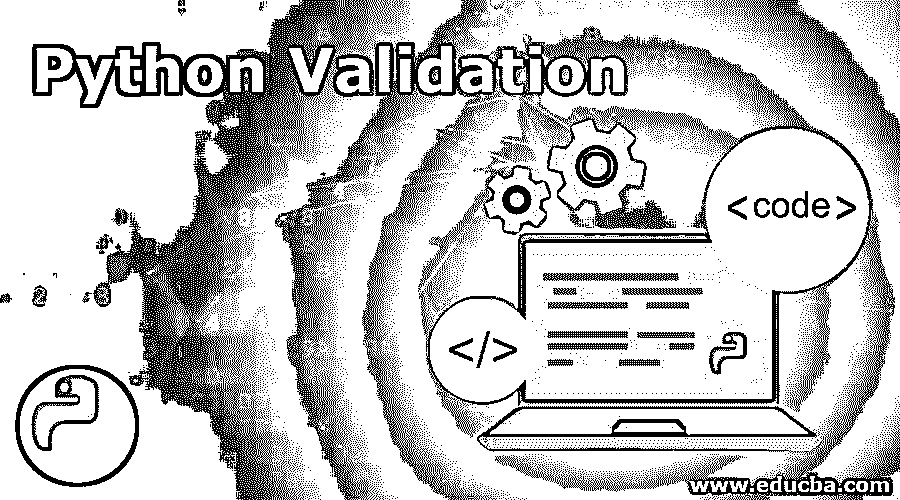
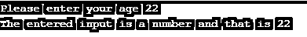
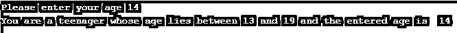
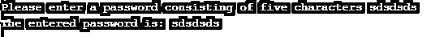

# Python 验证

> 原文：<https://www.educba.com/python-validation/>




## Python 验证简介

每当用户接受一个输入时，都需要对其进行验证，以检查输入数据是否是我们所期望的。可以通过两种不同的方式进行验证，即使用标志变量或使用 try 或 except，标志变量最初将被设置为 false，如果我们可以发现输入数据是我们所期望的，则标志状态可以被设置为 true，并根据标志的状态找出接下来可以做什么，而在使用 try 或 except 时，将尝试运行一段代码。如果有否定的响应，那么运行 except 代码块。

### Python 中的验证类型

python 中有三种类型的验证，它们是:

<small>网页开发、编程语言、软件测试&其他</small>

*   **类型检查:**python 中的这种验证技术用于检查给定的输入数据类型。比如 int，float 等。
*   **长度检查:**python 中的这种验证技术用于检查给定输入字符串的长度。
*   **范围检查:**python 中的这种验证技术用于检查给定的数字是否在两个数字之间。

Python 中的验证语法如下所示:

**使用标志的语法:**

```
 flagName = False
while not flagName:
   	 if [Do check here]:
        		flagName = True
   	 else:
       		print('error message') 
```

标志的状态最初被设置为 false，并且对于 while 循环考虑相同的条件以使语句 while not true，并且如果满足验证条件，则将标志设置为 true 来执行验证；否则，将打印错误消息。

**使用异常的语法:**

```
 while True:
    		try:
        		[run code that might fail here]
       		break
   		 except:
        		print('This is the error message if the code fails')

print('run the code from here if code is successfully run in the try block of code above') 
```

print('如果上面的 try 代码块中的代码成功运行，则从此处运行代码)

我们最初将条件设置为 true，并通过运行一个代码块来执行必要的验证，如果代码未能执行验证，则会引发一个异常，显示错误消息，如果 try 块成功执行了代码，则会打印一条成功消息。

### Python 验证的示例

python 验证的示例有:

#### 示例#1

Python 程序使用一个标志来验证用户给出的输入是否为整数。#数据类型检查。

```
 #Declare a variable validInt which is also considered as flag and set it to false
validInt = False
#Consider the while condition to be true and prompt the user to enter the input
while not validInt:
    	#The user is prompted to enter the input
age1 = input('Please enter your age ')
 	 #The input entered by the user is checked to see if it’s a digit or a number
if age1.isdigit():
        		#The flag is set to true if the if condition is true
validInt = True
   	 else:
       		 print('The input is not a valid number')
  #This statement is printed if the input entered by the user is a number
  print('The entered input is a number and that is ' + str(age1)) 
```

**输出:**




#### 实施例 2

Python 程序使用标志和异常来验证用户给定的输入类型，并确定它是否在给定的范围内。#范围检查。

**代码:**

```
 #Declare a variable areTeenager which is also considered as flag and set it to false
areTeenager = False
#Consider the while condition to be true and prompt the user to enter the input
while not areTeenager:
    	try:
        		#The user is prompted to enter the input
age1 = int(input('Please enter your age '))
#The input entered by the user is checked if it lies between the range specified
if age1 >= 13 and age1 <= 19:
            		areTeenager = True
   	except:
       		 print('The age entered by you is not a valid number between 13 and 19')
#This statement is printed if the input entered by the user lies between the range of the         number specified
print('You are a teenager whose age lies between 13 and 19 and the entered age is  ' +    str(age)) 
```

**输出:**




#### 实施例 3

Python 程序使用标志来检查输入字符串的长度。#长度检查。

**代码:**

```
 #Declare a variable lenstring which is also considered as flag and set it to false
lenstring = False
#Consider the while condition to be true and prompt the user to enter the input
while not lenstring:
    	password1 = input('Please enter a password consisting of five characters ')
           #The input entered by the user is checked for its length and if it is below five
           if len(password1) >= 5:
       		 lenstring = True
   	else:
print('The number of characters in the entered password is less than five characters')
#This statement is printed if the input entered by the user consists of less than five characters
 print('The entered password is: ' + password1) 
```

**输出:**




### 利益

*   它有助于提高代码的安全性。
*   python 中的验证可以防止第三方用户无意或有意地错误处理代码。
*   它可用于检查输入数据类型是否正确。
*   它可用于检查给定输入中是否没有无效值。
*   它可用于检查给定的输入是在范围内还是超出范围。
*   它可以用来检查给定的输入是否满足对它们指定的约束。
*   它可以用来检查给定的输入是否一致。
*   python 中的验证可用于检查给定输入是否有效。
*   python 中的验证可用于检查给定输入是完整的还是不完整的。

### 推荐文章

这是一个 Python 验证的指南。在这里，我们讨论 python 中验证的介绍和类型，以及不同的例子和代码实现。您也可以看看以下文章，了解更多信息–

1.  [Python 地图功能](https://www.educba.com/python-map-function/)
2.  [Python 中的过滤器](https://www.educba.com/filter-in-python/)
3.  [Python SQLite 创建数据库](https://www.educba.com/python-sqlite-create-database/)
4.  [Python 中的装饰器](https://www.educba.com/decorator-in-python/)


