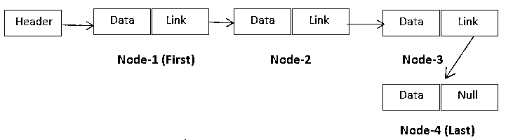
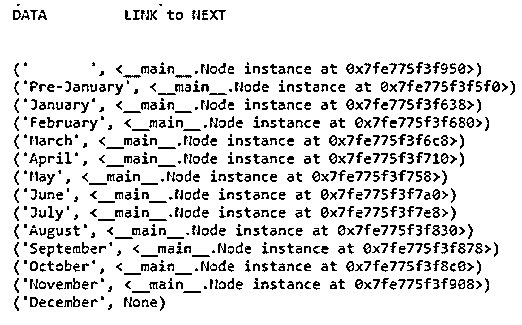
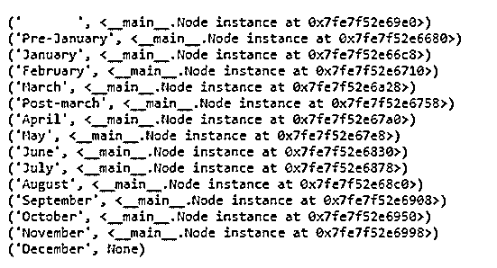

# Python 中的链表

> 原文：<https://www.educba.com/linked-list-in-python/>


## Python 中链表的定义

Python 中的链表提供了存储在物理上不同位置的内存中的数据元素之间的逻辑连接。数据元素与指向下一个直接数据元素的引用链接一起存储在节点中。在 Python 中，数据的逻辑顺序是通过数据节点中的这些链接实现的，通过从第一个数据元素导航到下一个数据元素等等，可以使用这些链接顺序访问整个数据范围。

Python 中的链表消除了预先定义内存块的麻烦，提供了动态扩展数据的灵活性，简化了数据操作，并确保了内存的最佳使用。

<small>网页开发、编程语言、软件测试&其他</small>

### 单向链表

在 python 中可用的各种类型的链表中，单链表是最基本的类型。其他类型如双向链表、循环链表都是在单向链表的基础上建立起来的。让我们更关注单链表

单链表的特点是

1.  数据集的标题总是指向第一个数据元素。
2.  每个节点都包含数据并链接到下一个数据。
3.  最后一个节点中的链接为空。
4.  该列表也被称为单向链，因为数据元素只能以一个方向访问，即从第一个到最后一个。无法在数据集中反向导航。
5.  这个列表中的任何数据元素都不能被随机访问，我们必须从第一个节点开始一个接一个地顺序遍历。

绘画作品




### **链表操作示例**

#### 1.节点创建

创建节点的程序类应该被定义为 python 程序的第一步，数据对象可以在需要时创建。

**代码:**

```
# Linked list Concepts  - Demo Program
class Node:
def __init__(data_node, data):
data_node.item = data                   #node is created with data
data_node.ref = None                    #Link is made null
```

#### 2.链表创建

下一步应该在程序中定义另一个程序类来创建带有初始值的链表。这个类将包含插入、删除、遍历(导航)等后续操作的步骤。

**代码:**

`class LinkedListdemo:
def __init__(lld):                                #Linked list creation
lld.start_node = None                   #Link to first node`

#### 3.初始数据加载(在末尾插入)

理想情况下，初始加载可以从空数据集的末尾开始。插入新数据时，如果数据集为空，则使新节点成为第一个和最后一个节点，然后退出。如果数据集中存在数据，则导航到 end，使当前最后一个节点成为倒数第二个节点。新节点将是最后一个。

**代码:**

```
def insert_at_last(ial, data):
new_node = Node(data)                     # move data
if ial.start_node is None:                    # empty set
ial.start_node = new_node
return
n = ial.start_node
while n.ref is not None:
n= n.ref
n.ref = new_node;                         #new node is the last
#old last is last but one
```

#### 4.浏览数据集

导航时检查列表是否为空。使用起始节点链接到达第一个节点，并使用第一个节点中存在的链接到达第二个节点，并继续前进直到结束

**代码:**

```
def navigate_list(nll):
if nll.start_node is None:                 # if there is no first node
print("List has no element")        #     it is empty list
return
else:
print ("DATA         LINK to NEXT")      #  Header
print ("\n")                                            # blank line
print ("       ", nll.start_node)              # Link to first node
n = nll.start_node                                 # start from first
while n is not None:
print(n.item , n.ref)                          # Print Data and next link
n = n.ref                                              # loop iteration
```

#### 5.将节点追加到数据集

所有定义完成后，为链表创建模块创建一个工作对象，并调用它在末尾插入新节点。

**代码:**

`new_linked_listdemo = LinkedListdemo()                   # new object
new_linked_listdemo.insert_at_last("January")         # inserting nodes at end
new_linked_listdemo.insert_at_last("February")
new_linked_listdemo.insert_at_last("March")
new_linked_listdemo.insert_at_last("April")
new_linked_listdemo.insert_at_last("May")
new_linked_listdemo.insert_at_last("June")
new_linked_listdemo.insert_at_last("July")
new_linked_listdemo.insert_at_last("August")
new_linked_listdemo.insert_at_last("September")
new_linked_listdemo.insert_at_last("October")
new_linked_listdemo.insert_at_last("November")
new_linked_listdemo.insert_at_last("December")`

#### 6.列表数据集

使用相同的链表创建对象类，扫描数据集并查看它。

**代码:**

new _ linked _ list demo . navigate _ list()#遍历列表

**输出:**

**T2】**


 **#### 7.在开头插入

将新节点作为起始节点，现有的起始节点作为第二个节点。

**代码:**

```
def insert_at_beginning(iab, data):
new_node = Node(data)                 # move data
new_node.ref = iab.start_node         # Current first as second
iab.start_node= new_node              # new as latest first
new_linked_listdemo.insert_at_beginning("Pre-January")
new_linked_listdemo.navigate_list()                   # traverssing the list
```

**输出:**




#### 8.在现有项目旁插入

到达现有项目，使其成为新节点的上一个节点。将新节点作为下一个节点的上一个节点。

**代码:**

```
def insert_nextto_item(inti, x, data):
n = inti.start_node
while n is not None:
if n.item == x:                       # match the item
break
n = n.ref
if n is None:                                  # no match
print("item not in the list")
else:
new_node = Node(data)
new_node.ref = n.ref                # Swap new node address and previous
n.ref = new_node                      # node link
```

#### 9.在现有节点后插入节点

`new_linked_listdemo.insert_nextto_item("March","Post-march")
new_linked_listdemo.navigate_list()                   # traverssing the list`

**输出:**




#### 10.删除节点

第一个节点–将第二个节点作为起始节点

最后一个节点–到达倒数第二个节点，并清空下一个链接

由内容标识的任何中间节点–到达该节点并更改

上一个节点指向下一个节点，并引用要删除的节点。

**代码:**

```
def delete_at_beginning(dab):
if dab.start_node is None:              # Empty list
print("Empty List")
return
dab.start_node = dab.start_node.ref     # make second node as initial
def delete_at_last(dal):
if dal.start_node is None:
print("Empty list")
return
n = dal.start_node
while n.ref.ref is not None:         # Search last but one node
n = n.ref
n.ref = None                         # blank out the link
def delete_element_by_content(debc, x):
n = debc.start_node
while n.ref is not None:
if n.ref.item == x:         # match found
break
n = n.ref
if n.ref is None:
print("no such item")
else:
n.ref = n.ref.ref         # change previous node link with next
```

#### 11.测试删除功能

**代码:**

`new_linked_listdemo.delete_at_beginning()
new_linked_listdemo.delete_at_last()
new_linked_listdemo.delete_element_by_content("August")
new_linked_listdemo.navigate_list()                   # traverssing the list`

**输出:**

**T2】**


 **#### 12.双向链表

该列表的特点是

1.  每个数据节点都有实际数据和两个链接，即，前一个链接连接到前一个节点，下一个链接连接到下一个节点，如在单链表中。
2.  对于第一个节点，前一个链接将为空，对于最后一个节点，下一个链接将为空。
3.  可以正向导航，也可以反向导航。数据可以先读取到最后，也可以先读取到最后。但是仅仅随机访问是不可能的。

#### 13.循环单链表

单链表和循环单链表的区别是

1.  最后一个节点中的链接总是用第一个节点的存储器地址来更新
2.  它变成了循环，遍历数据元素变得更加简单
3.  严格地说，这个列表中没有第一个节点或最后一个节点

#### 14.循环双向链表

双向链表和循环双向链表的区别是

1.  最后一个节点中的下一个链接总是用第一个节点的内存地址更新。
2.  第一个节点中的前一个链接总是用最后一个节点的存储器地址来更新
3.  可以从任何地方到任何其他地方以任何方向顺序访问数据

### 推荐文章

这是一个关于 Python 中链表的指南。在这里，我们还讨论了定义和链表操作以及例子。您也可以看看以下文章，了解更多信息–

1.  [Python 中的 Shell 排序](https://www.educba.com/shell-sort-in-python/)
2.  [Python 中的插入排序](https://www.educba.com/insertion-sort-in-python/)
3.  [Lua vs Python](https://www.educba.com/lua-vs-python/)
4.  [Python 中的排序字符串](https://www.educba.com/sort-string-in-python/)


****