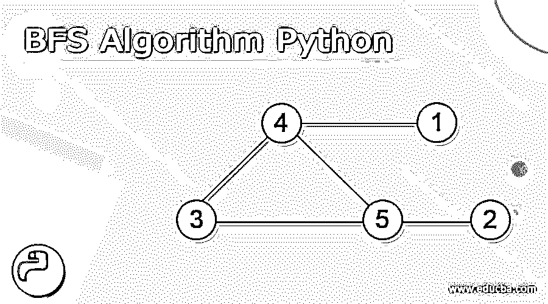
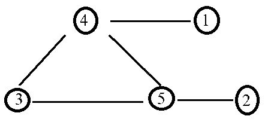
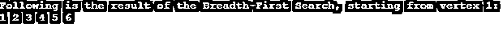

# BFS 算法 Python

> 原文：<https://www.educba.com/bfs-algorithm-python/>




## BFS 算法 Python 的定义

python 中的 BFS 算法用于遍历图或树。遍历一个图需要访问每个节点。BFS 的完整形式是广度优先搜索，也称为广度优先遍历算法。搜索一个图或树的所有顶点的递归算法叫做广度优先搜索。深度优先搜索(DFS)算法也用于搜索图或树的所有顶点。字典和列表等数据结构可用于在 Python 中构建 BFS。树和图中的广度优先搜索几乎是相同的。唯一的区别是图可以有循环，允许我们返回到同一个节点。

算法访问的都是节点和顶点，所以图的 BFS 算法的时间复杂度为 O(V + E)，其中 V 是图的顶点数，E 是图的边数。

<small>网页开发、编程语言、软件测试&其他</small>

BFS 算法的算法:

该算法的步骤如下:

1.将图的任意顶点放在队列的末尾开始。
2。获取队列中的第一个项目，并将其添加到已访问过的项目列表中。
3。列出与该顶点相邻的节点。将不在访问列表中的个人移到队列的后面。
4。应该重复第二步和第三步，直到队列为空。
标准的 BFS 方法将图的每个顶点分为两类，因为广度优先搜索遍历图的每个节点。

1.参观了
2。未访问

该算法的目标是访问每个顶点，同时避免循环。BFS 从一个节点开始，然后检查开始节点一个距离内的所有节点，然后检查两个距离内的所有节点，依此类推。BFS 使用队列(或列表)来记住要访问的节点。

BFS 算法的伪代码

在 Python 中，BFS 的伪代码如下:

创建队列队列

将顶点 v 标记为已访问，并放置 que

当阙不空时

去掉 que 的头顶点 u

标记并排列顶点 u 的所有未访问的邻居

### BFS 算法在 python 中的应用

让我们看一个 BFS 算法如何工作的例子。在这个例子中使用了具有 5 个顶点的无向图。




1.首先，从顶点 4 开始。将其添加到已访问列表中，其附近的所有顶点都会添加到未访问列表中。

已访问列表–[ 4]队列–[ 3，5，1]

2.接下来，通过访问队列的前面来访问节点 4 的邻居节点。

已访问列表–[ 4，3]队列–[ 5，1]

3.接下来，通过访问队列前面的节点 5 来访问节点 3 的相邻节点。因为顶点 5 有一个未被访问的相邻顶点 2，我们倾向于把它移到队列的后面。

已访问列表–[ 4，3，5]队列–[ 1，2]

4.接下来，访问节点 1，它位于队列的前面。

已访问列表—[4，3，5，1]队列—[2]

5.最后，只有节点 2 留在队列中；访问节点 2，队列变空。

已访问列表–[ 4，3，5，1，2]队列–[]

### 例子

python 中 BFS 算法遍历所有树节点的示例

#### 示例#1

```
#function implementing BFS algorithm
def bfs_algorithm( visited, graph, node ):
visited.append( node )
q.append( node )
# using loop to visit each node of the tree
while q:
v = q.pop( 0 )
print ( v, end = " " )
# visit neighbour
for u in graph[v]:
if u not in visited:
visited.append( u )
q.append( u )
# Driver Code
print( "Following is the result of the Breadth-First Search, starting from vertex 1:" )
# createing a grapgh
g = {
'1' : ( '2', '3' ),
'2' : ( '4', '5' ),
'3' : ( '6' ),
'4' : ( ),
'5' : ( '6' ),
'6' : ( )
}
# creating list to store visited nodes
visited = [ ]
# createing a queue
q = [ ]
# calling function
bfs_algorithm( visited, g, '1' )
```

**输出:**




与上面的程序一样，图是使用字典创建的，其中键是节点，值是使用元组提到的相邻节点。接下来，定义 bfs_algorithm()函数，该函数接受已访问的列表、图和旅行将从其开始的节点。在函数内部，将传递的节点添加到已访问的列表和队列中，然后使用 while 循环访问树的每个节点及其邻居，并打印它们。接下来，调用 bfs_algorithm()函数，创建图、访问列表和 stating 节点，正如我们在上面的输出中看到的。

### 结论

BFS 算法也被称为广度优先遍历算法。BFS 算法用于遍历图形或树。字典和列表等数据结构可用于在 Python 中构建 BFS。图的 BFS 算法的时间复杂度为 O(V + E)。

### 推荐文章

这是一个关于 BFS 算法的 Python 指南。在这里，我们讨论的描述，BFS 算法在 Python 中的工作，代码实现的例子。您也可以看看以下文章，了解更多信息–

1.  [生成树算法](https://www.educba.com/spanning-tree-algorithm/)
2.  [链表算法](https://www.educba.com/linked-list-algorithm/)
3.  [冒泡排序算法](https://www.educba.com/bubble-sort-algorithm/)
4.  [人工智能中的搜索算法](https://www.educba.com/search-algorithms-in-ai/)


