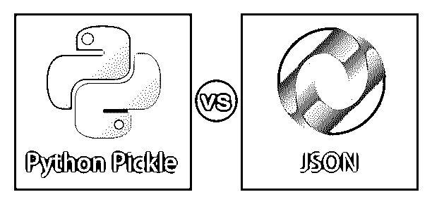
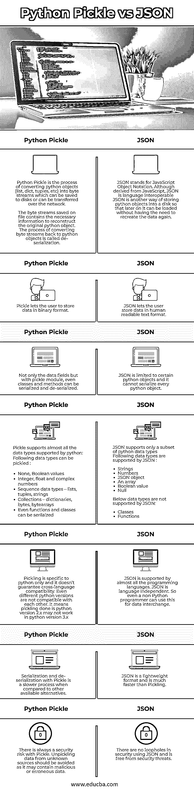

# Python Pickle vs JSON

> 原文：<https://www.educba.com/python-pickle-vs-json/>

## Python Pickle 和 JSON 的区别

酸洗或序列化是转换 Python 对象(列表、字典、元组等)的过程。)转换成可以保存到磁盘或可以通过网络传输的字节流。保存在文件中的字节流包含了重建原始 python 对象的必要信息。将字节流转换回 python 对象的过程称为反序列化。

JSON 代表 JavaScript 对象符号。它源于 JavaScript，但并不特定于一种语言。JSON 是标准化的，几乎所有语言都支持它。这类似于 Pickling，但是 JSON 不是以二进制格式存储数据，而是以人类可读的文本格式存储数据。

<small>网页开发、编程语言、软件测试&其他</small>

### Python Pickle 和 JSON 的正面比较(信息图)

以下是 Python Pickle 与 JSON 的 7 大区别:

### Python Pickle 和 JSON 的主要区别

Python Pickle 和 JSON 之间的主要区别如下-

*   Pickle 模块的大部分是用 C 语言编写的，并且只针对 python。JSON 来源于 JavaScript，但顾名思义并不仅限于 JavaScript。它被设计成可以在多种语言中使用。
*   Pickle 支持二进制序列化格式，而 JSON 支持简单文本序列化格式。
*   JSON 对于常见任务很有用，并且仅限于某些类型的数据。这意味着 JSON 不能序列化和反序列化每个 python 对象。而 pickle 可以序列化任何任意的 Python 对象，比如列表、元组和字典。甚至类和方法都可以用 Pickle 序列化。
*   JSON 是一种轻量级的数据交换格式，因此比 Pickle 快得多
*   JSON 支持语言互操作性，这意味着它是独立于语言的，可以在许多语言中使用，而 pickling 只针对 python，不受其他语言的支持
*   JSON 以文本格式存储数据，而 pickle 以二进制格式存储数据
*   JSON 是安全的，而 Pickling 是不安全的，容易受到安全威胁。因此，它建议不要从未知来源提取数据，因为它可能包含恶意和错误的数据。

### Python Pickle 与 JSON 比较表

我们来讨论一下 Python Pickle 和 JSON 的顶级对比:

| **蟒蛇泡菜** | **JSON** |
| Python Pickle 是转换 Python 对象(list、dict、tuples 等)的过程。)转换成字节流，这些字节流可以保存到磁盘或通过网络传输。
保存在文件上的字节流包含了重建原始 python 对象的必要信息。将字节流转换回 python 对象的过程称为反序列化。 | JSON 代表 JavaScript 对象符号。虽然源自 JavaScript，但 JSON 具有语言互操作性。JSON 是将 python 对象存储到磁盘的另一种方式，这样以后就可以加载它们，而不需要重新创建数据。 |
| Pickle 允许用户以二进制格式存储数据。 | JSON 允许用户以人类可读的文本格式存储数据。 |
| 不仅是数据字段，pickle 模块甚至可以序列化和反序列化类和方法。 | JSON 仅限于某些 python 对象，它不能序列化每个 python 对象。 |
| Pickle 支持 python 支持的几乎所有数据类型:以下数据类型可以被 Pickle:

*   None, Boolean value
*   Integers, floating-point numbers and complex numbers
*   Sequence data types-list, tuple, string
*   Collection-dictionary, byte, byte array
*   Even functions and classes can be serialized.

 | JSON 只支持 python 数据类型的子集。JSON 支持以下数据类型:

*   character string
*   figure
*   JSON object
*   array
*   Boolean value
*   空

JSON 不支持以下数据类型:

*   kind
*   function

 |
| Pickling 只针对 python，不保证跨语言兼容性。甚至不同的 python 版本也互不兼容。这意味着在 python 版本 2.x 中完成的 pick 可能在 python 版本 3.x 中不起作用 | 几乎所有编程语言都支持 JSON。JSON 是独立于语言的。因此，即使非 Python 程序员也可以使用它进行数据交换。 |
| 与其他可用的替代方案相比，使用 Pickle 进行序列化和反序列化是一个较慢的过程。 | JSON 是一种轻量级格式，比 Pickling 快得多。 |
| Pickle 总是存在安全风险。应避免从未知来源提取数据，因为其中可能包含恶意或错误的数据。 | 使用 JSON 在安全性上没有漏洞，也没有安全威胁。 |

### 结论

在这里，我们看到了两种最常见和最简单的序列化数据的技术。两者各有利弊。如果用户没有互操作性需求，并且对二进制格式感到满意，他可以使用 Python Pickle，但是如果互操作性是用户的约束，并且想要一种文本格式，那么他可以使用 JSON 模块。这取决于程序员或用户根据他们的需要在其中进行选择。但是，建议不要从未知来源提取数据，因为它可能包含恶意和错误的数据。

### 推荐文章

这是 Python Pickle 和 JSON 之间最大区别的指南。在这里，我们还将讨论信息图和比较表的主要区别。您也可以看看以下文章，了解更多信息–

1.  [String vs StringBuffer](https://www.educba.com/string-vs-stringbuffer/)
2.  [zernq 与 RabbitMQ](https://www.educba.com/zeromq-vs-rabbitmq/) 的比较
3.  [蟒蛇泡菜](https://www.educba.com/python-pickle/)
4.  [Python 字典方法](https://www.educba.com/python-dictionary-methods/)

