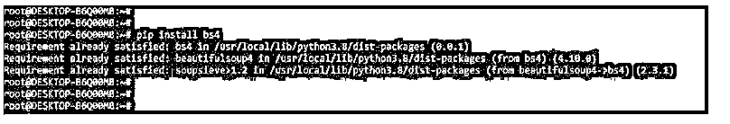
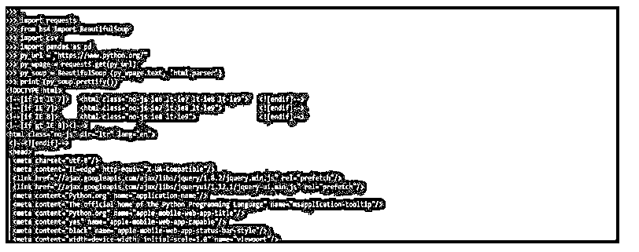
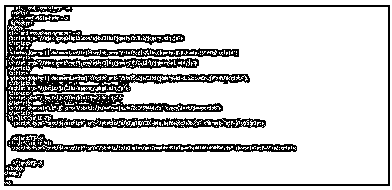
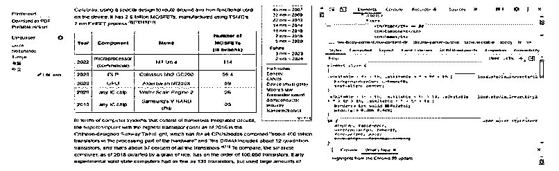
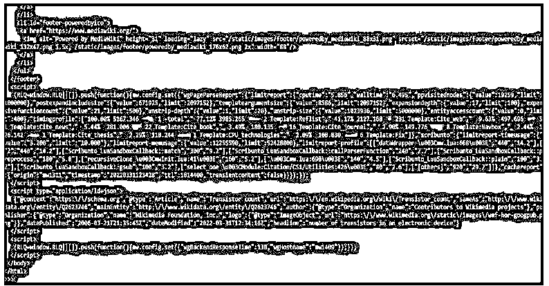
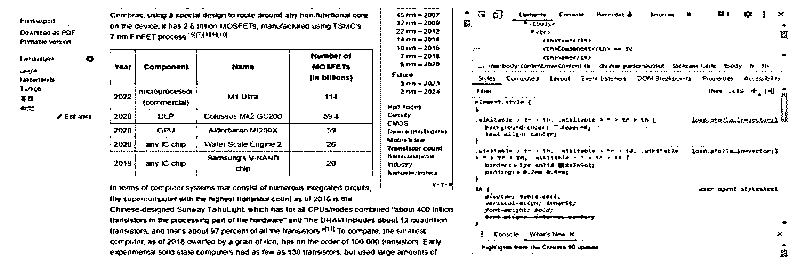
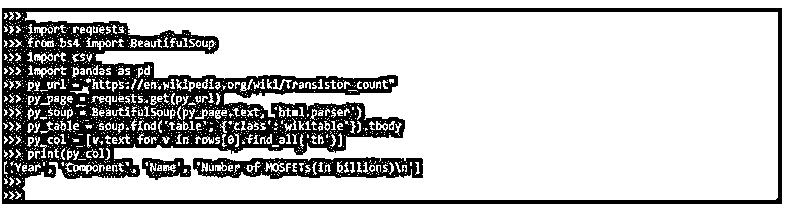

# 漂亮的组合桌

> 原文：<https://www.educba.com/beautifulsoup-table/>


## BeautifulSoup 表简介

BeautifulSoup table 不过是抓取网页；我们可能会遇到 HTML 表格，如果我们不知道自己在做什么，提取有用的数据可能会很困难。因此，BeautifulSoup 表被称为刮痧。我们在抓取页面时编写的代码传递了托管目标页面的请求。然后我们下载网页，只提取当时抓取任务中定义的组件。

### 什么是 BeautifulSoup 表？

*   我们并不总是能够访问组织良好的 CSV 格式的数据集；有时候，我们需要的信息可以在互联网上获得，我们必须能够获得它。幸运的是，python 提供了一个名为 Beautiful Soup 的库，可以帮助我们。
*   Pandas 是一个数据分析库，在许多情况下，当处理数据集时会用到它，尤其是当我们想要分析数据集时。如果我们对数据分析感兴趣，熊猫数据分析系列课程是一个很好的起点。此外，BeautifulSoup 表在 python 中是必不可少的。

### 刮网美容套餐

*   XML 和 HTML 一样，也使用标签，但是有所不同。为了解析 XML，我们可以使用几个库。
*   因此，我们将展示如何使用库从任何网站抓取任何表格。
*   我们甚至不需要用这种方法评估网站元素；我们只需要提供网站的网址。这就是它的全部；这项工作将在几秒钟内完成。

以下是在 beautifulsoup 表的网页抓取中使用的步骤:

<small>网页开发、编程语言、软件测试&其他</small>

1.在这一步中，我们使用 pip 命令安装 bs4 包。我们已经在我们的系统中安装了 bs4 包，所以它将显示需求已经得到满足，然后我们不需要做任何事情。

**代码:**

```
pip install bs4 
```

**输出:**




2.在此步骤中安装 bs4 包之后，我们正在安装请求包。在下面的例子中，我们已经在系统中安装了 requests 包，所以它将显示需求已经得到满足，所以我们不需要做任何事情。

**代码:**

```
pip install requests 
```

**输出:**


3.安装完所有模块后，我们使用 python3 命令打开 python shell。

**代码:**

```
python3 
```

**输出:**


4.在这一步登录到 python shell 之后，我们检查 bs4，请求包安装在我们的系统中。

**代码:**

```
import bs4
import requests 
```

**输出:**


5.在检查了这一步中的所有先决条件之后，我们导入 bs4 的库并请求包。

**代码:**

```
from bs4 import BeautifulSoup
import requests 
```

**输出:**


6.下面的例子显示了一个网页抓取美丽的一组表格。在下面的例子中，我们使用 python 的 web url。

**代码:**

```
import requests
from bs4 import BeautifulSoup
import csv
import pandas as pd
py_url = "https://www.python.org/"
py_wpage = requests.get (py_url)
py_soup = BeautifulSoup (py_wpage.text, 'html.parser')
print (py_soup.prettify ()) 
```

**输出:**







### BeautifulSoup 表解析 HTML

*   如果我们想要的只是一些表格，我们不需要设置 scraper 来从网站上获取一些表格，因为熊猫可以自己做所有的事情。例如，pandas.read html 函数返回包含页面上所有表格的 DataFrames 集合；我们只需要提供页面的 URL。
*   这个函数需要几个参数来帮助找到合适的表。首先，我们使用一个表应该匹配的正则表达式和一个头来接收带有我们定义的头的表。
*   熊猫是一个很棒的项目，但是它不能回答我们所有的问题。例如，有时我们需要抓取元素，无论是因为我们不想要完整的表，还是因为它们与数据库的结构不一致。
*   我们将在下面的示例中定位该表。我们可以访问第一个表，但是页面可以有多个表，这在维基百科网站上很常见。因此，我们必须检查所有的表来确定哪个是正确的。但是我们不能就这样一直走下去。看看 HTML 是如何构造的。

**代码:**

```
import requests
import pandas as pd
from bs4 import BeautifulSoup
py_url = "https://pt.wikipedia.org/wiki/Lista_de_bairros_de_Manaus"
py_data = requests.get(py_url).text
py_soup = BeautifulSoup (py_data, 'html.parser')
print ('Classes of each table:')
for table in py_soup.find_all ('table'):
print (table.get ('class')) 
```

**输出:**


### 漂亮的桌面刮擦

*   为了进行漂亮的组表抓取，我们需要在系统中安装 bs4 模块。在上面的例子中，我们已经安装了 bs4 和请求模块。
*   在刮表之前，我们需要检查应用了 BeautifulSoup 的网页。首先，使用工具前的链接进入维基百科页面。
*   使用开发人员工具可以在页面的 html 代码下找到目标表。下面的示例显示了您检查 beautifulsoup 表抓取页面。




下面的代码显示了 beautifulsoup 表抓取的概述。

**代码:**

```
import requests
from bs4 import BeautifulSoup
import csv
import pandas as pd
py_url = "https://en.wikipedia.org/wiki/Transistor_count"
py_page = requests.get(py_url)
py_soup = BeautifulSoup (py_page.text, 'html.parser')
print (py_soup.prettify()) 
```

**输出:**





*   我们可能认为我们不需要声明 table 类。这一次，它以不同的类名 box-More 存在，如下图所示。




下面的例子显示了如下提取表体。

**代码:**

```
import requests
from bs4 import BeautifulSoup
import csv
import pandas as pd
py_url = "https://en.wikipedia.org/wiki/Transistor_count"
py_page = requests.get (py_url)
py_soup = BeautifulSoup (py_page.text, 'html.parser')
py_table = soup.find ('table', {'class':'wikitable'}).tbody
py_rows = py_table.find_all ('tr')
print (rows[0])
print (rows[1]) 
```

**输出:**


以下示例显示了如何在 beautifulsoup 表抓取中创建数据框。

**代码:**

```
import requests
from bs4 import BeautifulSoup
import csv
import pandas as pd
py_url = "https://en.wikipedia.org/wiki/Transistor_count"
py_page = requests.get(py_url)
py_soup = BeautifulSoup(py_page.text, 'html.parser')
py_table = soup.find('table', {'class':'wikitable'}).tbody
py_col = [v.text for v in rows[0].find_all('th')]
print (py_col) 
```

**输出:**




### 结论

基本的数据收集概念是网络搜集是一个漂亮的组合表。Python 中的 web 抓取工具有 BeautifulSoup、Selenium 和 XPath。刮痧对任何想拔牙的人来说都是一项至关重要的技能。然而，如果我们使用标准的漂亮的 soup 解析器，这是一项耗时的任务。

### 推荐文章

这是一份美丽餐桌指南。在这里，我们讨论介绍，网络抓取 BeautifulSoup 表，解析 HTML，和抓取。您也可以看看以下文章，了解更多信息–

1.  [Python BeautifulSoup](https://www.educba.com/python-beautifulsoup/)
2.  [Python 连接列表](https://www.educba.com/python-join-list/)
3.  [python 中的二分搜索法](https://www.educba.com/binary-search-in-python/)
4.  [JSON 转 CSV Python](https://www.educba.com/json-to-csv-python/)


