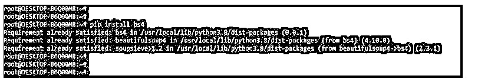
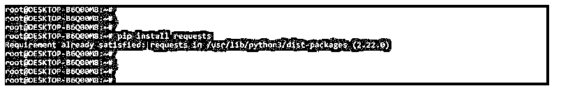
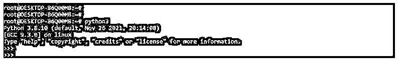
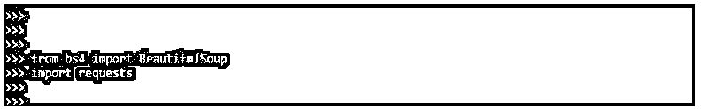
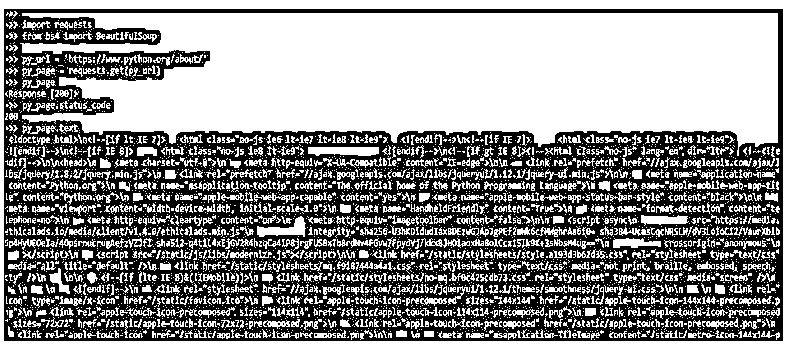
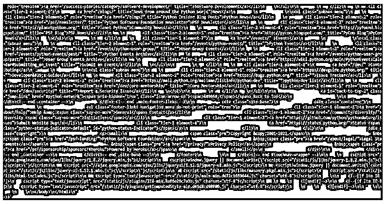
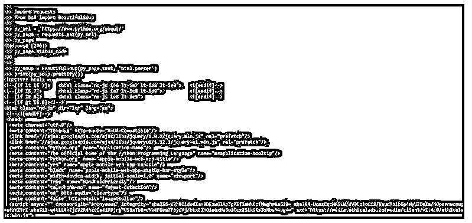
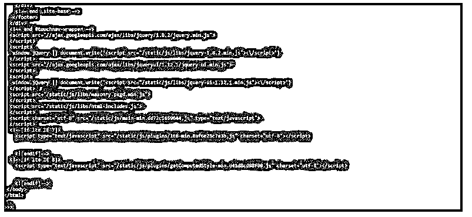
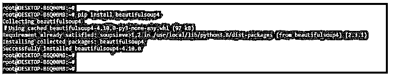

# 美丽的团体请求

> 原文：<https://www.educba.com/beautifulsoup-requests/>


## BeautifulSoup 请求简介

BeautifulSoup request 用于创建蜘蛛，以最小的重复从各种网站抓取数据。BeautifulSoup 请求在 python 中很有用。BeautifulSoup 对网页的请求，通常带有返回的请求(通常带有 BeautifulSoup ),以获取所需的信息——使用 Selenium 和其他自动化软件测试工具以编程方式访问网站内容。需要 Javascript 但无法通过 HTML 访问的网站是日常使用的案例。

我们编写的抓取页面的代码将我们的请求传递给以页面为目标的服务器主机——只提取先前在爬行任务中定义的项目。Beautiful Soup 提供了简单的技术来改变 HTML 和 XML 文件中的解析树。在其他情况下，我们必须手动从互联网上获取文本。它还自动转换 Unicode，所以我们不必担心编码。这个程序不仅抓取数据，还清理数据。Beautiful Soup 支持 python 标准库中包含的 HTML 解析器。

<small>网页开发、编程语言、软件测试&其他</small>

### BeautifulSoup 请求是如何工作的？

*   我们经常希望以编程的方式处理数据，以便理解它，因为 web 提供了数据。
*   网站创建者可能会以. csv 或逗号分隔值文件的形式向我们提供数据。请求模块允许我们将 Python 程序连接到 web 服务。
*   如今，数据变得更加重要，它如何帮助我们发现新的模式和见解。正确的数据有助于公司改进营销方法，从而提高整体销售额。Python 的 BeautifulSoup 包用于从 web 上抓取数据，是一个受欢迎的选择。

以下步骤显示了如何处理 beautifulsoup 请求。

1.在这一步中，我们使用 pip 命令安装 bs4 包。在下面的例子中，我们已经在我们的系统中安装了 bs4 包，所以它将显示需求已经得到满足，所以我们不需要做任何事情。

**代码:**

```
pip install bs4 
```

**输出:**




2.在这一步安装 bs4 包之后，我们安装请求的包。在下面的例子中，我们已经在系统中安装了 requests 包，所以它将显示需求已经得到满足，所以我们不需要做任何事情。

**代码:**

```
pip install requests 
```

**输出:**




3.安装完所有模块后，我们使用 python3 命令打开 python shell。

**代码:**

```
python3 
```

**输出:**




4.在这一步登录到 python shell 之后，我们检查 bs4，请求包安装在我们的系统中。

**代码:**

```
import bs4
import requests 
```

**输出:**


5.在检查了这一步中的所有先决条件之后，我们导入 bs4 的库并请求包。

**代码:**

```
from bs4 import BeautifulSoup
import requests 
```

**输出:**




6.在下面的例子中，我们收集有请求的网页。我们使用的是 python url。

**代码:**

```
import requests
from bs4 import BeautifulSoup
py_url = 'https://www.python.org/about/'
py_page = requests.get (py_url)
py_page
py_page.status_code
py_page.text 
```

**输出:**







*   漂亮的 Soup 软件从解析的 HTML 和 XML 文档构建解析树。因此，由于这一功能，网页上的文本将更具可读性，而不是我们在请求模块中观察到的内容。
*   在下面的例子中，我们使用了 beautifulsoup 请求。此外，我们使用带有 py_page 变量的 html.parser。

**代码:**

```
import requests
from bs4 import BeautifulSoup
py_url = 'https://www.python.org/about/'
py_page = requests.get(py_url)
py_page
py_page.status_code
py_soup = BeautifulSoup(py_page.text, 'html.parser')
print(py_soup.prettify()) 
```

**输出:**







*   在上面的例子中，我们首先导入了 request 和 bs4 模块。导入模块后，我们得到 python URL 来发出 beautifulsoup 请求。在下一步中获得请求后，我们使用 request 方法通过 URL 发送请求。
*   然后我们打印打印 URL 的状态代码。在下一步中获得状态代码后，我们使用带有 html.parser 的 beautifulsoup 方法。

### 美丽组安装请求

*   以下步骤显示了如何安装 beautifulsoup 请求。要使用 beautifulsoup 请求，我们主要需要 bs4 和请求模块。
*   我们需要检查 pip 命令位于何处来安装请求包。

以下示例显示了如何检查 pip 命令位置。

**代码:**

```
which pip 
```

**输出:**


*   要处理网页，我们需要请求页面。Requests 包使得在 Python 项目中以人类可读的方式使用 HTTP 成为可能。一旦我们建立了开发环境，我们将使用 pip 来安装请求。

**代码:**

```
pip install requests 
```

**输出:**


*   在上面的例子中，我们可以看到消息显示需求已经得到满足，因为我们已经在系统中安装了请求。
*   通常，我们使用 lxml 来提高速度；如果假设我们使用的是旧版本的 python，建议在我们的系统中安装 lxml 和 html5lib。
*   在上面的例子中，我们已经安装了请求模块，现在在下面的例子中，我们正在安装 beautifulsoup 模块。我们正在使用 pip 命令安装 beautifulsoup。
*   下面的例子显示了在我们的系统中安装 beautifulsoup4。在下面的例子中，我们正在安装 beautifulsoup 4.10.0 版本。

**代码:**

```
pip install beautifulsoup4 
```

**输出:**




### 漂亮的一组网页请求

*   我们可以使用请求库从 URL 获取内容，漂亮的 soup 库可以帮助我们解析它并获得我们想要的细节。我们可以使用一个可爱的汤库，通过 Html 标签、类、id、CSS 选择器和各种其他方法来获取数据。
*   以下是输出，其中包括页面标题。以下示例显示了 beautifulsoup 网页请求，如下所示。我们使用 python 网页进行请求。在下面的例子中，我们可以看到我们使用了 bs4 和请求模块。我们正在打印网页的状态代码。

**代码:**

```
import requests
from bs4 import BeautifulSoup
py_res = requests.get ('https://www.python.org/about/')
print ("Status ", py_res.status_code)
print ("\n")
py_data = BeautifulSoup (py_res.text, 'html.parser')
print (py_data.title) 
```

**输出:**


### 结论

Beautiful Soup 提供了简单的技术来改变 HTML 和 XML 文件中的解析树。对网页的请求，通常带有获取所需信息的请求。我们编写的抓取页面的代码将我们的请求传递给目标页面的服务器主机。

### 推荐文章

这是一个美丽的团体请求指南。这里我们讨论介绍、工作、安装请求和网页请求。您也可以看看以下文章，了解更多信息–

1.  [Python BeautifulSoup](https://www.educba.com/python-beautifulsoup/)
2.  [Python 连接列表](https://www.educba.com/python-join-list/)
3.  [python 中的二分搜索法](https://www.educba.com/binary-search-in-python/)
4.  [JSON 转 CSV Python](https://www.educba.com/json-to-csv-python/)


