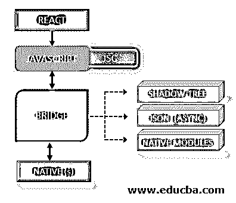
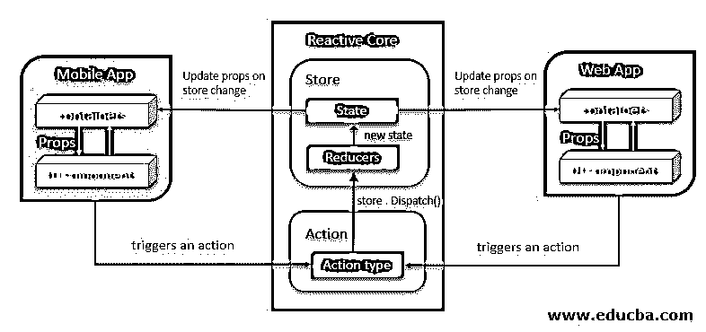
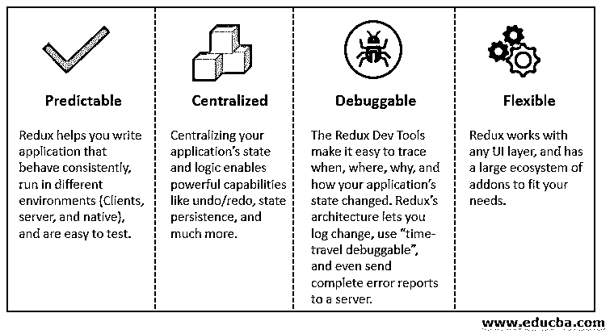

# 反应本地架构

> 原文：<https://www.educba.com/react-native-architecture/>

## 什么是 React 原生架构？

React Native 是一个由脸书创建的开源框架，它帮助我们使用 [JavaScript 创建移动应用](https://www.educba.com/what-is-javascript/)。它在行业中被广泛使用，直接来自它的创造者脸书，但它也被像亚马逊和微软这样的企业公司使用，甚至被一些初创公司使用。让我们朝着 React native 的基本架构前进。

有四个核心部分:

<small>网页开发、编程语言、软件测试&其他</small>

*   开发者写的 React 代码。
*   最终从开发人员编写的代码中得到解释的 JavaScript。
*   一系列的元素统称为桥梁。
*   土著的一面。

### React Native 中的领域

让我们来看看在移动应用程序中并行运行的两个领域:

#### 1.JavaScript 领域

在 JavaScript 领域，我们的程序运行在 JavaScript 上，这里的代码运行在 JavaScript 引擎上。React Native 使用 score，这是一个用于 WebKit 的开源 JavaScript 引擎。这个引擎在我们的应用程序中的一个线程上运行，一个移动应用程序有几个线程，javascript 是其中之一。

#### 2.本土领域

在原生领域，开发者将使用 Object Swift 开发 iOS，或者使用 Java 开发 Android。我们将使用以前使用过的本地的、特定于平台的语言，主 UI 线程将照常可用。跨平台，我们只需要从主 UI 线程改变 UI，我们将能够根据需要创建不同的后台线程

**解释:**上面讨论的两个境界是不同的，用一座桥连接起来。React Native 在整个设置中非常重要。我希望开发人员可以尝试在 Chrome 上调试他们的应用程序。因此，当我们使用 Chrome 调试 React 本机应用程序时，我们可以看到这两个领域同时在不同的计算机上运行。我们可以完全在 Chrome 上运行。即使在通过 Chrome 调试它的时候，你也可以运行原生领域。现在，你可以直接通过 WebSocket，而不是检查你的应用程序。该桥也通过 WebSocket 传输。

### 反应本地架构

#### Redux

应用程序状态和状态变化由 Redux 维护，这是一个部署了脸书 Flux 架构的纯变体的库。Redux 和 Flux 用于让数据单向流过应用程序。

##### Redux 的特性

Redux 有一个同步更新状态的特性，但是它没有处理异步动作的答案。Redux 生态系统有一些方法来检查这个问题。一个可能的解决方案是普通的 redux-thunk 中间件，或者我们也可以使用 redux-loop。

**1。组件**

*   **components 目录包含 React 原生 JSX 组件，其中以 props 作为输入。在 Redux 中，智能容器组件使用这些组件。组件应该考虑将状态外部化到 Redux 存储中。如果状态需要由其他组件继续或共享，那么它应该转到 Redux 存储。**
***   如果该组件的实现在 iOS 和 Android 版本的应用程序之间有任何不同，那么我们需要为该组件创建单独的. android.js 和. ios.js 文件。在不太复杂的情况下。OS 属性可以用来开发平台之间的分支。**

 ****2。模块**

*   [React Native 的模块目录由应用程序有趣的](https://www.educba.com/react-native-asyncstorage/)部分组成。所有修改了应用程序状态或从商店中读取的代码都应该继续。
*   每个模块都有自己的目录，由一个“离散域”表示。将应用程序拆分成模块没有规则，尽管这是设计 Redux 应用程序过程中最艰难的决定之一。

**好模块的特征:**

1.  它应该代表应用程序中的一个屏幕或一组屏幕。
2.  它应该用自己的状态来表示一些技术特性。
3.  它不应该被强制使用来自任何其他模块状态的数据。
4.  它不应该包含其他模块使用的数据。

**3。状态**

*   状态由应用程序状态和对状态的任何修改组成。状态可以被认为是从服务器接收的或由用户创建的数据，例如登录数据或 UI 元素。
*   模块的状态方被称为 Redux Duck——一个由 Redux、Action Creators 和 app 初始阶段组成的文件。
*   Redux Duck 模式用于保持代码的可移植性，并且易于将 reducer 与 action creators 放在一起。对于一些复杂的模块，Duck 可能很难维护，并且很难将它分割成更小的块。
*   它可以通过将状态分割成更小的鸭子，并通过标准的 Redux 分割/合并策略将其添加到 reducers 中来解决。

**4。容器**

*   容器负责将视图组件连接到 Redux 存储。该容器还用于具有重组功能的高阶函数。
*   Redux connect 接收两个参数，第一个是 mapStateToProps，它突出显示应用程序状态的相关部分以传递给视图，第二个是 mapActionsToProps，它帮助将操作创建者绑定到存储的调度程序，以便现在可以部署操作。
*   这些功能被称为选择器。每当应用程序的状态发生变化时，Container 都会显示最新的状态。如果合成的道具不同于先前的道具，则再现连接的视图。

### 结论

React Native 的架构帮助我们构建多平台移动应用程序的项目，将业务逻辑保持在可重用和可维护的子模块中。在一些项目中，我们可以看到容器在核心模块中很重要，但这取决于应用程序。React Native 使用不同的机制为应用程序创建高效、一致且可重用的视觉标识。

### 推荐文章

这是一个反应原生架构的指南。这里我们讨论了特色建筑的基本概念、两个领域、方面和重复。您也可以浏览我们的其他相关文章，了解更多信息——

1.  [React Native SectionList](https://www.educba.com/react-native-sectionlist/)
2.  [反应自然状态](https://www.educba.com/react-native-state/)
3.  [反应原生状态栏](https://www.educba.com/react-native-statusbar/)
4.  [反应原生表](https://www.educba.com/react-native-table/)**