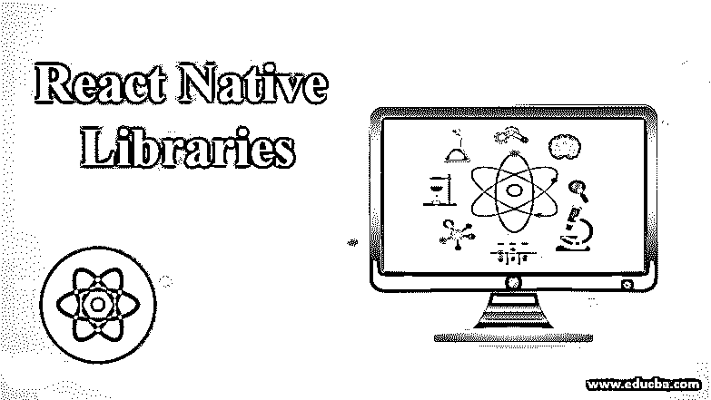

# React 本地库

> 原文：<https://www.educba.com/react-native-libraries/>

## 什么是 React 本地库？

React native 库是使 react native 更受欢迎的关键因素，因为它提供了开发更快和更可靠的移动应用程序的方法，React native 建议我们使用隔离的组件开发我们的 UI，基本上使用组件 Native 库和 UI 属性的主要好处是它们有助于更快的开发以及更少的代码和更好的性能，因为这些库已经过测试，性能更好。 最重要的是，在这些 react 原生库的帮助下，我们能够为应用程序的开发节省一些额外的工作和时间，它们也有助于节省时间和更快地构建您的应用程序。

### 9 大 React 原生库

以下是 9 大图书馆及其详细说明:

#### 1.NativeBase

这个 reacts 本地库将用于跨平台工作。这个库是一个流行的库，提供了许多 react-native 跨平台库组件。它有将近 10k 颗星星和超过 1k 个叉子。它可以用于设计任何应用程序所需的任何组件，例如页眉、页脚和主体。我们不需要写太多的 UI 代码来得到一个漂亮的 UI 供我们使用。在原生库的帮助下，我们可以开箱即用地使用第三方库。大多数时候他们会反应——native 将用于漂亮的布局，看起来太轻松了。它允许我们用所有必要的组件设置一个漂亮的 UI 布局。我们可以在官方文档和例子中看到图标列表和它们的结构。

#### 2.反应本地元素

到目前为止，这个 reactions 原生库已经有了将近 12k 的星星，重要的是这个库完全是用 javascript 开发的。这些库提供了一种用高度可定制的跨平台 UI 组件开发 UI 组件的方法。该库的设计者解释说，开发该库的主要目标是它更关注于 react-native 应用程序的结构，而不是原始设计。我们可以在官方文档和例子中看到图标列表和它们的结构。

#### 3.Shoutem

这个组件也很受欢迎，迄今为止它已经有差不多 3.5k 颗星了。这个 react 本地组件库将被定义为三个部分，它们在下面给出，

*   UI 组件:它为我们提供了各种预构建的 UI 组件供我们使用。
*   主题:它为我们提供了需要在应用程序中使用的预构建主题，而无需做任何额外的工作。如果需要的话，它还允许我们定制和修改 CSS。

这个库中的每个组件都能够拥有自己的风格，这有助于我们开发甚至是困难的设计，而无需手动编写任何复杂的设计。该库还支持跨平台 UI 组件，这些组件同时支持 android 和 IOS。我们可以在官方文档和例子中看到图标列表和它们的结构。

#### 4.UI 小猫

这个库在可重用性方面有很大的特点，在这方面，我们可以开发一次库，并可以在这些库中稍加修改就可以用于许多地方。它有大约 3000 颗恒星。它的主题在使用中非常健壮，因为它们可以随时改变。在这里，动态更改意味着可以根据设备配置和应用程序所需的 UI 组件来更改或定制设计。我们阅读了它的文档，并关注世博会，以获得更好的例子。我们可以在官方文档和例子中看到图标列表和它们的结构。

#### 5.反应原生材料用户界面

它使用谷歌材料设计来实现。这是一个高度可定制的 react-native UI 库。整个图书馆只基于一个原则，那就是它只有一个主题。我们将使用该属性进行定制。在 uiTheme 中，我们需要传递上下文和必需的 UI 属性来显示内容。这个主题使用了轻量级主题。我们可以在官方文档和例子中看到图标列表和它们的结构。

#### 6.反应天然材料工具包

这个库没有更新新版本，因为上一次发布是在 2017 年 12 月，但它仍然有近 4k 颗星，所以它是一个重要的库。它使用谷歌的 MD 作为其主题和组件。建议大家谨慎使用，因为它的发布次数少，维护量低。它有漂亮的按钮和小的 UI 组件。我们可以在官方文档和例子中看到图标列表和它们的结构。

#### 7.玉米片用户界面

这个 reactions 原生库得到了大约 1.5 颗星和将近 30 个可定制的 react-native 组件库。Nachos UI 库的好处是它非常适合 jest。这里是脸书开发的 UI 测试框架。有了 jest，使用该库进行快照测试变得更加容易。在 react-native-web 库的帮助下，它支持应用程序和 web。我们可以在官方文档和例子中看到图标列表和它们的结构

#### 8.反应原生纸

这个 reactions 原生库有 1.5 k 的星星，这个库是完全跨平台的 UI 库。它基于材质设计模式，也支持全局主题化。我们可以借助 babel-plugin with Paper 来减小包的大小。对于 babel-plugin 来说，使用 react-native Paper 是完全可选的，可以减少包的大小。我们可以在官方文档和例子中看到图标列表和它们的结构

#### 9.反应原生矢量图标

这是使用最多的 react 本地库之一。它有将近 1 万颗恒星。这个库主要用于可定制的图标，这些图标支持导航条/工具栏和标签栏以及具有完整样式的图像源。甚至一些其他的 react 本地库也使用它作为他们的图标，比如 react-native-paper。该库提供了预构建捆绑的带有定制功能的完整图标。我们可以在官方文档和例子中看到图标列表和它们的结构

### 结论

从本教程中，我们了解了各种具有特殊行为的库，如一些适用于图标，一些适用于布局，还有一些库支持跨平台功能的应用程序和 web，我们了解到 react 本机库用于减少我们的额外工作以及更好的性能。

### 推荐文章

这是一个反应本地库的指南。在这里，我们讨论了什么是 React 本地库和 React 本地库中的前 9 个库，并给出了适当的详细解释。您也可以浏览我们的其他相关文章，了解更多信息——

1.  [React Native SectionList](https://www.educba.com/react-native-sectionlist/)
2.  [React 原生抽屉导航](https://www.educba.com/react-native-drawer-navigation/)
3.  [反应原生矢量图标](https://www.educba.com/react-native-vector-icons/)
4.  [反应原生闪屏](https://www.educba.com/react-native-splash-screen/)

