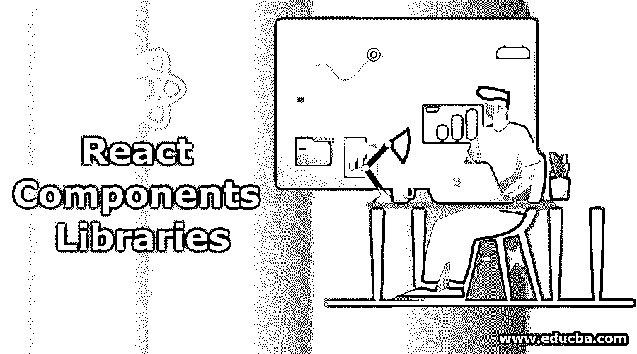
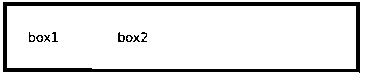

# React 组件库

> 原文：<https://www.educba.com/react-components-libraries/>




## React 组件库简介

下面的文章提供了 React 组件库的概要。React 组件库既可以被 NPM 使用，也可以被 CDN 使用。社区或我们开发的每个 react 组件库都有特定的用途，有些库用于处理来自服务器的大量数据，以表格形式向最终用户显示数据，有些库为我们提供了漂亮的图标，有些库为我们提供了类似 Microsoft office 的视图。所有这些库都是以这样一种方式创建的，我们只需要为 HTML 编写最少的代码，我们只需要传递一个参数来设计我们想要的东西。

### React 组件库说明

正如我们在[简介中看到的，react](https://www.educba.com/what-is-react/) 组件库是一个可以在任何项目中使用的库。因此，例如，假设我们有 3 个独立的项目，我们希望保持按钮、页眉和页脚等一些东西在所有 3 个项目中看起来相同，那么，在这种情况下，我们将创建一个 react 组件库，并将其发布到 NPM(节点包管理器)。每当任何项目需要显示一个按钮，页脚或页眉，我们在所有这些项目中使用这些软件包库。

<small>网页开发、编程语言、软件测试&其他</small>

有许多可用的 react 库可以在我们的项目中使用，这个库是由其他人开发的，并作为开放源代码发布。

### 十大 React 组件库

下面给出了 10 大 react 组件库:

#### 1.雷巴斯

Rebass 有许多组件，我们可以用来设计和开发任何组件。任何库组件看起来都与任何常规组件相似，唯一的区别是它们是从库中导入的，而不是从现有文件夹中导入的。Rebass 有许多库组件，让我们讨论其中的一个。

我们将使用一个名为“Flex”的组件，它将设计包含所有必需参数的容器。Flex 容器将各种属性作为输入，并相应地生成 HTML 设计。所有这些属性都将被写入库中的另一个父容器。以下面的例子为例，我们正在传递 align-items、px、py、bg 和 button、heading。这些属性的实际 html 设计是在库组件内部编写的，库组件将为它返回有效的 HTML 设计。Rebass 提供了更多的组件，我们需要了解我们的需求，因此我们需要传递属性给它。它会给我们 html 设计。这里的主要优势是我们不必一次又一次地编写 HTML，而且所有项目的一个精确设计将在库中定义。

遵循下面的示例以及代码的 html 输出:

它有一些常用的组件:

##### 形容词（adjective 的缩写）弯曲

例如，如果您想以不同的 2:6 比例并行显示两个框，它将创建响应迅速且灵活的布局组件。

**代码:**

```
<Flex>
<Box
p={4}
width={1/6}
color='black'
bg='primary'>
box1
</Box>
<Box
p={4}
width={1/2}
color='black'
bg='secondary'>
box2
</Box>
</Flex>
```

**输出:**




我们有更多像 Flex 一样的组件，例如，Box、Slider、radio 和各种输入框。

#### 2.蚂蚁设计

在上面我们学习了 Rebass 组件库的一个非常基本的设计，这里 Ant-design 给了我们一个完整而灵活的设计。蚂蚁设计有 50 个组件库。在蚂蚁设计的帮助下，人们可以设计和开发一个成熟的应用程序。我们可以讨论一些重要的和最常用的蚂蚁设计组件。

##### a. DatePicker

日期选择器提供了一个非常漂亮的方式来显示日期格式，它给了我们更多的自定义功能来显示日期和年份。下面给出了一个非常简单的格式，你可以将各种参数传递给这个属性。

**代码:**

```
<DatePicker />
```

##### b.图标

你已经看到了各种图标，如下载图标、上传图标、下一个或上一个图标等。蚂蚁设计给了我们各种各样的图标。如果我们去为这些图标写 HTML，这将需要时间，甚至可能没有那么精确。在下面的代码中，我们只定义了图标的类型，我们将得到一个相应的图标。例如，如果我们想要创建一个 twitter 图标，我们只需要定义 type="twitter "，同样，如果我们想要一个 Windows 图标，我们需要传递 type="windows "。

**代码:**

```
<Icon type="step-backward" />
```

##### 碳（carbon 的缩写）下拉式

你已经在 HTML 中看到了选择和选项，来创建一个下拉菜单，但是这些用 HTML 创建的下拉菜单并没有太多的交互性，或者为了使它们具有交互性，我们需要编写大量的 css 和设计。在 Ant-Design 的帮助下，我们可以只使用名为<dropdown>的组件，我们可以传递关于下拉菜单如何打开以及它看起来如何的参数，我们可以为每个下拉菜单指定任何文本名称作为选项对象。</dropdown>

**代码:**

```
<Dropdown overlay={menu} placement="position where dropdown will open like right left and center etc">
<Button>button</Button>
</Dropdown>
```

##### d.纽扣

你一定听说过 HTML 中的按钮，但是你曾经创建过任何用于搜索、删除、上传和下载的按钮。要使用任何普通的 HTML 创建这些按钮，我们需要大量的 HTML 编码，但在 Ant-Design 组件库的帮助下，我们只需定义 icon="button type what we want "的名称。例如，如果我们想创建一个上传按钮，我们可以简单地传递 icon="upload "。参见下面的例子。请记住，任何按钮在单击时都会执行业务逻辑。因此，最终用户应该能够理解按钮的目的与按钮的外观。

**代码:**

```
<Button type="primary" shape="circle" icon="download" size={size} />
```

Ant-Design 组件库中有更多的组件，大约有 50 个，我们可以浏览所有的组件及其实现。

#### 3.反应引导

React-bootstrap 提供各种组件来设计按钮、下拉菜单或任何基于 HTML 的 UI 组件。它与任何其他组件都非常相似。我们可以以两种不同的方式使用这些组件，要么借助 NPM 软件包，要么借助包含库。以下是将它们包含在任何实施项目中的方法。React-bootstrap 将 CSS 样式和 html 混合在一起。由于其漂亮的风格，我们可以使用它们来预样式和预编译的用户界面。

*   npm 安装反应引导引导

**代码:**

```
<script src="https://unpkg.com/react-bootstrap@next/dist/react-bootstrap.min.js" crossorigin/>(CDN)
```

#### 4.材料-用户界面

Material UI 是 react js 最流行的组件库之一。它有很多组件，可以用最少的 HTML 代码来设计和开发我们的网站。谷歌设计的材料用户界面，它完全基于卡，基于网格的布局。它有漂亮的反应动画。如果你想让你的网站拥有漂亮的交互式 UI 组件，就用这个库吧。

这个软件包可以在 NPM 图书馆找到，我们可以从他们那里得到，也可以使用 CDN 图书馆的 URL。

*   npm 安装@material-ui/core。
*   通过将脚本路径和 CSS 路径包含到脚本和链接部分。

**代码:**

```
<link rel="stylesheet" href="path" />
```

#### 5.织物反应

它是由微软开发的。所以你能理解它的重要性。他们以这样一种方式使用户界面看起来与任何微软 offices 相似。因此，任何人都希望有一个像微软 UI 的外观和感觉，而不是他们应该用这个库。如果你正在开发一些东西，我们将会有很多逻辑操作，将会有一个类似办公室的工作和属性，那么我们应该考虑这个。

#### 6.反应虚拟化

该反应组件库可用于对 NPM 作出反应。它主要是为表格和列表呈现而开发的。我们可能认为渲染一个表格或列表没什么大不了的，但这确实是一件大事。假设您的 UI 要一次呈现数千个元素，在这种情况下，性能将是一个度量问题。React Virtualized 在解决大型数据表示的性能问题方面做了大量工作。

#### 7.完全形态

为了解决开发人员和设计人员沟通不畅的问题，他们开发了格式塔反应组件库。根据这个库，它给了我们许多预编译的库，可以解决许多组件的原型设计，可以很容易地进行设计和分析。

#### 8.反应微调器

如果你听说过 spinner，那么这个组件库仅仅是关于 Spinner 的。这个组件库并没有涵盖所有内容，它主要关注的是 spinner。因此，任何时候，如果你需要像图标旋转的东西，我们可以使用这个库。

#### 9.索环

如果你的设计包含更多的草图和屏幕阅读器功能，我们应该使用这个组件库。所以这个组件背后的主要思想是可访问性。这也有利于主题化和响应。

#### 10.自定义组件库

我们还可以设计和开发自己的组件库，并在 NPM 上发布。您可以在控制台命令上通过 NPM 的登录凭据登录，并发布您开发的库。记住我们不能发布一个重复的 NPM 组件库。例如，如果我们试图开发发布任何名为 React-bootstrap 的组件，那么它将不会被允许，因为它已经被其他人发布了。

### 推荐文章

这是 React 组件库的指南。这里我们分别讨论简介和 10 大 react 组件库。您也可以阅读以下文章，了解更多信息——

1.  [反应工具](https://www.educba.com/react-tools/)
2.  [反应成分](https://www.educba.com/react-components/)
3.  [反应原生导航](https://www.educba.com/react-native-navigation/)
4.  [React 路由器转换](https://www.educba.com/react-router-transition/)