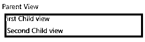
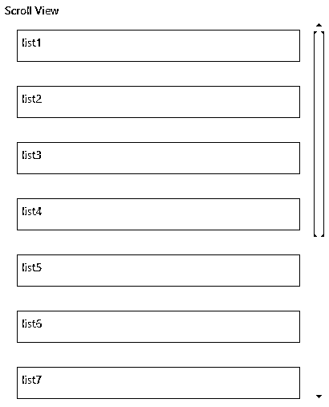

# 反应原生成分

> 原文：<https://www.educba.com/react-native-components/>


## React 本机组件简介

React Native 提供了各种内置组件。通过组件，人们可以将 UI 分成可重用的、独立的部分，并且可以孤立地考虑每一部分。React Native 中的组件被定义为函数或类。为了定义 React 组件类，需要扩展 React.component。要定义 React.component 子类，唯一的方法是 render()。它有几个“生命周期方法”，可以被覆盖以在整个过程中的特定时间运行代码。它们类似于 JavaScript 函数。

**语法:**

<small>网页开发、编程语言、软件测试&其他</small>

```
class  Welcome  extends  React.Component  { render() {
return  <h1>  Hello,  {this.props.name}</h1>;
}
}
```

### React Native 的组件和用途

以下是组件及其用途:

#### 示例 1–视图

**用途:**构建一个用户界面，视图是最重要的组件。

**代码:**

```
import React, { Component } from 'react';
import {AppRegistry,StyleSheet,Text,View} from 'react-native';
export default class NativeSample extends Component { render() {
return (
<View style={{backgroundColor:"yellow",margin:5}}>
<Text>Parent View</Text>
<View style={{backgroundColor:"red",margin:5}}>
<Text>first Child view</Text>
<View style={{backgroundColor:"green",margin:5}}>
<Text>Second Child view</Text>
</View>
</View>
</View>
);
}
}
AppRegistry.registerComponent('NativeSample', () => NativeSample);
```

**输出:**




#### 示例 2–样式表

**用途:**它可以定义为移动应用程序将出现的样式，因此它用于样式化移动应用程序，并将使应用程序具有吸引力。

**代码:**

```
import React, { Component } from 'react';
import {AppRegistry,StyleSheet,Text,View} from 'react-native';
export default class NativeSample extends Component {
constructor() {
super()
this.state = {
firstVar: 'It displays using styleSheet'
}
}
render() {
return (
<View >
<Text style={styles.textStyle} > {this.state.firstVar}</Text>
</View>
);
}
}
AppRegistry.registerComponent('NativeSample', () => NativeSample);
const styles = StyleSheet.create ({
textStyle: {
margin: 50,
fontSize: 30,
color:'red',
fontWeight: 'bold',
}
})
```

**输出:**


#### 示例 3–文本输入

**用途:**是一个用来通过键盘向移动应用输入文本的组件。

**代码:**

```
import React, { Component } from 'react';
import {AppRegistry,StyleSheet,Text,TextInput,View} from 'react-native';
export default class NativeSample extends Component {
constructor() {
super()
this.state = {
firstVar: ' '
}
}
render() {
return (
<View style={{margin:50}}>
<TextInput style={{height: 40}}
placeholder="Type your text!"
onChangeText={(firstVar) => this.setState({firstVar})}
/>
<Text style={{padding: 10, fontSize: 42}}>
{this.state.firstVar}
</Text>
</View>
);
}
}
AppRegistry.registerComponent('NativeSample', () => NativeSample);
```

**输出:**

**T2】**


 **#### 示例 4–滚动视图

**用途:**用于提供一个大的列表或大的内容用滚动条查看。它有助于查看大量内容。

**代码:**

```
import React, { Component } from 'react';
import {AppRegistry,StyleSheet,Text,ScrollView,View} from 'react-native';
export default class NativeSample extends Component {
constructor() {
super()
this.state = {
firstVar: ' ',
listvalue: [
{'name':'list1',               'id':         1},
{'name':'list2',               'id':         2},
{'name':'list3',               'id':         3},
{'name':'list4',               'id':         4},
{'name':'list5',               'id':         5},
{'name':'list6',               'id':         6},
{'name':'list7',               'id':         7},
{'name':'list8',               'id':         8},
{'name':'list9',               'id':         9},
{'name':'list10',             'id':         10},
{'name':'list11',             'id':         11},
{'name':'list12',             'id':         12},
]
}
}
makeList= (item) => (
<Text
key={item.id}
style={styles.list}>
{item.name}
</Text>
);
render() {
return (
<View style={{margin: 50,
height: 500,}}>
<Text>Scroll View</Text>
<ScrollView>
{ this.state.listvalue.map(this.makeList)}
</ScrollView>
</View>
);
}
}
AppRegistry.registerComponent('NativeSample', () => NativeSample);
const styles = StyleSheet.create ({
list: {
margin: 15,
padding: 5,
height: 40, borderColor: 'red', borderWidth: 1
}
})
```

**输出:**




#### 示例 5–列表视图

**用途:**为视图提供数据源数组值。ListView 用于显示变化数据的垂直滚动列表。

**代码:**

```
import React, { Component } from 'react';
import {AppRegistry,StyleSheet,Text,ListView,View} from 'react-native';
export default class NativeSample extends Component {
constructor() {
const ds = new ListView.DataSource({rowHasChanged: (r2, r3) => r2 !== r3});
super()
this.state = {
dataSource: ds.cloneWithRows(['row 1', 'row 2', 'row 3', 'row 4', 'row 5','row6','row7','row8']),
}
}
render() {
return (
<View style={{margin: 50,
height: 500,}}>
<Text>List View</Text>
<ListView
dataSource={this.state.dataSource}
renderRow={(rowData) => <Text>{rowData}</Text>}
/>
</View>
);
}
}
AppRegistry.registerComponent('NativeSample', () => NativeSample);
```

**输出:**

**T2】**


 **#### 示例 6–容器组件

**用途:**用于处理所有功能和状态。

**代码:**

```
import React, { Component } from 'react';
import { AppRegistry, View,Text } from 'react-native';
import presentationalComponent from './presentationalComponent';
class Helloworld extends Component {
constructor() {
super()
this.state = {
firstVar: 'It display using state'
}
}
hideText = () => {
this.setState({firstVar: ' '})
}
render() {
return (
<View style={{backgroundColor:'blue'}}>
<presentationalComponent
myText = {this.state.firstVar}
deleteText = {this.hideText}
/>
</View>
);
}
}
AppRegistry.registerComponent('Helloworld', () => Helloworld);
```

#### 示例 7–演示组件

**用途:**使用道具显示视图。

**代码:**

```
import React, { Component } from 'react'
import {Text,View} from 'react-native'
const presentationalComponent = (props) => {
return (
<View>
<Text onPress = {props.deleteText}>
{props.myText}
</Text>
</View>
)
}
export default presentationalComponent
```

#### 示例 8–弹性方向

**用途:**用于定义布局的主轴。

**代码:**

```
import React, { Component } from 'react';
import {AppRegistry,StyleSheet,Text,View} from 'react-native';
export default class NativeSample extends Component {
render() {
return (
<View style={{flex: 1, flexDirection: 'row'}}>
<View style={{width: 50, height: 50, backgroundColor: 'blue'}} />
<View style={{width: 50, height: 50, backgroundColor: 'red'}} />
<View style={{width: 50, height: 50, backgroundColor: 'green'}} />
</View>
);
}
}
AppRegistry.registerComponent('NativeSample', () => NativeSample);
```

**输出:**

**T2】**


 **#### 示例 9–对齐项目

**用途:**用于确定子对象在副轴上的对齐方式。

**代码:**

```
import React, { Component } from 'react';
import {AppRegistry,StyleSheet,Text,View} from 'react-native';
export default class NativeSample extends Component {
render() {
return (
<View style={{flex: 1, flexDirection: 'row', justifyContent: 'space-between', alignItems: 'center'}}>
<View style={{width: 50, height: 50, backgroundColor:'blue'}} />
<View style={{width: 50, height: 50, backgroundColor:'red'}} />
<View style={{width: 50, height: 50, backgroundColor:'green'}} />
</View>
);
}
}
AppRegistry.registerComponent('NativeSample', () => NativeSample);
```

**输出:****T3】**

")


### 结论

在上述讨论的基础上，使用它来开发移动应用程序的用户界面。我们还了解了 React Native 不同组件的用法。因为它有各种各样的内置组件，这有助于为 iOS 和 Android 制作具有良好用户界面的移动应用程序。所以我们可以说组件是一个 JavaScript 函数，它可以选择接受输入并返回 React 元素。

### 推荐文章

这是一个反应原生组件的指南。在这里，我们讨论 React 本机组件的介绍及其示例和代码实现。您也可以浏览我们推荐的其他文章，了解更多信息——

1.  [什么是 React Native？](https://www.educba.com/what-is-react-native/)
2.  [反应原生布局](https://www.educba.com/react-native-layout/)
3.  [React Native FlatList](https://www.educba.com/react-native-flatlist/)
4.  [反应本地异步存储](https://www.educba.com/react-native-asyncstorage/)******