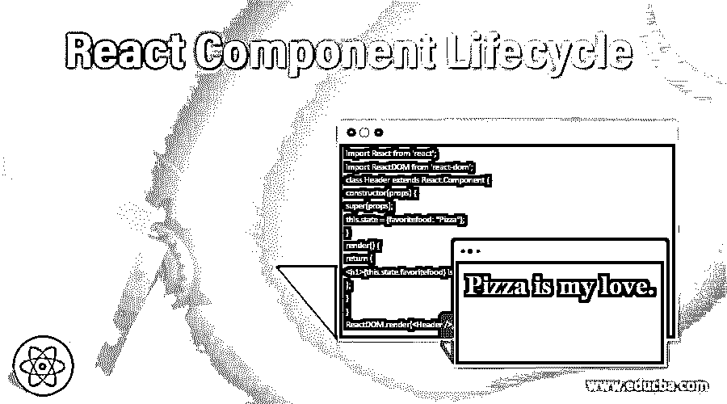
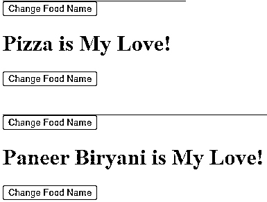
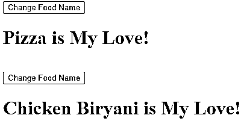
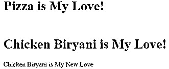
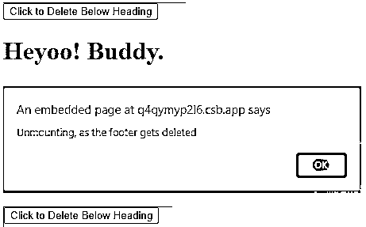

# 反应组件生命周期

> 原文：<https://www.educba.com/react-component-lifecycle/>

## React 组件生命周期简介

正如我们所见，React 应用程序由不同的组件组成，其集合定义了一个 React 应用程序。通常，所有组件都在它们之间进行交互，这有助于运行 React 应用程序。使用的每个组件都有自己的生命周期。以有序方式调用的一系列不同方法定义了 React 组件的生命周期。被调用的一系列方法被分为生命周期的三个不同阶段。在本文中，我们已经看到了所有的三个阶段以及其中使用的不同方法。这些阶段和方法按照构建 React 应用程序时应该遵循的顺序进行描述。

### 反应组件生命周期

React 中使用的每个组件都有其生命周期，可以在生命周期的三个阶段中对其进行监控和操作。

<small>网页开发、编程语言、软件测试&其他</small>

React 组件生命周期的三个主要阶段是:

*   增加
*   更新
*   卸载

#### 1.增加

挂载是指将不同的元素放入 DOM 的过程。有四种不同的方法，按照下面所写的特定顺序调用来安装组件。

*   构造函数()
*   getDerivedStateFromProps()
*   渲染()
*   componentDidMount()

render()方法是最重要的，并且总是被调用，rest 是可选的，如果我们定义了它们，它们就会被调用。

##### 1.构造器

第一个需要调用的方法是 constructor()，它是在我们初始化组件时定义的。这是最适合设置初始状态和值的地方。这些属性作为参数与 constructor()方法一起被调用。Super(props)应该总是在调用任何其他东西之前的最开始被调用，因为它启动父构造函数方法，并且组件很容易从父构造函数继承方法。

**举例:**

每当创建一个组件时，React 都会调用构造函数方法。在下面的示例中，我的 favouritefood 名称是使用构造函数方法显示的。

**index.js:**

**代码:**

`import React from 'react';
import ReactDOM from 'react-dom';
class Header extends React.Component {
constructor(props) {
super(props);
this.state = {favoritefood: "Pizza"};
}
render() {
return (
<h1>{this.state.favoritefood} is my love.</h1>
);
}
}
ReactDOM.render(, document.getElementById('root'));`

**输出:**

##### 2\. getDerivedStateFromProps

在将元素呈现到文档对象模型(DOM)之前，调用 getDerivedStateFromProps()方法。这是最适合设置基于初始道具的状态对象的地方。状态作为参数，对象随着状态的变化一起返回。

**举例:**

在实现 render 方法之前，调用 getDerivedStateFromProps 方法。在下面的示例中，使用 getDerivedStateFromProps 方法显示了 foodIlove。

**index.js:**

**代码:**

`import React from 'react';
import ReactDOM from 'react-dom';
class Header extends React.Component {
constructor(props) {
super(props);
this.state = {foodIlove: "Pizza"};
}
static getDerivedStateFromProps(props, state) {
return {foodIlove: props.favcol };
}
render() {
return (
<h1>{this.state.foodIlove} is my love! </h1>
);
}
}
ReactDOM.render(, document.getElementById('root'));`

**输出:**

##### 3.提供；给予

Render()是用于将 HTML 的输出呈现给 DOM 的方法，render()方法是代码中最重要的部分之一。

**举例:**

在下面的示例中，使用简单的呈现方法开发了一个简单的组件。

**index.js:**

**代码:**

`import React from 'react';
import ReactDOM from 'react-dom';
class Header extends React.Component {
render() {
return (
<h1>Heyoo! My name is Rahul.</h1>
);
}
}
ReactDOM.render(, document.getElementById('root'));`

**输出:**

##### 4.组件安装

渲染完组件后，我们需要调用 componentDidMount()方法。这里运行的语句要求组件在 DOM 中。

**举例:**

在下面的例子中，首先显示我的第一个第一个最喜欢的食物的名字，然后几秒钟后，我的第二个和第三个最喜欢的食物的名字显示出来，并保持不变。

**index.js:**

**代码:**

`import React from 'react';
import ReactDOM from 'react-dom';
class Header extends React.Component {
constructor(props) {
super(props);
this.state = {foodIlove: "Pizza"};
}
componentDidMount() {
setTimeout(() => {
this.setState({foodIlove: "Chicken Biryani"})
}, 2000)
}
render() {
return (
<h1>{this.state.foodIlove} is My Love! </h1>
);
}
}
ReactDOM.render(, document.getElementById('root'));`

**输出:**

#### 2.更新

更新组件被认为是组件生命周期的第二个阶段。每当组件的状态发生任何变化时，组件都需要更新。

对于更新，使用了五种方法，并按以下顺序调用:

*   getDerivedStateFromProps()
*   shouldComponentUpdate()
*   渲染()
*   getSnapshotBeforeUpdate()
*   componentDidUpdate()

render()方法是最重要的，并且总是被调用，rest 是可选的，如果我们定义了它们，它们就会被调用。

##### **1。getDerivedStateFromProps**

当我们开始更新阶段时，第一个被调用的方法是 getDerivedStateFromProps 方法。

**举例:**

在下面的例子中，在点击按钮时，食物名称应该已经变成了“Chicken Biryani”，但是由于食物的状态是通过调用 getDerivedStateFromProps 的 favfood 属性更新的。所以食物名称被翻译成“Paneer Biryani”。

**index.js:**

**代码:**

`import React from 'react';
import ReactDOM from 'react-dom';
class Header extends React.Component {
constructor(props) {
super(props);
this.state = {foodIlove: "Pizza"};
}
static getDerivedStateFromProps(props, state) {
return {foodIlove: props.favfood };
}
changeColor = () => {
this.setState({foodIlove: "Chicken Biryani"});
}
render() {
return (

<button type="button" onClick={this.changeColor}>Change Food Name</button>
<h1>{this.state.foodIlove} is My Love</h1>

);
}
}
ReactDOM.render(, document.getElementById('root'));`

**输出:**

##### 2.shouldComponentUpdate

shouldComponentUpdate()方法返回一个布尔值。它确认 React 是应该继续渲染还是应该停止。True 是返回的默认值。

**举例:**

在下面的例子中，当点击相应的按钮时，食物名称得到更新。如果我们把:

**代码:**

`shouldComponentUpdate() {
return false;
}`

那么即使点击了相应的按钮，食物名称也不会更新。

**index.js:**

**代码:**

`import React from 'react';
import ReactDOM from 'react-dom';
class Header extends React.Component {
constructor(props) {
super(props);
this.state = {foodIlove: "Pizza"};
}
shouldComponentUpdate() {
return true;
}
changefood1 = () => {
this.setState({foodIlove: "Chicken Biryani"});
}
changefood2 = () => {
this.setState({foodIlove: "Paneer Biryani"});
}
render() {
return (

<button type="button" onClick={this.changefood1}> Change Food Name </button>
<h1>{this.state.foodIlove} is My Love! </h1>
<button type="button" onClick={this.changefood2}> Change Food Name </button>

);
}
}
ReactDOM.render(, document.getElementById('root'));`

**输出:**

##### 3.提供；给予

每当组件需要更新时，我们都要调用 render()方法。HTML 的重新呈现将通过所有新的更改在 DOM 中完成。

**举例:**

在下面的例子中，当我们点击按钮时，食物名称得到更新。

**index.js**

`import React from 'react';
import ReactDOM from 'react-dom';
class Header extends React.Component {
constructor(props) {
super(props);
this.state = {foodIlove: "Pizza"};
}
changeFood = () => {
this.setState({foodIlove: "Chicken Biryani"});
}
render() {
return (

<button type="button" onClick={this.changeFood}>Change Food Name</button>
<h1>{this.state.foodIlove} is My Love!</h1>

);
}
}
ReactDOM.render(, document.getElementById('root'));`

**输出:**

##### 4.getSnapshotBeforeUpdate

getSnapshotBeforeUpdate()方法允许我们检查更新前的状态和属性的值。每当我们使用 getSnapshotBeforeUpdate()方法时，我们都需要包含 componentDidUpdate()方法，以使代码没有错误。

**举例:**

在下面的例子中，首先出现一个食品名称的文本，然后食品名称在几秒钟内自动更新，同样的文本显示更新的食品名称，后面跟着更多的文本。

**index.js:**

**代码:**

`import React from 'react';
import ReactDOM from 'react-dom';
class Header extends React.Component {
constructor(props) {
super(props);
this.state = {foodIlove: "Pizza"};
}
componentDidMount() {
setTimeout(() => {
this.setState({foodIlove: "Chicken Biryani"})
}, 2000)
}
getSnapshotBeforeUpdate(prevProps, prevState) {
document.getElementById("content1").innerHTML =
prevState.foodIlove + " is also My Love." ;
}
componentDidUpdate() {
document.getElementById("content2").innerHTML =
"But I love " + this.state.foodIlove +" More!";
}
render() {
return (

<h1>{this.state.foodIlove} is My Love</h1>

);
}
}
ReactDOM.render(, document.getElementById('root'));`

**输出:**

##### 5.componentDidUpdate

将组件更新到 DOM 后，我们需要调用 componentDidUpdate 方法。

**举例:**

在下面的例子中，首先是一个带有食物名称的文本，几秒钟后食物名称被更新，同样的带有更新的食物名称的文本后面跟着一些文本。

**index.js:**

**代码:**

`import React from 'react';
import ReactDOM from 'react-dom';
class Header extends React.Component {
constructor(props) {
super(props);
this.state = {foodIlove: "Pizza"};
}
componentDidMount() {
setTimeout(() => {
this.setState({foodIlove: "Chicken Biryani"})
}, 2000)
}
componentDidUpdate() {
document.getElementById("content").innerHTML =
this.state.foodIlove + " is My New Love";
}
render() {
return (

<h1>{this.state.foodIlove} is My Love!</h1>

);
}
}
ReactDOM.render(, document.getElementById('root'));`

**输出:**

#### 3.卸载

组件生命周期的最后一个阶段是卸载阶段。在这个阶段，我们从 DOM 中移除组件。只有一个方法被调用来卸载组件:

##### **1\. componentWillUnmount()**

 **当我们需要从 DOM 中移除或卸载一个组件时，我们调用 componentWillUnmount 方法。

**举例:**

在下面的示例中，按钮用于删除标题。

**index.js:**

**代码:**

`import React from 'react';
import ReactDOM from 'react-dom';
class Container extends React.Component {
constructor(props) {
super(props);
this.state = {show: true};
}
Headerdel = () => {
this.setState({show: false});
}
render() {
let footer;
if (this.state.show) {
footer = <Child />;
};
return (

<button type="button" onClick={this.Headerdel}>Click to Delete Below Heading</button>
{footer}

);
}
}
class Child extends React.Component {
componentWillUnmount() {
alert("Unmounting, as the footer gets deleted");
}
render() {
return (
<h1>Heyoo! Buddy.</h1>
);
}
}
ReactDOM.render(<Container />, document.getElementById('root'));`

**输出:**

### 结论

在上述文章的基础上，我们介绍了 React 组件生命周期。组件生命周期的三个主要阶段以及它们的方法在上面以有序的方式进行了描述，这些例子将帮助您理解创建 React 应用程序的过程。

### 推荐文章

这是 React 组件生命周期的指南。在这里，我们讨论一个介绍，React 组件的三个主要阶段，以及适当的示例和代码。您也可以浏览我们的其他相关文章，了解更多信息——

1.  [反应受控输入](https://www.educba.com/react-controlled-input/)
2.  [反应三元运算符](https://www.educba.com/react-ternary-operator/)
3.  [反应构造器](https://www.educba.com/react-constructor/)
4.  [反应键](https://www.educba.com/react-keys/)

**