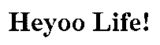
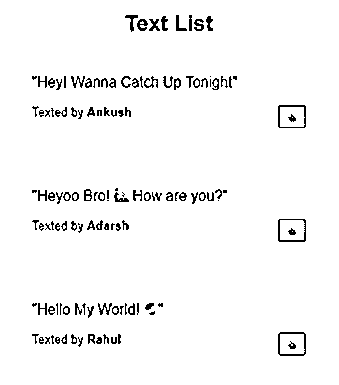
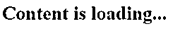
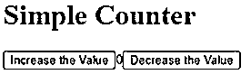
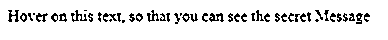
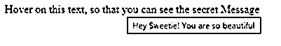

# 反应高阶成分

> 原文：<https://www.educba.com/react-higher-order-component/>

## 反应高阶组分介绍

为了向现有组件添加额外的功能，使用更高阶的组件。这些组件是 JavaScript 的功能。高阶组件接收数据并根据数据返回值，这使它们成为纯函数。每当数据输入发生变化时，较高阶的元件会以新的数据输入重新运行。这意味着每当我们想要改变返回值时，我们只需要相应地改变数据，而高阶分量不需要改变。高阶组件返回一个新组件，该组件实际上包装在提供给函数的原始组件中。在本文中，我们将通过多个例子来理解它的工作方式，如一个简单的高阶组件，使用 React 高阶组件的文本列表，使用 Loader 的 React 高阶组件，使用高阶组件的计数器，使用高阶组件的悬停文本显示。下面分别解释这些例子。

**语法:**

<small>网页开发、编程语言、软件测试&其他</small>

`varnewData = {
data: 'Welcome',
}
varMyHOC = ComposedComponent => class extends React.Component {
componentDidMount() {
this.setState({
data: newData.data
});
}
export default MyHOC(MyComponent);`

### 反应高阶元件的工作

下面是一些例子:

#### 1.简单反应高阶成分

开发它所需的文件:

*   index.html
*   索引. js

##### 1.index.html

`

`

##### 2.索引. js

`import React from 'react';
import { render } from 'react-dom';
const Hello = ({ name }) =><h1>Heyoo {name}!</h1>;
function simpleHOC(WrappedComponent) {
return class extends React.Component{
render() {
return <WrappedComponent {...this.props}/>;
}
}
}
constNewComponent = simpleHOC(Hello);
const App = () =>

<NewComponent name="Life" />

;
render(<App />, document.getElementById('root'));`

**输出:**

#### 2.使用高阶分量的文本列表

src 文件夹中的组件:

*   索引. js
*   消息. json

##### 1.索引. js

`import React from "react";
import { render } from "react-dom";
import * as data from "./messages.json";
constMessageTemplate = props => {
return (

"{props.text}"

<small>
Texted by <b>{props.sentBy}</b>
</small>
{props.button}

);
};
constlikeButtonHOC = WrappedComponent => {
return class LikeButton extends React.Component {
constructor(props) {
super(props);
this.state = { hasLike: false };
}
handleClick() {
this.setState({
hasLike: !this.state.hasLike
});
}
render() {
constbuttonText = this.state.hasLike ? "Liked ✔" : "👍";
constlikedClass = this.state.hasLike ? "liked" : "";
const button = (
<button className={likedClass} onClick={this.handleClick.bind(this)}>
{buttonText}
</button>
);
return <WrappedComponent button={button} {...this.props} />;
}
};
};
const App = props => {
constMessageContainer = likeButtonHOC(MessageTemplate);
return (

<h2>Text List</h2>
{props.messages.map((message, i) => (
<MessageContainer
key={`message-${i}`}
text={message.text}
sentBy={message.sentBy}
/>
))}

);
};
render(<App messages={data.messages} />, document.getElementById("root"));`

##### 2.消息. json

`{
"messages": [
{
"text": "Hey! Wanna Catch Up Tonight",
"sentBy": "Ankush"
},
{
"text": "Heyoo Bro! 🙋 How are you?",
"sentBy": "Adarsh"
},
{
"text": "Hello My World! 🌏",
"sentBy": "Rahul"
}
] }`

**输出:** 

#### 3.将高阶组件与加载器反应

src 文件夹中的组件:

*   App.js
*   hoc.js
*   索引. js
*   样式. css

##### 1.App.js

`import React from "react";
import ReactDOM from "react-dom";
import HOC from "./hoc";
import "./styles.css";
class WrapApp extends React.Component {
constructor(props) {
super(props);
this.state = { data: {} };
}
render() {
console.log("here--->", this.props);
return (

<h1>EDUCBA</h1>
<h2>Welome to best platofrm for Latest Courses and Trainings</h2>
<h3>We provide trainings related to Data Science, Data Analysis, and every emaerging technology</h3>

);
}
}
const App = HOC(WrapApp);
export default App;`

##### 2.hoc.js

`import React
, { Component } from "react";
let HOC = WComponent => {
return class Loader extends Component {
constructor(props) {
super(props);
this.state = {
data: [],
loading: true
};
}
componentDidMount() {
fetch("https://jsonplaceholder.typicode.com/posts/1")
.then(response =>response.json())
.then(data => {
this.setState({ data, loading: false });
});
}
render() {
console.log("i", this.state.data);
if (this.state.data.length === 0) {
return <h1>Content is loading...</h1>;
} else {
return <WComponent {...this.state} />;
}
}
};
};
export default HOC;`

##### 3.索引. js

`import React from "react";
import ReactDOM from "react-dom";
import App from "./App";
constrootElement = document.getElementById("root");
ReactDOM.render(<App />, rootElement);`

##### 4.样式. css

`.App {
font-family: 'Times New Roman'
, Times
, serif
text-align: center;
}`

**输出:**

#### 4.使用 React 高阶组件的计数器

src 文件夹中的组件:

*   index.js]
*   样式. css

##### 1.索引. js

`import React from "react";
import { render } from "react-dom";
constwithCounter = Component =>
class Hoc extends React.Component {
constructor(props) {
super(props);
this.state = { count: 0 };
}
update = type => {
if (type === "Inc") {
this.setState(({ count }) => ({ count: count + 1 }));
} else if (type === "Dec") {
this.setState(({ count }) => ({ count: count - 1 }));
}
};
render() {
return <Component {...this.state} {...this.props} update={this.update} />;
}
};
const Counter = ({ count, update }) => (

<h1>Simple Counter</h1>
<button onClick={() => update("Inc")}>Increase the Value</button>
{ count }
<button onClick={() => update("Dec")}>Decrease the Value</button>

);
constCounterExample = withCounter(Counter);
render(<CounterExample />, document.getElementById("root"));`

##### 2.样式. css

`.App {
font-family: arial;
text-align: center;
}`

**输出:**

#### 5.带有 React 高阶组件的 Hoover 上的文本显示

src 文件夹中的组件:

*   hocs 文件夹
*   MyComponent.js
*   索引. js
*   样式. css

hocs 文件夹中的一个组件:

*   索引. js
*   withTooltip.js

##### 1.index.js(在 hocs 文件夹中)

`export * from "./withTooltip";`

##### 2.withTooltip.js(在 hocs 文件夹中)

`import React from "react";
export constwithTooltip = WrappedComponent =>({ tooltipText, ...props }) => (

<WrappedComponent {...props} />

);`

##### 3.MyComponent.js

`import React from "react";
import { withTooltip } from "./hocs";
constMyComponent = ({ label }) =>
{label}
;
export default withTooltip(MyComponent);`

##### 4.index.js

`import React from "react";
import ReactDOM from "react-dom";
import "./styles.css";
import MyComponent from "./MyComponent";
function App() {
return (

<MyComponent
tooltipText={"Hey Sweetie! You are so beautiful"}
label={"Hover on this text, so that you can see the secret Message"}
/>

);
}
constrootElement = document.getElementById("root");
ReactDOM.render(<App />, rootElement);`

##### 5.样式. css

`.App {
font-family: 'Times New Roman'
, Times
, serif;
text-align: center;
}`

**输出:**

### 推荐文章

这是对高阶分量进行反应的指南。在这里，我们还讨论了 react 高阶组件的介绍和工作方式，以及示例和代码实现。您也可以看看以下文章，了解更多信息–

1.  [React 路由器转换](https://www.educba.com/react-router-transition/)
2.  [React 组件库](https://www.educba.com/react-component-library/)
3.  [反应本地本地存储](https://www.educba.com/react-native-local-storage/)
4.  [React-原生日历](https://www.educba.com/react-native-calendar/)