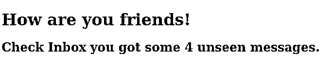
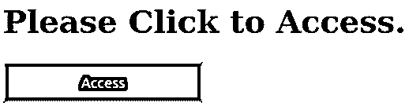
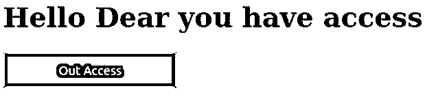

# 反应三元运算符

> 原文：<https://www.educba.com/react-ternary-operator/>

## 反应三元算子简介

react js 中的三元运算符的工作方式与其在 Javascript 中的工作方式相同。在三元运算符的帮助下，我们可以在一个条件的基础上显示内容，其中所有内容都取决于条件 true 和 false 我们可以将内容放在条件基础上。我们可以举一个三元运算符的例子，比如我们从服务器获取数据，而数据是空的，那么我们可以使用数据检查三元运算符，如果数据是空的或者服务器返回空的日期，那么显示一些静态数据，这样看起来就不错，而不是向最终用户显示空的。

**语法:**

<small>网页开发、编程语言、软件测试&其他</small>

下面是 react js 中三元运算符的简单语法。在下面的第一个语法中，我们写了条件表达式。这个表达式返回任何布尔值，html 代码的执行依赖于它的成功，它失败或者只是条件为假，那么 html 代码将不会显示。

为了更好地理解，请参见下面的三元运算符语法。

`{Conditional expression > 0 &&
<ANY HTML TAG TO DISPLAY CONTENTS>
//Display any message on successful condition
</ANY HTML TAG TO DISPLAY CONTENTS>`

### React 中三元运算符是如何工作的？

在理解三元运算符的工作原理之前，我们需要理解为什么我们需要三元运算符。您已经在 JavaScript 中看到了条件语句，我们根据条件的成功或失败来执行语句，同样，我们可能会遇到这样的情况，我们希望根据条件显示一个 html 或任何组件。为了解释它的工作原理，我们可以举几个例子。

*   我们可以在花括号里放一个条件表达式。
*   写在花括号内的表达式可以是多个表达式的组合，但是它们总是返回一个布尔值。
*   如果写在花括号内的条件表达式为真，那么我们将显示写在第一个。

### React 三元运算符的示例

在下面，我们将展示两个例子来解释 react 三元运算符。如果我们想运行这些例子，那么我们可以创建一个 html 文件，我们可以将 react 代码放在 javascript 中，将 html 代码放在 html 和 css 代码中，我们可以得到与屏幕相同的输出。

#### 示例#1

这是一个简单的例子，我们根据一个标签的真或假来显示消息。在这里，我们使用了简单的三元运算符来检查数组的长度，如果长度大于 0，则表示有消息，如果长度不大于 0，则表示不显示任何内容。

**Javascript 部分，**

`//Main components which will display the message
function MsgBox(props) {
constunseenmsg = props.unseenmsg;
return (

<h1>How are you friends!</h1>
//Checking the message length if length is greater than zero or not
{unseenmsg.length> 0 &&
<h2>
Check Inbox you got some  {unseenmsg.length} unseen messages.
</h2>
}

);
}
//Message contents of array
constmsg = ['GO', 'Ruby On Rail', 'Javascript', 'React JS'];
ReactDOM.render(
<MsgBoxunseenmsg={msg} />,
document.getElementById('main')
);`

**HTML 部件，**

这是显示 react 内容的 HTML。

`

`

**CSS 零件，**

CSS 很少为身体做设计

`* {
margin: 1;
background-color:yellow;
}`

**输出:**

在这个屏幕中，我们可以看到消息，因为数组长度大于 0，表明消息也是可见的。

#### 实施例 2

举例说明在不同的情况下点击按钮会显示不同的信息。在下面的点击按钮的例子中，我们显示消息 change。

请在输出屏幕上找到下面的例子。

**JavaScript 部件，**

`//Component to display the main contents with button
class AccessComponent extends React.Component {
constructor(props) {
super(props);
//Binding the function so that it will be available for this call
this.manageAccessClick = this.manageAccessClick.bind(this);
this.manageOutAccessClick = this.manageOutAccessClick.bind(this);
this.state = {isAccessed: false};
}
//Function to handle button change and message change on the basis of the flag
manageAccessClick() {
this.setState({isAccessed: true});
}
manageOutAccessClick() {
//Changing flag to false
this.setState({isAccessed: false});
}
render() {
//Getting the value of the value of the isAccessed to handle the display work
constisAccessed = this.state.isAccessed;
let ClickableButton;
//checking the flag status
if (isAccessed) {
ClickableButton = <OutAccessButtononClick={this.manageOutAccessClick} />;
} else {
ClickableButton = <AccessButtononClick={this.manageAccessClick} />;
}
return (

<Welcome isAccessed={isAccessed} />
{ClickableButton}

);
}
}
function WelcomeMsgUser(props) {
return <h1>Hello Dear you have access</h1>;
}
function WelcomeMsgGuest(props) {
return <h1>Please Click to Access.</h1>;
}
//Function to display different different contents using operator
function Welcome(props) {
constisAccessed = props.isAccessed;
if (isAccessed) {
return <WelcomeMsgUser />;
}
return <WelcomeMsgGuest />;
}
//Initial button to display access
function AccessButton(props) {
return (
<button onClick={props.onClick}>
Access
</button>
);
}
//Button after clicking the Access button
function OutAccessButton(props) {
return (
//Here we are calling and changing the button on call
<button onClick={props.onClick}>
Out Access
</button>
);
}
//Finally returning the all the combination of the react component to display
ReactDOM.render(
<AccessComponent />,
document.getElementById('main')
);`

**HTML 部件，**

这部分是 html，负责包含所有的 react 组件并显示它们。

`

`

**CSS 零件，**

下面是这个例子的 css 设计

`* {
font-size:14;
margin: 1;
}
button {
height: 42px;
background: black;
color: red;
width: 202px;
}`

**输出:**

下面我们展示了两个屏幕示例，一个是点击访问按钮之前的屏幕，另一个是点击访问按钮之后的屏幕，在这里，点击按钮和消息都会发生变化。

### 结论

从本教程中，我们了解了 react 三元运算符的基本概念，也了解了 react 三元运算符的工作原理。我们看到了三元运算符的简单语法，以及一些解释其工作原理的重要例子。

### 推荐文章

这是一个反应三元运算符的指南。在这里我们也讨论了三元运算符的定义以及如何在 react？以及不同的示例及其代码实现。您也可以看看以下文章，了解更多信息–

1.  [React Native SQLite](https://www.educba.com/react-native-sqlite/)
2.  [反应原生燃烧基](https://www.educba.com/react-native-firebase/)
3.  [React-Native 样式表](https://www.educba.com/react-native-stylesheet/)
4.  [反应本地一个信号](https://www.educba.com/react-native-onesignal/)