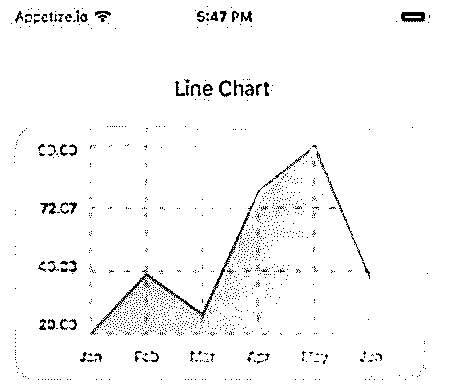
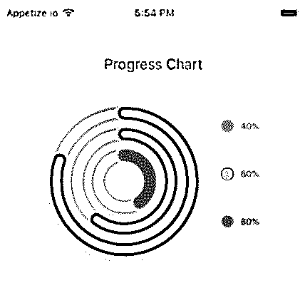
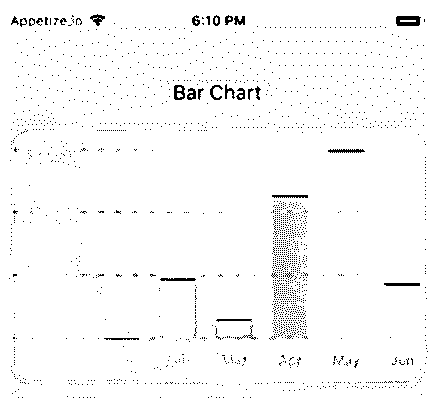
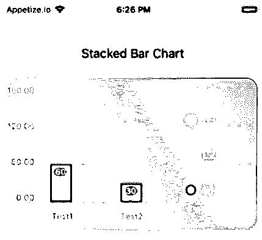
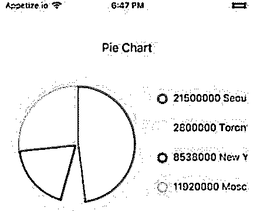

# 反应原生图表

> 原文：<https://www.educba.com/react-native-charts/>

## React 本机图表简介

下面的文章提供了 React 本机图表的概述。图表是吸引人的视觉元素，有助于提升移动应用程序的感觉和外观。通过添加图表作为设计工具，人们可以使他们的应用程序更具吸引力，同时也提升了用户体验。图表有效地传达了数据故事，并且非常易于阅读。有了它的组件，一个应用程序的故事讲述变得非常强大。人们可以非常容易和有效地创建贡献图、进度图、条形图、饼图、贝塞尔线图和折线图。他们提供了一个图表 API，这个 API 是高度可定制的，非常灵敏，易于插入，非常易于使用。

**导入图表套件的语法**

<small>网页开发、编程语言、软件测试&其他</small>

1.使用纱线

`yarn add react-native-chart-kit`

2.使用 NPM

`npm install react-native-chart-kit`

**导入图表组件的语法**

`import { LineChart,
BarChart,
PieChart,
ProgressChart,
ContributionGraph,
StackedBarChart
} from 'react-native-chart-kit'`

### React 本机图表示例

下面是一些例子:

#### 示例#1

折线图

**代码:**

`import * as React from 'react';
import { Text, View, StyleSheet, Dimensions, ScrollView } from 'react- native';
import {
LineChart,
BarChart,
PieChart,
ProgressChart,
ContributionGraph,
StackedBarChart,
} from 'react-native-chart-kit';
export default class App extends React.Component {
render() {
return (
<ScrollView>
<View style={styles.container}>
<View>
{/*It is an Example of LineChart*/}
<Text
style={{
textAlign: 'center', fontSize: 18,
padding: 16,
marginTop: 16,
}}>
Line Chart
</Text>
<LineChart data={{
labels: [ 'Jan',
'Feb',
'Mar',
'Apr',
'May',
'Jun',
],
datasets: [
{
data: [20, 45, 28, 80, 99, 43],
strokeWidth: 2,
},
],
}}
width={Dimensions.get('window').width - 16}
height={220}
chartConfig={{
backgroundColor: '#c92ac7',
backgroundGradientFrom: '#7bede2',
backgroundGradientTo: '#dbb8cd',
decimalPlaces: 2,
color: (opacity = 1) => `rgba(0, 0, 0, ${opacity})`,
style: {
borderRadius: 16,
},
}}
style={{ marginVertical: 8,
borderRadius: 16,
}}
/>
</View>
</View>
</ScrollView>
);
}
}
const styles = StyleSheet.create({
container: {
flex: 1,
justifyContent: 'center', padding: 8,
paddingTop: 30,
backgroundColor: '#ecf0f1',
},
});`

**输出:**

#### 例 2

进度表

**代码:**

`import * as React from 'react';
import { Text, View, StyleSheet, Dimensions, ScrollView } from 'react- native';
import {
LineChart,
BarChart,
PieChart,
ProgressChart,
ContributionGraph,
StackedBarChart,
} from 'react-native-chart-kit';
export default class App extends React.Component {
render() {
return (
<ScrollView>
<View style={styles.container}>
<View>
{/*It is an Example of Progress Chart*/}
<Text
style={{
textAlign: 'center', fontSize: 18,
padding: 16,
marginTop: 16,
}}>
Progress Chart
</Text>
<ProgressChart data={[0.4, 0.6, 0.8]}
width={Dimensions.get('window').width - 16} height={220}
chartConfig={{
backgroundColor: '#cc14aa',
backgroundGradientFrom: '#7ff591',
backgroundGradientTo: '#f0f716',
decimalPlaces: 2,
color: (opacity = 1) => `rgba(0, 0, 0, ${opacity})`,
style: {
borderRadius: 16,
},
}}
style={{ marginVertical: 8,
borderRadius: 16,
}}
/>
</View>
</View>
</ScrollView>
);
}
}
const styles = StyleSheet.create({
container: {
flex: 1,
justifyContent: 'center', padding: 8,
paddingTop: 30, backgroundColor: '#ecf0f1',
},
});`

**输出:**

#### 实施例 3

条形图

**代码:**

`import * as React from 'react';
import { Text, View, StyleSheet, Dimensions, ScrollView } from 'react- native';
import {
LineChart,
BarChart,
PieChart, ProgressChart,
ContributionGraph,
StackedBarChart,
} from 'react-native-chart-kit';
export default class App extends React.Component {
render() {
return (
<ScrollView>
<View style={styles.container}>
<View>
{/*It is an Example of Bar Chart*/}
<Text
style={{
textAlign: 'center',
fontSize: 18,
padding: 16,
marginTop: 16,
}}>
Bar Chart
</Text>
<BarChart data={{
labels: [ 'Jan',
'Feb',
'Mar',
'Apr',
'May',
'Jun',
],
datasets: [
{
data: [20, 45, 28, 80, 99, 43],
},
],
}}
width={Dimensions.get('window').width - 16}
height={220}
yAxisLabel={'$'} chartConfig={{
backgroundColor: '#10c9bd',
backgroundGradientFrom: '#f2b40a',
backgroundGradientTo: '#99f7e3',
decimalPlaces: 2,
color: (opacity = 1) => `rgba(0, 0, 0, ${opacity})`,
style: {
borderRadius: 16,
},
}}
style={{ marginVertical: 8,
borderRadius: 16,
}}
/>
</View>
</View>
</ScrollView>
);
}
}
const styles = StyleSheet.create({
container: {
flex: 1,
justifyContent: 'center', padding: 8,
paddingTop: 30, backgroundColor: '#ecf0f1',
},
});`

**输出:**

#### 实施例 4

堆积条形图

**代码:**

`import * as React from 'react';
import { Text, View, StyleSheet, Dimensions, ScrollView } from 'react- native';
import {
LineChart,
BarChart,
PieChart,
ProgressChart,
ContributionGraph,
StackedBarChart,
} from 'react-native-chart-kit';
export default class App extends React.Component {
render() {
return (
<ScrollView>
<View style={styles.container}>
<View>
{/*It is an Example of StackedBar Chart*/}
<Text
style={{
textAlign: 'center'
fontSize: 18,
padding: 16,
marginTop: 16,
}}>
Stacked Bar Chart
</Text>
<StackedBarChart data={{
labels: ['Test1', 'Test2'],
legend: ['L1', 'L2', 'L3'],
data: [[60, 60, 60], [30, 30, 60]],
barColors: ['#f52105', '#ff9e1f', '#53ff1f'],
}}
width={Dimensions.get('window').width - 16}
height={220}
chartConfig={{
backgroundColor: '#10abc9',
backgroundGradientFrom: '#f7f78b',
backgroundGradientTo: '#fc5858',
decimalPlaces: 2,
color: (opacity = 1) => `rgba(0, 0, 0, ${opacity})`, style: {
borderRadius: 16,
},
}}
style={{ marginVertical: 8,
borderRadius: 16,
}}
/>
</View>
</View>
</ScrollView>
);
}
}
const styles = StyleSheet.create({
container: {
flex: 1,
justifyContent: 'center', padding: 8,
paddingTop: 30, backgroundColor: '#ecf0f1',
},
});`

**输出:**

#### 实施例 5

圆形分格统计图表

**代码:**

`import * as React from 'react';
import { Text, View, StyleSheet, Dimensions, ScrollView } from 'react- native';
import {
LineChart,
BarChart,
PieChart,
ProgressChart,
ContributionGraph,
StackedBarChart,
} from 'react-native-chart-kit';
export default class App extends React.Component {
render() {
return (
<ScrollView>
<View style={styles.container}>
<View>
{/*It is an Example of Pie Chart*/}
<Text
style={{
textAlign: 'center',
fontSize: 18,
padding: 16,
marginTop: 16,
}}>
Pie Chart
</Text>
<PieChart data={[
{
name: 'Seoul',
population: 21500000,
color: '#b81ff0',
legendFontColor: '#050505',
legendFontSize: 15,
},
{
name: 'Toronto',
population:  2800000,
color: '#f2f763',
legendFontColor: '#050505',
legendFontSize: 15,
},
{
name: 'New York',
population: 8538000,
color: '#f51818',
legendFontColor: '#050505',
legendFontSize: 15,
},
{
name: 'Moscow',
population: 11920000,
color: '#62f518',
legendFontColor: '#050505',
legendFontSize: 15,
},
]}
width={Dimensions.get('window').width - 16} height={220}
chartConfig={{ backgroundColor: '#194ad1',
backgroundGradientFrom: '#f74871',
backgroundGradientTo: '#ffbc47',
decimalPlaces: 2,
color: (opacity = 1) => `rgba(0, 0, 0, ${opacity})`,
style: {
borderRadius: 16,
},
}}
style={{ marginVertical: 8,
borderRadius: 16,
}}
accessor="population"
backgroundColor="transparent"
paddingLeft="15"
absolute
/>
</View>
</View>
</ScrollView>
);
}
}
const styles = StyleSheet.create({
container: {
flex: 1,
justifyContent: 'center',
padding: 8,
paddingTop: 30,
backgroundColor: '#ecf0f1',
},
});`

**输出:**

### 结论

在以上讨论的基础上，我们了解了可以创建的不同图表。这些图表有助于提供基于移动应用的最佳用户体验。我们已经创建了折线图、进度图、条形图、堆积条形图和饼图，尽管贡献图和贝塞尔折线图也可以在其中创建。实现这些图表来升级 UI/UX 是非常容易和高效的。

### 推荐文章

这是一个反应原生图表的指南。在这里，我们讨论介绍和例子。您也可以看看以下文章，了解更多信息–

1.  [反应原生架构](https://www.educba.com/react-native-architecture/)
2.  [反应原生文本输入](https://www.educba.com/react-native-textinput/)
3.  [反应原生闪屏](https://www.educba.com/react-native-splash-screen/)
4.  [React 原生搜索栏](https://www.educba.com/react-native-search-bar/)

