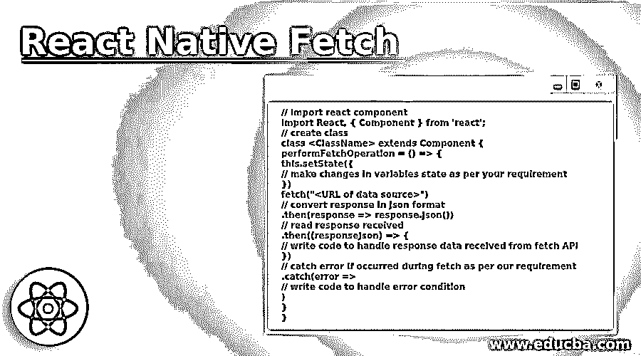

# 反应本地提取

> 原文：<https://www.educba.com/react-native-fetch/>

## React 本机获取简介

从数据源获取数据被认为是任何移动应用程序的基本要求。为了从给定的 URL 中检索数据，它提供了 fetch API，fetch API 是一个网络 API，其工作方式类似于 rest API，fetch API 接受源的 URL 作为需要从中提取数据的参数。

**语法:**

<small>网页开发、编程语言、软件测试&其他</small>

`// import react component
import React, { Component } from 'react';
// create class
class <ClassName> extends Component {
performFetchOperation = () => {
this.setState({
// make changes in variables state as per your requirement
})
fetch("<URL of data source>")
// convert response in json format
.then(response => response.json())
// read response received
.then((responseJson) => {
// write code to handle response data received from fetch API
})
// catch error if occurred during fetch as per our requirement
.catch(error =>
// write code to handle error condition
)
}
}`

上面的语法显示了如何在 react native 中使用 fetch API。在上面的语法中，我们定义了一个负责从给定的数据源执行提取操作的方法。

### React 本机获取的函数

Fetch 可用于从给定的 URL 源中检索数据。下面给出的是突出的功能。

#### 1.初始化 React 本机类的构造函数

*   首先，我们需要定义两种不同的状态，一种是布尔变量，另一种是数组，由 fetch API 加载的数据将存储在该数组中。
*   构造函数中设置为 true 的布尔变量表示已经开始从 URL 加载数据。
*   下面是如何定义具有 fetch 实现的构造函数类。

**代码:**

`constructor(props) {
super(props);
this.state = {
dataloadstarted: true, // boolean variable
dataReceivedFromFetch:[] // array of data
};
}`

#### 2.编写 React 本机类的实现

*   在构造函数初始化成功后，我们将编写 react native fetch API 的实现。
*   例如，我们将使用 react native lifecycle 的 componentDidMount 方法来编写它的实现，因为这个方法在应用程序开始时被调用。其中 fetch 方法的实现包括按照我们的要求处理从给定 URL 收到的响应。
*   它提供了 catch 子句，其目的是在从给定的 URL 获取数据时处理失败场景。

#### 3.将从获取接收的数据呈现到用户界面上

*   这是使用 react native fetch API 的最后一步。
*   这一步涉及到从 API 接收的数据在所需的用户界面上呈现。
*   这通常在 react 本地类的 render 方法中完成。

### React 本机获取的示例

下面的例子清楚地展示了其中涉及的不同步骤:

**代号:**

`import React from "react";
import {
StyleSheet,
View,
ActivityIndicator,
FlatList,
Text,
TouchableOpacity
} from "react-native";
export default class App extends React.Component {
constructor(props) {
super(props);
this.state = {
loading: true,
dataSource:[] };
}
componentDidMount(){
fetch("http://dummy.restapiexample.com/api/v1/employees")
.then(response => response.json())
.then((responseData)=> {
this.setState({
loading: false,
dataSource: responseData.data
})
})
.catch(error=>console.log(error)) *//to catch the errors if any*
}
FlatListItemSeparator = () => {
return (
<View style={{
height: .5,
width:"100%",
backgroundColor:"rgba(0,0,0,0.5)",
}}
/>
);
}
renderItem=(data)=>
<TouchableOpacity style={styles.list}>
<Text style={styles.lightText}>Employee Name : {data.item.employee_name}</Text>
<Text style={styles.lightText}>Employee Salary : {data.item.employee_salary}</Text>
<Text style={styles.lightText}>Employee Age : {data.item.employee_age}</Text></TouchableOpacity>
render(){
if(this.state.loading){
return(
<View style={styles.loader}>
<ActivityIndicator size="large" color="#0c9"/>
</View>
)}
return(
<View style={styles.container}>
<View>
<Text> Employee Details</Text>
</View>
<FlatList
data= {this.state.dataSource}
ItemSeparatorComponent = {this.FlatListItemSeparator}
renderItem= {item=> this.renderItem(item)}
keyExtractor= {item=>item.id.toString()}
/>
</View>
)}
}
const styles = StyleSheet.create({
container: {
flex: 1,
backgroundColor: "#0c9"
},
loader:{
flex: 1,
justifyContent: "center",
alignItems: "center",
backgroundColor: "#fff"
},
list:{
paddingVertical: 2,
margin: 5,
backgroundColor: "#fff"
}
});`

在上面的代码中，我们从 URL[http://dummy.restapiexample.com/api/v1/employees](http://dummy.restapiexample.com/api/v1/employees)获取雇员数据，并在列表视图中显示雇员数据。

**输出:**

### 推荐文章

这是一个反应原生获取的指南。在这里，我们讨论了简介，以及 Fetch 如何在 React Native 中工作，并附有示例。您也可以看看以下文章，了解更多信息–

1.  [React 原生库](https://www.educba.com/react-native-libraries/)
2.  [反应原生架构](https://www.educba.com/react-native-architecture/)
3.  [反应原生燃烧基](https://www.educba.com/react-native-firebase/)
4.  [反应原生抽屉](https://www.educba.com/react-native-drawer/)

