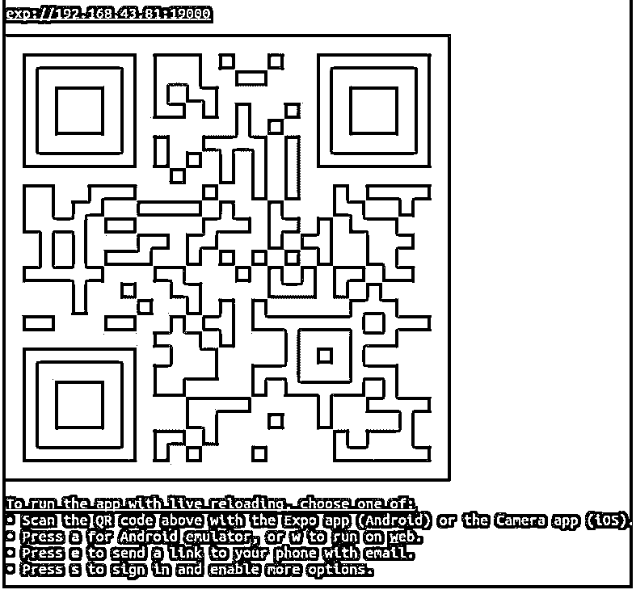
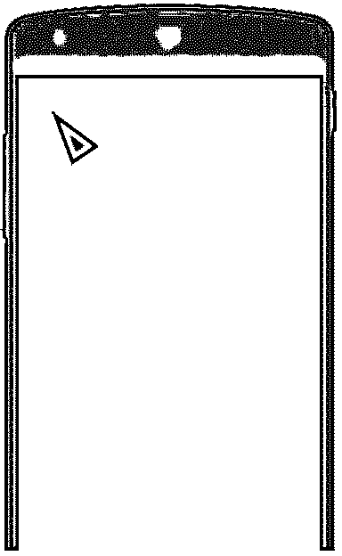
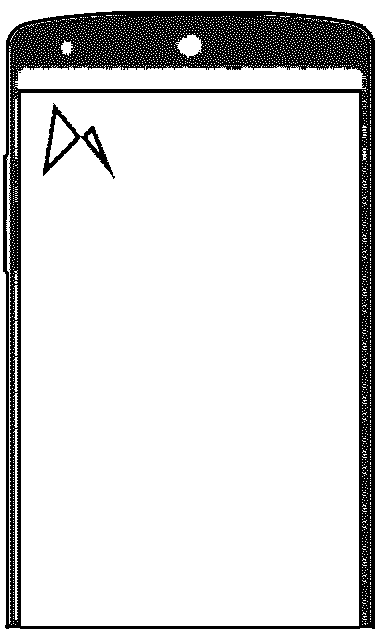
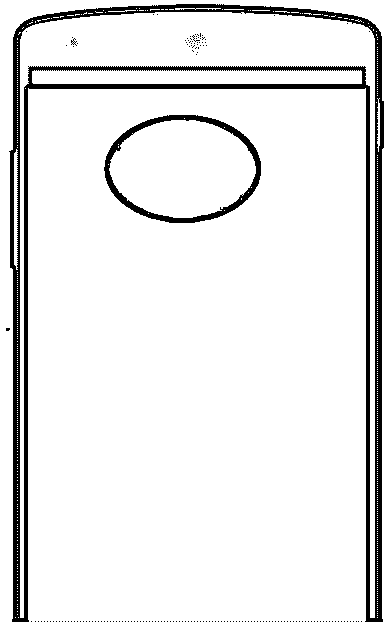

# 反应本地 SVG

> 原文：<https://www.educba.com/react-native-svg/>

## React 原生 SVG 简介

下面的文章提供了 React Native SVG 的概要。它允许我们在 android 和 IOS 上设计各种类型的形状，形状可以是直线或简单的矩形。它还允许我们用各种颜色和各种结构填充形状。它的性能优于现有的其他 SVG 模块。如果你在 android 和 IOS 系统上见过各种形状，那么这是这些形状的最佳选择，它们提供了一种软机制，我们可以轻松地将结构放置在另一个内部，我们可以定义子形状的颜色以及父形状的颜色。

### 句法

下面是 react-native-svg 的简单语法，在下面的语法中，我们导入 svg 和形状(圆形、矩形、多边形、直线等)。这里的形状可以是任何形状，如圆形、矩形、线形等。我们在 Svg 组件中编写形状，在形状组件中将有各种与形状相关的属性，这些属性将定义形状的结构，例如形状的高度、宽度和填充颜色。我们可以通过定义 Svg 的高度和宽度来定义它的维度。

<small>网页开发、编程语言、软件测试&其他</small>

`import Svg, { Shape } from 'react-native-svg';
<Svg height="200" width="200">
<Shape
//Here we can write various attributes for the shape like height, width, color, and many more attributes
/>
</Svg>`

### 如何用 SVG 反应 Native？

*   要在 react native for android 和 IOS 应用程序中使用 svg，我们需要使用 react-native-svg 模块，该模块包含两个重要内容来执行操作或生成所需的形状，一个是 SVG，另一个是我们希望在 android 和 IOS 应用程序上显示的形状类型。
*   无论我们想要在设备屏幕上显示什么形状和设计，我们都需要将导入的形状放入 Svg 中，该形状是从 react-native-svg 模块导入的。
*   在这里，我们可以定义和提及用于创建结构的各种属性值。
*   形状可以是圆形、矩形、多边形或简单的直线。我们可以设置形状内部的颜色填充以及要显示的形状的高度和宽度。它还允许我们在另一个形状中定义一个形状，这使它更强大，我们还可以为内部和外部形状定义不同的颜色和外观。

### React 本机 SVG 的示例

在下面我们已经给出了一些重要的例子。如果我们想运行下面的例子，那么首先我们需要对应用程序进行设置，然后我们可以运行命令 npm start，在 npm start 上，我们可以选择在 IOS 或 Android 手机上查看输出。我们需要在手机上安装 expo，以便在手机上进行测试。expo 在运行 npm start 命令时，将显示一个 qr 代码，如下图所示。扫描 QR 代码时，我们将看到以下代码的输出。

#### 示例#1

下面是一个简单的例子，我们通过传递所需的属性来显示多边形以及多边形的各种设计。

**代码:**

`//Importing the react core package for uses
import * as React from 'react';
//Importing the Svg and ploygon to create a shape of Polygon
import Svg, { Polygon } from 'react-native-svg';
export default function ExampleSVG(props) {
return (
<Svg height="200" width="200">
<Polygon
fill="black"
points="50,52 88,80 66,95"
strokeWidth="10"
stroke="green"
/>
</Svg>
);
}`

**输出:**

#### 实施例 2

在下面的例子中，我们已经定义了线条的结构，在线条中，我们可以定义我们想要在两条线之间填充的颜色。路径有许多属性，其中一些我们可以在下面的例子中看到。

**代码:**

`//Importing the react core package for uses
import * as React from 'react';
//Importing the Svg and Path to create a shape of Line
import Svg, { Path } from 'react-native-svg';
export default function ExampleSVG(props) {
return (
//Defining the Dimension for the Svg
<Svg height="200" width="200">
//Here the path is nothing but the line and we are passing some of the attribute for path
<Path
d="M35 11 L99 89 L77 34 L23 88"
fill="green"
stroke="red"
/>
</Svg>
);
}`

**输出:**

#### 实施例 3

下面是一个简单的例子，我们正在创建一个椭圆的形状。在这个形状中，我们传递了椭圆的所有相关属性，比如椭圆内部的颜色填充以及椭圆的 x 轴和 y 轴。

**代码:**

`//Importing the react core package for uses
import * as React from 'react';
//Importing the Svg and Ellipse and other to draw and to create a shape of Ellipse
import Svg, { Defs,RadialGradient,Stop ,Ellipse} from 'react-native-svg';
export default function ExampleSVG(props) {
return (
//Defining the dimension for the Svg
<Svg height="200" width="400">
<Defs>
//Defining the Redial structure
<RadialGradient
id="shape"
>
</RadialGradient>
</Defs>
//Defining the dimension of the Ellipse and it’s other attribute like color ,length of x axis and y axis for the y axis
<Ellipse  rx="84"  ry="58" fill="url(#shape)" cx="165" cy="85" />
</Svg>
);
}`

**输出:**

### 优势

下面给出了 React Native SVG 的优点:

*   他们有大量的形状，我们可以设计，也允许我们为每个结构设置不同的颜色。
*   在 react native svg 的帮助下，我们可以绘制和设计一个形状包含另一个形状的复杂结构。
*   随着许多属性的可用性，如高度，宽度，颜色，位置和其他许多属性，它成为一个非常有用的库，用于显示任何类型的形状。
*   目前我们将获得更好的社区支持。

### 推荐文章

这是一个反应原生 SVG 的指南。这里我们用例子和优点来讨论如何使用 SVG 来反应 native。您也可以看看以下文章，了解更多信息–

1.  [反应原生模态](https://www.educba.com/react-native-modal/)
2.  [React 本地认证](https://www.educba.com/react-native-authentication/)
3.  [反应自然取向](https://www.educba.com/react-native-orientation/)
4.  [React Native Redux](https://www.educba.com/react-native-redux/)

