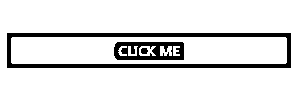
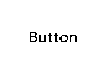

# React Native 中的按钮

> 原文：<https://www.educba.com/button-in-react-native/>


## React Native 中的按钮介绍

众所周知，按钮是用户界面的关键元素，按下按钮后就会工作。因此，有必要了解如何在 react native 中创建按钮。本文将介绍如何在 react native 中创建按钮，它们的语法，以及 react native 中可用的不同类型的按钮。此外，我们将看到一些展示 react 应用程序中按钮使用的例子。

### 属性类型的语法

语法和属性类型解释如下:

<small>网页开发、编程语言、软件测试&其他</small>

**语法:**

```
import React, { Component } from 'react'
import { Button } from 'react-native'
const Test = () => {
return (
**<**Button
//define the properties of button
/>
)
}
export default Test
```

**属性类型及描述:**

以上语法显示了如何在 react native 中使用按钮。它包括定义一个带有按钮元素的 XML 标签；现在，可以根据我们的需求为一个按钮定义不同的属性。以下是属性及其类型和描述的列表。

| **属性 Name** | **类型** | **使用** |
| **按下** | 功能 | 这是一个必需的属性，它要求指定单击该按钮时将执行的功能。 |
| **Title** | 线 | 这是将在按钮上显示为标签的文本，这是一个必需的属性。 |
| **颜色** | 颜色 | 这是设置按钮背景颜色所必需的可选属性。 |
| **禁用** | 布尔型 | 它用于禁用按钮的触摸事件。 |
| **文本时间** | 线 | 这是唯一标识按钮所需的可选属性。 |
| **辅助功能标签** | 线 | 用于显示按钮的盲人辅助功能的文本。 |

### React Native 中的按钮类型

React 中的按钮可以分为以下几种类型:

**1。基本类型:**这些属于基本类别，可以是以下类型:

*   **按钮:**用于定义点击按钮。
*   **提交:**这种类型的按钮与表单一起使用，用于提交详细信息。
*   **复位:**用于点击清除字段内容。

**2。平面按钮:**这是一个没有背景颜色的样式。要在 react 中创建平面按钮，请将 CSS 类设置为 e-flat。

**3。轮廓按钮:**这种类型的按钮包含一个带有透明背景的边框。要创建这种类型的按钮，请将 CSS 类设置为 e-outline。

**4。圆形按钮:**此按钮为圆形。要创建圆形按钮，请将 CSS 类设置为 e-round。

**5。切换按钮:** [切换按钮是一个可以改变状态的按钮](https://www.educba.com/bootstrap-toggle-button/)。让我们考虑一个播放和暂停按钮的例子。单击此按钮时，它的状态会改变，再次单击后，它会恢复其状态。这种状态改变功能是通过点击按钮的事件来实现的。要创建切换，我们需要将 isToggle 属性设置为 true。

### React Native 中的按钮示例

以下是 React Native 中的按钮示例:

#### 示例#1

首先，让我们设计一个简单的按钮来展示它的 click 事件是如何处理的。

**代码:**

```
import { AppRegistry } from "react-native";
import React, { Component } from 'react';
import { Alert, Button, StyleSheet, View } from 'react-native';
export default class ButtonDemo extends Component {
onPressButton() {
Alert.alert ('Hello Welcome to Edubca!')
}
render() {
return (
<View style={styles.container}>
<View style={styles.buttonContainer}>
<Button
onPress={this.onPressButton}
title="Click Me"
color="#000000"
/>
</View>
</View>
);
}
}
const styles = StyleSheet.create({
container: {
flex: 1,
justifyContent: 'center',
},
buttonContainer: {
margin: 20
},
multiButtonContainer: {
margin: 20,
flexDirection: 'row',
justifyContent: 'space-between'
}
})
AppRegistry.registerComponent("App", () => ButtonDemo);
AppRegistry.runApplication("App", {
rootTag: document.getElementById("root")
});
```

**输出:**




单击上面的按钮，将会生成一个警告，显示带有文本的弹出窗口。

**输出:**


生成此警报是因为触发了 onPress 事件，该事件调用 onPressButton 方法，该方法包含警报的逻辑。因此，上面的例子显示了如何在 react native 中创建按钮[以及如何处理它的 click 事件。](https://www.educba.com/react-native-image-picker/)

#### 实施例 2

在这个例子中，我们看到了如何在 react 中改变一个按钮的不透明度。为此，我们将使用一个 TouchableOpacity 标签，其中将包含一个 button 标签。

**代码:**

```
Import React from ‘react'
import { TouchableOpacity, StyleSheet, View, Text } from 'react-native'
const TestApp = () => {
return (
<View style = {styles.container}>
<TouchableOpacity>
<Text style = {styles.text}>
Button
</Text>
</TouchableOpacity>
</View>
)
}
export default TestApp
const styles = StyleSheet.create ({
container: {
alignItems: 'center',
},
text: {
borderWidth: 1,
padding: 25,
borderColor: 'black',
backgroundColor: 'blue'
}
})
```

**输出:**




按下这个按钮后，我们会看到下面的变化。

**输出:**


### 结论

从上面的讨论中，我们清楚地了解了如何创建按钮来做出反应。我们可以提供不同的风格和定制，以提供更好的用户体验。button 组件提供了内置动画，它们的 click 事件可以使用 onPress 方法来处理。

### 推荐文章

这是 React Native 中的按钮指南。这里我们讨论 React Native 中的 Button 及其类型的介绍以及代码实现。您也可以浏览我们推荐的其他文章，了解更多信息——

1.  [React Native vs React](https://www.educba.com/react-native-vs-react/)
2.  [React Native FlatList](https://www.educba.com/react-native-flatlist/)
3.  [反应原生布局](https://www.educba.com/react-native-layout/)
4.  [反应原生架构](https://www.educba.com/react-native-architecture/)


