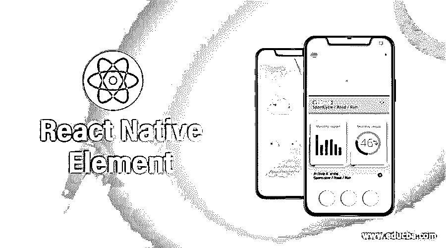
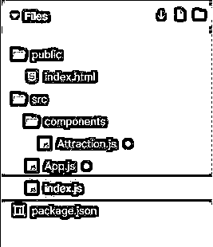
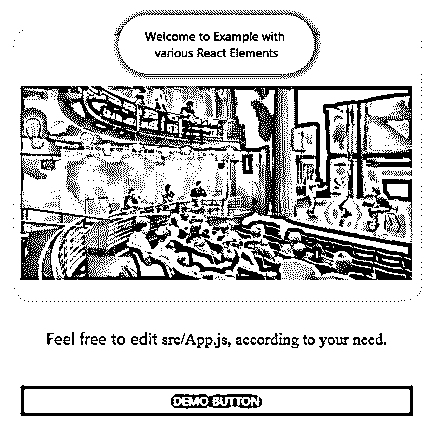
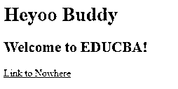
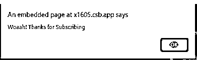
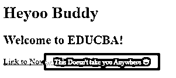
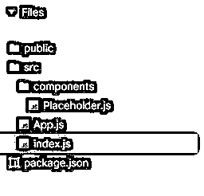

# 反应原生元素

> 原文：<https://www.educba.com/react-native-element/>

## React 本机元素简介

React Native Element 是一个用于设计 React 应用程序样式的库，它内置了一些组件，取代了 React Native 的基本组件。元素提供的样式非常有用，可以根据我们的需要进行定制。Elements 中的每一个组件都包括 React Native 的一个<view>组件，并且样式是根据所指示的属性来完成的。在本文中，我们将介绍元素的工作原理，并在示例中看到一些元素的用法。</view>

### React 本机元素的语法

不同元素的语法及其工作原理:

<small>网页开发、编程语言、软件测试&其他</small>

#### 1.纽扣

按钮是可以作为文本或图片显示在屏幕上的元素，它用于在屏幕上进行交互。按钮帮助我们在应用程序上启动操作。使用基本按钮的语法写在下面。我们提供了按钮的不同属性，如标题、颜色和可访问性标签，它们解释了按钮在屏幕上的显示方式。

`import { Button } from "react-native";
<Button
onPress={onPressLearnMore}
title="Click"
color=" #b1f266"
accessibilityLabel="Click the Button"
/>`

#### 2.文本

这用于显示文本。因此，根据显示内容所应用的条件，之间的任何内容都将显示在输出中。React Native 中文本的工作非常简单，只需通过 React Native 导入文本，然后显示文本内容，只需将内容放置在<text>和</text>之间。

`import { Text } from "react-native";
<Text style={styles.baseText}>
<Text style={styles.titleText} onPress={onPressTitle}>
{titleText}
{"\n"}
{"\n"}
</Text>
<Text numberOfLines={5}>{bodyText}</Text>
</Text>`

#### 3.图像

可以使用 Image React 元素显示本地图像、来自静态资源的图像或任何其他类型的图像。首先，从 react-native 导入图像，然后使用各种网络资源获取图像并显示在我们的输出中。

`import { Image } from "react-native";
<Image source={{uri: 'https://url_of_image.png'}}
style={{width: 68, height: 68}} />
<Image source={{uri: 'https://url_of_image.png'}} />`

#### 4.工具提示

工具提示用于在点击或单击元素时显示信息文本。首先，通过 react-native-elements 导入工具提示，在中，文本显示为“单击我”，一旦您点击/单击该文本，就会弹出一个文本“信息存在于此”。

`import { Tooltip
, Text } from 'react-native-elements';
...
<Tooltip popover={<Text>Information Exist here</Text>}>
<Text>Click me</Text>
</Tooltip>`

#### 5.覆盖物

覆盖图用于向用户提供信息或提取信息。这是一个浮动在应用程序内容之上的视图。首先，通过 react-native-elements 导入覆盖图，并在 <overlay></overlay> 中显示一个浮动文本。

`import { Overlay } from 'react-native-elements';
<Overlay isVisible={this.state.isVisible}>
<Text>It is an Example of Overlay!</Text>
</Overlay>;`

#### 6.瓷砖

磁贴用于显示与主题相关的内容，其工作原理与 React native 上的卡片一样。在之间，使用<placeholder>显示不同的图块。而图块是通过@mobily/stacks 导入的。</placeholder>

`import { Tiles } from "@mobily/stacks";
<Tiles space={2} columns={3}>
<Placeholder />
<Placeholder />
<Placeholder />
<Placeholder />
<Placeholder />
</Tiles>`

### 反应原生元素例子

下面是下面提到的例子

#### 示例 1–各种元素，如图像、文本、按钮

在下面的例子中，各种对图像、文本和按钮等本地元素做出反应。

在 Attraction.js 文件中，视图元素被用作，

`<View style={styles.wrapper}>
<View style={styles.distance}>
....
</View>`

并且图像元素被用作，

`<Image
accessibilityLabel="Teatro Solís"
source={{
uri: "http://theatreprojects.com/files/projects/allegheny-college-vukovich-center-for-communication-arts-01.jpg"
}}
resizeMode="contain"
style={styles.image}
/>`

并且文本元素被用作，

`<Text>Welcome to Example with various React Elements</Text>`

在 App.js 文件中，button 元素用作，

`<Button onPress={() => {}} title="DEMO button" />`

用于实现以下代码的文件是:

**Attraction.js**

`import React from "react";
import { Image
, StyleSheet
, Text
, View } from "react-native";
function Attraction(props) {
return (
<View style={styles.wrapper}>
<View style={styles.distance}>
<Text>Welcome to Example with various React Elements</Text>
</View>
<Image
accessibilityLabel="Teatro Solís"
source={{
uri: "http://theatreprojects.com/files/projects/allegheny-college-vukovich-center-for-communication-arts-01.jpg"
}}
resizeMode="contain"
style={styles.image}
/>
</View>
);
}
const styles = StyleSheet.create({
wrapper: {
backgroundColor: "#fff",
boxShadow: "1px 1px 6px 6px #74f2d3",
borderRadius: 8,
marginTop: 45
},
distance: {
backgroundColor: "#d4f781",
borderRadius: 50,
boxShadow: "1px 1px 8px 5px #df96fa",
paddingTop: 15,
paddingBottom: 15,
paddingLeft: 25,
paddingRight: 25,
textAlign: "center",
maxWidth: 225,
alignSelf: "center",
marginTop: -24
},
image: {
width: "99.9%",
height: 250,
resizeMode: "contain"
}
});
export default Attraction;`

**App.js**

`import React from "react";
import { StyleSheet
, Button
, Text
, View } from "react-native";
import Attraction from "./components/Attraction";
const Link = props => (
<Text
{...props}
accessibilityRole="link"
style={StyleSheet.compose(
styles.link,
props.style
)}
/>
);
function App() {
return (
<View style={styles.app}>
<Attraction />
<Text style={styles.text}>
Feel free to edit <Text style={styles.code}>src/App.js, according to your need</Text>.
</Text>
<Button onPress={() => {}} title="DEMO button" />
</View>
);
}
const styles = StyleSheet.create({
app: {
marginHorizontal: "auto",
maxWidth: 450
},
title: {
fontWeight: "bold",
fontSize: "1.75rem",
marginVertical: "2em",
textAlign: "center"
},
text: {
lineHeight: "1.75em",
fontSize: "1.15rem",
marginVertical: "2em",
textAlign: "center"
},
link: {
color: "#a151f0"
},
code: {
fontFamily: "times"
}
});
export default App;`

**index.js**

`import React from "react";
import ReactDOM from "react-dom";
import App from "./App";
ReactDOM.render(<App />, document.getElementById("root"));`

**输出:**

#### 示例# 2–工具提示，一个 React 本地元素

在下面的示例中，工具提示是通过，

`import ReactTooltip from "react-tooltip";
And is used as,

<ReactTooltip />
<h1 onClick={handleClick} data-tip="🏓 Click to Subscribe">
Heyoo Buddy
</h1>
<h2 data-tip="😅 Greetings from EDUCBA 😅">
Welcome to EDUCBA!
</h2>
<a href="" data-tip="This Doesn't take you Anywhere 😅">
Link to Nowhere
</a>

`

在示例中，使用的文件是:

**index.js**

`import React from "react";
import ReactDOM from "react-dom";
import ReactTooltip from "react-tooltip";
import "./styles.css";
function App() {
const handleClick = () => {
alert("Woaah! Thanks for Subscribing");
};
return (

<ReactTooltip />
<h1 onClick={handleClick} data-tip="🏓 Click to Subscribe">
Heyoo Buddy
</h1>
<h2 data-tip="😅 Greetings from EDUCBA 😅">
Welcome to EDUCBA!
</h2>
<a href="" data-tip="This Doesn't take you Anywhere 😅">
Link to Nowhere
</a>

);
}
const rootElement = document.getElementById("root");
ReactDOM.render(<App />, rootElement);`

**styles.css**

`.App {
font-family: 'Times New Roman'
, Times
, serif;
}
::selection {
background: #bf6ad9;
color: #db326e;
}`

**输出:**

#### 例 3–瓷砖，一种反应自然元素

在下面的示例中，平铺元素被导入为，

`import { Tiles } from "@mobily/stacks";
And is used as,
<Tiles space={2} columns={3}>
<Placeholder />
<Placeholder />
<Placeholder />
<Placeholder />
<Placeholder />
</Tiles>`

用于实现以下示例的文件是:

**Placeholder.js**

`import React from "react";
import { View
, StyleSheet } from "react-native";
const styles = StyleSheet.create({
root: {
backgroundColor:"#ff57a2",
borderWidth: StyleSheet.hairlineWidth,
borderColor: "#4784ed"
}
});
export const Placeholder = props => {
const { width, height= 99, style } = props;
return <View style={[styles.root, { width, height }, style]} />;
};`

**App.js**

`import React from "react";
import { Tiles } from "@mobily/stacks";
import { Placeholder } from "./components/Placeholder";
const App = () => {
return (
<Tiles space={2} columns={3}>
<Placeholder />
<Placeholder />
<Placeholder />
<Placeholder />
<Placeholder />
</Tiles>
);
};
export default App;`

**index.js**

`import { AppRegistry } from "react-native";
import App from "./App";
AppRegistry.registerComponent("App", () => App);
AppRegistry.runApplication("App", {
rootTag: document.getElementById("root")
});`

**输出:**

### 结论

在上述文章的基础上，我们理解了元素的概念。我们学习了 React 本地元素及其各自的语法，并从上面演示的例子中理解了元素的用法。我希望这篇文章能使元素更容易理解和实现。

### 推荐文章

这是一个反应原生元素的指南。在这里，我们讨论 React 本地元素的工作方式以及示例中一些元素的用法。您也可以看看以下文章，了解更多信息–

1.  [React 本机调试器](https://www.educba.com/react-native-debugger/)
2.  [React 路由器转换](https://www.educba.com/react-router-transition/)
3.  [React Redux Connect](https://www.educba.com/react-redux-connect/)
4.  [React Native Redux](https://www.educba.com/react-native-redux/)

