# 反应状态管理

> 原文：<https://www.educba.com/react-state-management/>

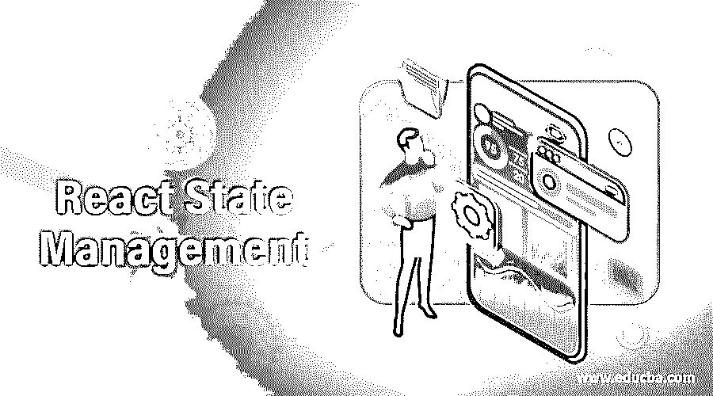

## React 状态管理简介

任何应用程序的状态都由应用程序的用户界面来表示。状态是可变的，每当用户与应用程序交互并改变其状态时，应用程序的用户界面可能会改变，因为它将由新状态表示。这些状态可以由 React 组件管理。react 组件的主要目标是存储状态，并允许在用户与应用程序交互时更新状态。它还确保了只要状态有任何更新，UI 就会发生变化。在本文中，我们将解释管理状态的方法。在本主题中，我们将学习 React 状态管理。

### 用示例管理 React 中的状态

下面举几个例子:

<small>网页开发、编程语言、软件测试&其他</small>

#### 示例 1–反应状态:使用状态和反应状态:使用上下文

React 中的 useState 钩子被很多 React 初学者在刚开始使用 React 中的 State 时使用。

初始状态被当作 useState 钩子中的一个参数。最初，当 React 组件呈现时，返回两个值。这些值是状态更新函数和当前状态。为了显示组件的当前状态，使用当前状态，并且为了改变当前状态，使用状态更新功能。

useContext 有助于沿着组件树向下传递属性。React 的上下文 API 有助于在祖父组件和孙组件之间传递属性。这个过程不会影响链中可用的其他 React 组件。

在下面的例子中，数值可以在数值改变窗口中改变，我们也可以用上面提到的按钮在不同的主题之间切换。

下图中提到了用于开发应用程序的文件，后面分别是每个文件的代码。

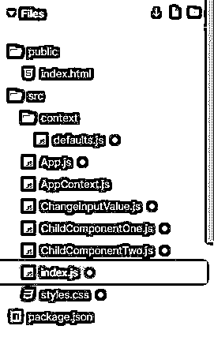

##### 默认值. js

`export const themes = {
light: {
foreground: "#b440de",
background: "#f05983",
color: "#f2f7fa"
},
dark: {
foreground: "#bcf55b",
background: "#de81fc",
color: "black"
}
};
const testValue = "Other Value";
const defaultContext = {
theme: themes.light,
toggleTheme: () => {},
value: testValue,
setValue: () => {}
};
export default defaultContext;`

##### App.js

`import React
, { useContext } from "react";
import AppContext from "./AppContext";
import ChildComponentOne from "./ChildComponentOne";
import ChangeInputValue from "./ChangeInputValue";
const App = props => {
const { theme, toggleTheme } = useContext(AppContext);
return (

<h1>Example of useContext & useState</h1>

Content 1

<ChildComponentOne />

Content 2

<h2>Unicorn Mode</h2>
<button onClick={toggleTheme}>Switch for Unicorn Mode 2</button>
<ChangeInputValue />

);
};
export default App;`

##### AppContext.js

`import { createContext } from "react";
import defaultContext from "./context/defaults";
const AppContext = createContext(defaultContext);
export default AppContext;`

##### ChangeInputValue.js

`import React
, { useContext } from "react";
import AppContext from "./AppContext";
const ChangeInputValue = props => {
const { value, setValue } = useContext(AppContext);
const updateValue = () => {
const newValue = document.querySelector(".newValue").value;
setValue(newValue);
document.querySelector(".newValue").value = "";
};
return (
<>
<h2>Change Value Here</h2>
<input className="newValue" placeholder="enter new value..." />
<button onClick={updateValue}>Click to Set Value</button>

Value is = "{value}"

</>
);
};
export default ChangeInputValue;`

##### child component on . js

`import React
, { useContext } from "react";
import AppContext from "./AppContext";
import ChildComponentTwo from "./ChildComponentTwo";
const ChildComponentOne = props => {
const { theme } = useContext(AppContext);
return (

Component One

<ChildComponentTwo />

);
};
export default ChildComponentOne;`

##### ChildComponentTwo.js

`import React
, { useContext } from "react";
import AppContext from "./AppContext";
const ChildComponentTwo = props => {
const { theme, toggleTheme, value } = useContext(AppContext);
return (

Component Two

value = "{value}"

<button onClick={toggleTheme}>Switch for Unicorn Mode 1</button>

);
};
export default ChildComponentTwo;`

##### 索引. js

`import React
, { useContext
, useState } from "react";
import ReactDOM from "react-dom";
import App from "./App";
import AppContext from "./AppContext";
import { themes } from "./context/defaults";
import "./styles.css";
function Root() {
const appContext = useContext(AppContext);
const [context, setContext] = useState(appContext);
const [isDarkMode, setDarkMode] = useState(false);
const toggleTheme = () => {
setContext({ ...context, theme: isDarkMode ? themes.light : themes.dark });
setDarkMode(!isDarkMode);
};
const setValue = value => {
setContext({ ...context, value });
};
const state = {
...context,
toggleTheme: toggleTheme,
setValue: setValue
};
return (
<AppContext.Provider value={state}>
<App />
</AppContext.Provider>
);
}
const rootElement = document.getElementById("root");
ReactDOM.render(<Root />, rootElement);`

##### 样式. css

`.App {
font-family: 'Times New Roman'
, Times
, serif;
text-align: center;
}
.flex-container {
display: flex;
justify-content: center;
}
.container {
border-radius: 50%;
height: 50px;
width: 100px;
margin: 25px;
border: 1px solid #de338e;
display: flex;
justify-content: center;
align-items: center;
}`

**输出:**

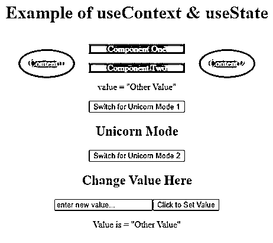

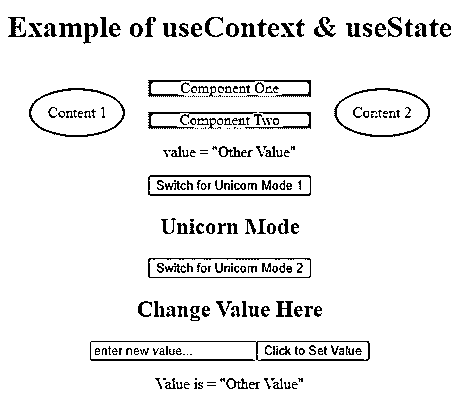

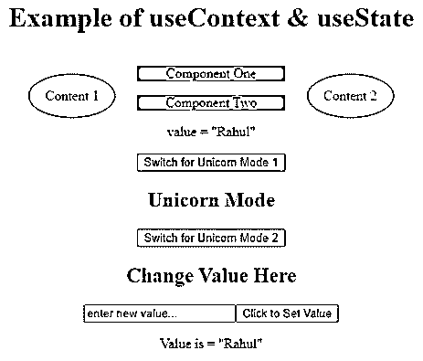

#### 示例 2–反应状态:useReducer

React 的 useReducer 的想法取自 JavaScript Reducer。一般来说，当前状态与有效载荷的动作一起被 Reducer 保持，然后它产生新的状态。

在下面的例子中，我们开发了一个计数器，在 useReducer 的帮助下维护它的值状态。我们可以增加、减少和重置计数器的值。

下图中提到了用于开发计数器的文件，下面分别是每个文件的代码。

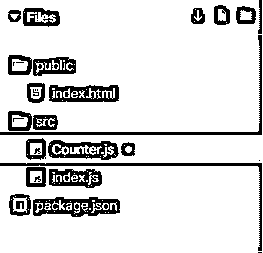

##### Counter.js

`import React
, { useReducer } from "react"
function init(initialCount) {
while (initialCount < 0) {
initialCount++
}
return { count: initialCount }
}
function reducer(state, action) {
switch (action.type) {
case "increment":
return { count
: state.count + 1 }
case "decrement":
return { count
: state.count - 1 }
case "reset":
return init(action.payload)
default:
throw new Error()
}
}
function Counter({ initialCount }) {
const [state
, dispatch] = useReducer(reducer
, initialCount
, init)
return (
<>
Count: {state.count}
 
<button
onClick={() => dispatch({ type: "reset", payload: initialCount })}
>
Reset Value
</button>
<button onClick={() => dispatch({ type: "increment" })}>Increasing Button</button>
<button onClick={() => dispatch({ type: "decrement" })}>Decreasing Button</button>
</>
)
}
export default Counter`

##### 索引. js

`import React from "react";
import ReactDOM from "react-dom";
import Counter from "./Counter";
function App() {
return (

<Counter initialCount={0} />

);
}
const rootElement = document.getElementById("root");
ReactDOM.render(<App />, rootElement);`

**输出:**

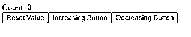

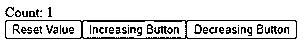

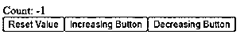

#### 示例 3–反应状态:Redux

使用 Redux，可以通过使用外力来全局管理状态。Redux Reducer 的工作是处理两个 Redux 动作，不依赖于 Redux 库。

在下面的例子中，我们开发了一个 ToDo 应用程序，在 Redux 的帮助下维护状态。

下图中提到了用于开发 ToDO 应用程序的文件，下面分别是每个文件的代码。

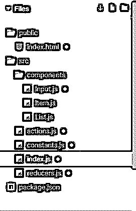

##### index.html

`<!DOCTYPE html>
<html>
<head>
<title>React State Management Using Redux</title>
<meta name="viewport" content="width=device-width, initial-scale=1.0">
</head>
<body>
<h1>
React State Management Using Redux
</h1>

Page is Loading...

</body>
</html>`

##### 输入. js

`import * as React from "react";
class Input extends React.Component {
constructor(props) {
super(props);
this.state = {
value: ""
};
this.handleChange = this.handleChange.bind(this);
this.handleKeyPress = this.handleKeyPress.bind(this);
}
handleChange(event) {
this.setState({ value: event.target.value });
}
handleKeyPress(e) {
if (e.key === "Enter") {
this.props.onCreate(this.state.value);
this.setState({
value: ""
});
}
}
render() {
return (
<input
placeholder="Enter Your Tasks Here"
onKeyPress={this.handleKeyPress}
onChange={this.handleChange}
value={this.state.value}
/>
);
}
}
export default Input;`

##### Item.js

`import * as React from "react";
class Item extends React.Component {
constructor(props) {
super(props);
this.handleToggle = this.handleToggle.bind(this);
this.handleOnChange = this.handleOnChange.bind(this);
}
handleToggle(event) {
this.setState({ value: event.target.value });
}
handleKeyPress(e) {
if (e.key === "Enter") {
this.props.onCreate(this.state.value);
this.setState({
value: ""
});
}
}
handleOnChange(e) {
this.props.onClick(this.props.id, e.target.checked);
}
render() {
return (

<input
id={`checkbox-${this.props.id}`}
type="checkbox"
value={this.props.done ? "false" : "true"}
onChange={this.handleOnChange}
checked={this.props.done}
/>
<label htmlFor={`checkbox-${this.props.id}`}>{this.props.text}</label>

);
}
}
export default Item;`

##### List.js

`import Item from "./Item";
import * as React from "react";
class List extends React.Component {
render() {
if (this.props.items.length === 0) {
return null;
}
return (

<strong>{this.props.title}</strong>
{this.props.items.map(item => (
<Item
key={item.id}
id={item.id}
text={item.text}
done={item.done}
onClick={this.props.onItemClick}
/>
))}

);
}
}
export default List;`

##### actions.js

`import { ADD_TODO
, MARK_TODO_DONE
, MARK_TODO_NOT_DONE } from "./constants";
export const addTodo = text => (
{
type: ADD_TODO
, text
}
);
export const markTodoDone = id => ({ type: MARK_TODO_DONE, id });
export const markTodoNotDone = id => ({
type: MARK_TODO_NOT_DONE,
id
});`

##### constants.js

`export const ADD_TODO = "ADD_TODO";
export const MARK_TODO_DONE = "MARK_TODO_DONE";
export const MARK_TODO_NOT_DONE = "MARK_TODO_NOT_DONE";`

##### 索引. js

`import * as React from "react";
import * as ReactDOM from "react-dom";
import { createStore } from "redux";
import { Provider
, connect } from "react-redux";
import Input from "./components/Input";
import List from "./components/List";
import { addTodo
, markTodoDone
, markTodoNotDone } from "./actions";
import reducer from "./reducers";
class App extends React.Component {
constructor(props) {
super(props);
this.handleCreate = this.handleCreate.bind(this);
this.itemClick = this.itemClick.bind(this);
}
handleCreate(text) {
this.props.addTodo(text);
}
itemClick(id, done) {
if (done) {
this.props.markTodoDone(id);
} else {
this.props.markTodoNotDone(id);
}
}
render() {
return (

<Input onCreate={this.handleCreate} />
<List
title="Tasks to be Done"
items={this.props.items.filter(item => !item.done)}
onItemClick={this.itemClick}
/>
<List
title="Completed Tasks"
items={this.props.items.filter(item => item.done)}
onItemClick={this.itemClick}
/>

);
}
}
const mapStateToProps = state => ({
items: state.items
});
const mapDispatchToProps = dispatch => ({
addTodo: text => dispatch(addTodo(text)),
markTodoDone: id => dispatch(markTodoDone(id)),
markTodoNotDone: id => dispatch(markTodoNotDone(id))
});
const AppContainer = connect(mapStateToProps, mapDispatchToProps)(App);
const store = createStore(reducer);
ReactDOM.render(
<Provider store={store}>
<AppContainer />
</Provider>,
document.getElementById("app")
);`

##### reducers.js

`import { ADD_TODO
, MARK_TODO_DONE
, MARK_TODO_NOT_DONE } from "./constants";
const initialState = {
items: [] };
export default function reducer(
state = initialState
, action
) {
switch (action.type) {
case ADD_TODO:
const maxId = state.items.reduce(
(maxId, todo) => Math.max(todo.id, maxId),
-1
);
return {
...state,
items: state.items.concat({
id: maxId + 1,
done: false,
text: action.text
})
};
case MARK_TODO_DONE:
return {
...state,
items: state.items.map(item => ({
id: item.id,
done: item.id === action.id ? true : item.done,
text: item.text
}))
};
case MARK_TODO_NOT_DONE:
return {
...state,
items: state.items.map(item => ({
id: item.id,
done: item.id === action.id ? false : item.done,
text: item.text
}))
};
default:
return state;
}
}`

**输出:**

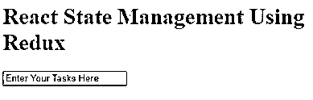

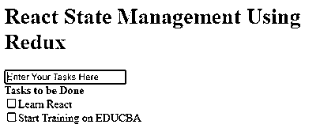

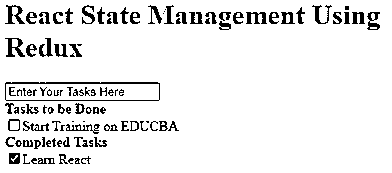

### 结论

在上述文章的基础上，我们理解了状态管理的概念和实现它的不同方法。上述示例向您介绍了管理状态的不同方式，并有助于理解每种方式的工作原理。

### **推荐文章**

这是一个反应状态管理的指南。为了更好地理解，我们在这里讨论管理 React 中的状态的方法以及相应的示例。您也可以看看以下文章，了解更多信息–

1.  [反应原生模态](https://www.educba.com/react-native-modal/)
2.  [反应本地本地存储](https://www.educba.com/react-native-local-storage/)
3.  [React-原生日历](https://www.educba.com/react-native-calendar/)
4.  [反应原生标签页](https://www.educba.com/react-native-tabs/)

