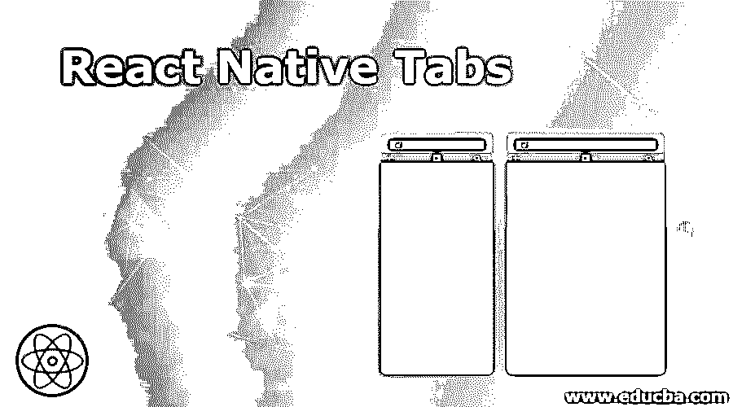
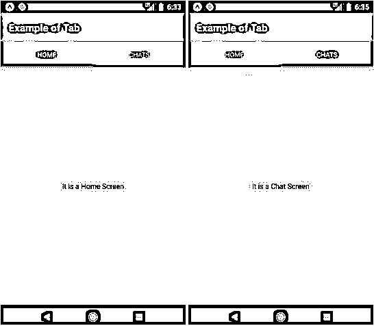
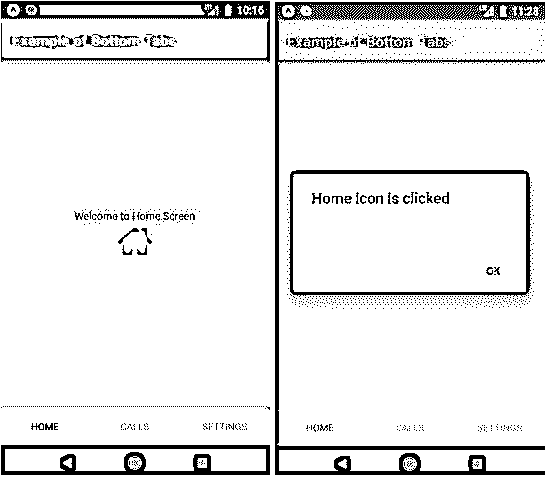
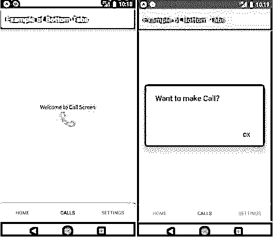
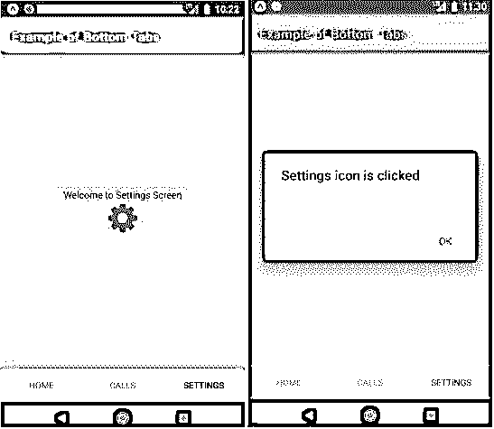

# 反应本地标签

> 原文：<https://www.educba.com/react-native-tabs/>

## React 本机选项卡简介

在移动用户界面中，选项卡是最常用的组件之一。在标签的帮助下，用户可以在少量同等重要的视图之间快速移动，标签也有助于为移动应用程序和 web 应用程序带来真实世界的元素。当标签被正确执行时，它们被认为是伟大的 UI 控件，旨在提高使用率。选项卡可以在屏幕的顶部或底部找到。在我们的日常生活中，我们已经在各种应用程序中看到了标签，如 WhatsApp、Pinterest、脸书、LinkedIn、Instagram 等。它是在移动应用程序中高效开发这些选项卡的最佳平台。

**语法:**

<small>网页开发、编程语言、软件测试&其他</small>

`<TabView
navigationState={{ index, routes }} onIndexChange={setIndex} renderScene={SceneMap({
first: FirstRoute, second: SecondRoute,
})}
/>`

### 如何创建 React 原生标签页？

下面是不同的例子。

#### 示例# 1–屏幕顶部的基本选项卡

**主屏幕或 FirstPage.js:**

`import React, { Component } from 'react'; import { Text, View } from 'react-native';
export default class FirstPage extends React.Component { render() {
return (
<View style={{ flex: 1, justifyContent: 'center', alignItems: 'center' }}>
<Text>It is a Home Screen</Text>
</View>
);
}`

**聊天画面或 SecondPage.js:**

`import React, { Component } from 'react'; import { Text, View } from 'react-native';
export default class SecondPage extends React.Component { render() {
return (
<View style={{ flex: 1, justifyContent: 'center', alignItems: 'center' }}>
<Text>It is a Chat Screen</Text>
</View>
);
}
}`

**App.js:**

`import React from 'react'; import {
createStackNavigator, createMaterialTopTabNavigator, createAppContainer,
} from 'react-navigation';
import FirstPage from './pages/FirstPage'; import SecondPage from './pages/SecondPage';
const TabScreen = createMaterialTopTabNavigator(
{
Home: { screen: FirstPage }, Chats: { screen: SecondPage },
},
{
tabBarPosition: 'top',
swipeEnabled: true,
animationEnabled: true, tabBarOptions: {
activeTintColor: '#f0f0f0', inactiveTintColor: '#fff7f7', style: {
backgroundColor: '#a8395e',
},
labelStyle: { textAlign: 'center',
},
indicatorStyle: { borderBottomColor: '#a6ff6e', borderBottomWidth: 2,
},
},
}
);
const App = createStackNavigator({ TabScreen: {
screen: TabScreen, navigationOptions: {
headerStyle: { backgroundColor: '#369c95',
},
headerTintColor: '#FFFFFF', title: 'Example of Tab',
},
},
});
export default createAppContainer(App);`

**输出:**

**图像 1 和图像 2**

#### 示例 2–屏幕底部有矢量图标

**主屏幕或 FirstPage.js:**

`import React, { Component } from 'react'; import {Platform, StyleSheet, Text, View, TouchableOpacity, Alert} from 'react-native';
import Icon from 'react-native-vector-icons/FontAwesome';
const instructions = Platform.select({ android:
'Press or Shake menu button for dev menu' + 'To reload Double tap R on the keyboard,\n',
ios: 'Cmd+D or shake for dev menu' + 'Press Cmd+R to reload,\n',
});
type Props = {};
export default class FirstPage extends React.Component { render() {
const home_icon = (
<Icon name="home" size={50} color="#73abff" onPress={()=>{Alert.alert("Home icon is clicked")}} />
);
return (
<View style={styles.MainContainer}>
<View style={{ flex: 1, justifyContent: 'center', alignItems:'center' }}>
<Text>Welcome to Home Screen</Text>
<TouchableOpacity>
{home_icon}
</TouchableOpacity>
</View>
</View>
);
}
}
const styles = StyleSheet.create({ MainContainer: {
flex: 1,
justifyContent: 'center', alignItems: 'center', backgroundColor: '#faf5f8', padding: 25
}
});`

**调用 Screen 或 SecondPage.js:**

`import React, { Component } from 'react'; import {Platform, StyleSheet, Text, View, TouchableOpacity, Alert} from 'react-native';
import Icon from 'react-native-vector-icons/FontAwesome';
const instructions = Platform.select({ android:'Press or Shake menu button for dev menu' + 'To reload Double tap R on the keyboard,\n',
ios: 'Cmd+D or shake for dev menu' + 'Press Cmd+R to reload,\n',
});
type Props = {};
export default class SecondPage extends React.Component {
render() {
const phone_icon = (
<Icon name="phone" size={50} color="#acff63" onPress={()=>{Alert.alert("Want to make Call?")}} />
);
return (
<View style={styles.MainContainer}>
<View style={{ flex: 1, justifyContent: 'center', alignItems:'center' }}>
<Text>Welcome to Call Screen</Text>
<TouchableOpacity>
{phone_icon}
</TouchableOpacity>
</View>
</View>
);
}
}
const styles = StyleSheet.create({ MainContainer: {flex: 1,justifyContent: 'center', alignItems: 'center', backgroundColor: '#faf5f8', padding: 25}});`

**设置屏幕或 ThirdPage.js:**

`import React, { Component } from 'react';
import {Platform, StyleSheet, Text, View, TouchableOpacity, Alert} from 'react-native';
import Icon from 'react-native-vector-icons/FontAwesome';
const instructions = Platform.select({ android:'Press or Shake menu button for dev menu' +
' To reload Double tap R on the keyboard,\n',
ios: 'Cmd+D or shake for dev menu' + 'Press Cmd+R to reload,\n',
});
type Props = {};
export default class ThirdPage extends React.Component { render() {
const setting_icon = (<Icon name="cog" size={50} color="#a35086" onPress={()=>{Alert.alert("Settings icon is clicked")}} />);
return (<View style={styles.MainContainer}><View style={{ flex: 1, justifyContent: 'center', alignItems:'center' }}>
<Text>Welcome to Settings Screen</Text>
<TouchableOpacity>
{setting_icon}
</TouchableOpacity>
</View>
</View>
);
}
}
const styles = StyleSheet.create({ MainContainer: {flex: 1,justifyContent: 'center', alignItems: 'center', backgroundColor: '#faf5f8', padding: 25
}
});`

**app . js:T3】**

`import React from 'react';
import { createStackNavigator,
createMaterialTopTabNavigator, createAppContainer,
} from 'react-navigation';
import FirstPage from './pages/FirstPage'; import SecondPage from './pages/SecondPage'; import ThirdPage from './pages/ThirdPage';
const TabScreen = createMaterialTopTabNavigator(
{
Home: { screen: FirstPage },
Calls: { screen: SecondPage },
Settings: { screen: ThirdPage },
},
{
tabBarPosition: 'bottom', swipeEnabled: true, animationEnabled: true, tabBarOptions: {
activeTintColor: '#000000', inactiveTintColor: '#30362a', style: {
backgroundColor: '#a5ff45',
},
labelStyle: { textAlign: 'center',
,
indicatorStyle: { borderBottomColor: '#a6ff6e', borderBottomWidth: 2,
},
},
}
);
const App = createStackNavigator({ TabScreen: {
screen: TabScreen, navigationOptions: {
headerStyle: { backgroundColor: '#ff617e',
},
headerTintColor: '#FFFFFF', title: 'Example of Bottom Tabs',
},
},
});
export default createAppContainer(App);`

**输出:**

图 3 显示了应用程序的主屏幕，图 4 显示了单击 home 图标时出现的弹出窗口。类似地，图 5 显示了呼叫屏幕，图 6 显示了单击呼叫图标时出现的弹出窗口。同样，图 7 显示了设置屏幕，图 8 显示了单击设置图标时出现的弹出窗口。

**图像 3 和图像 4**

**图像 5 和图像 6**

### 结论

基于上面的讨论，我们知道了在一个特定的应用程序中标签的重要性。我们在 React Native 中开发了不同种类的选项卡。可以非常容易和有效地开发标签来反应本地。React Native 为开发这些选项卡提供了最好的平台和广泛的种类。

### 推荐文章

这是一个反应原生标签的指南。在这里，我们讨论选项卡的介绍及其示例和代码实现。您也可以浏览我们推荐的其他文章，了解更多信息——

1.  [反应本地异步存储](https://www.educba.com/react-native-asyncstorage/)
2.  [反应原生进度条](https://www.educba.com/react-native-progress-bar/)
3.  [反应原生燃烧基](https://www.educba.com/react-native-firebase/)
4.  [反应原生抽屉](https://www.educba.com/react-native-drawer/)