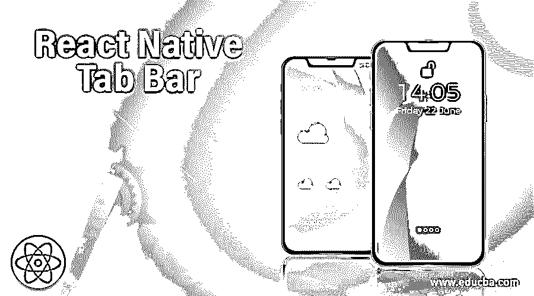
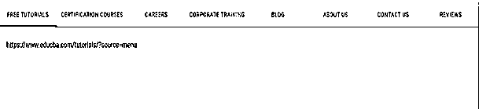
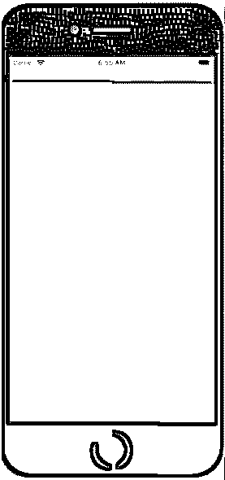
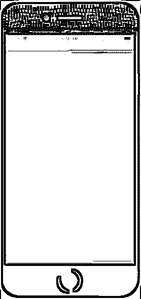
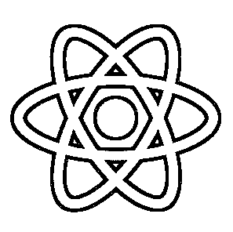
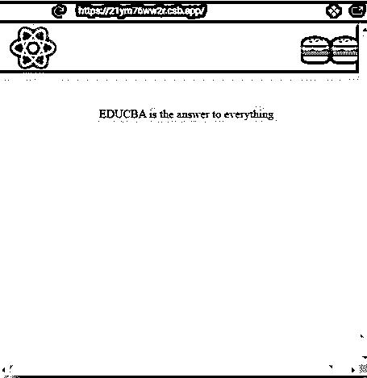
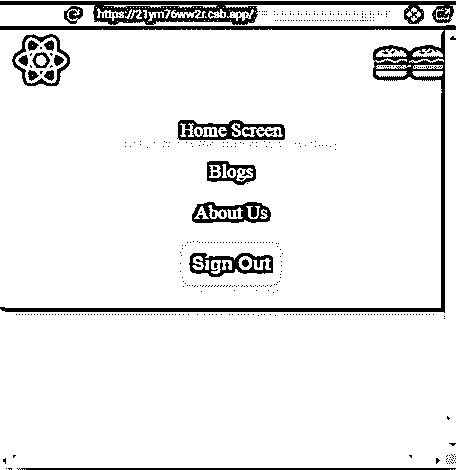

# 反应本机标签栏

> 原文：<https://www.educba.com/react-native-tab-bar/>

## React 本机标签栏简介

每当我们打开一个网站或一个应用程序，我们就开始从里面寻找我们想要的信息，然后就出现了拯救我们的标签。标签是任何应用程序或网站的重要组成部分。标签帮助我们作为用户在任何应用程序或网站上快速搜索信息。例如，如果你正在从应用程序中寻找一些支持，如果没有标签，搜索帮助部分会花费很多时间，但因为有了标签，所有信息或工具都方便地分类在不同的标签中，我们可以很容易地找到信息。它支持创建标签，就像 React 一样，我们可以很容易地将应用程序的不同部分分类，并将其放在不同的标签中，这使得应用程序对用户更具交互性。在这篇文章中，我们将通过一些例子来说明如何创建标签栏来反应本地。

**语法**

<small>网页开发、编程语言、软件测试&其他</small>

`import { TabView, SceneMap } from 'react-native-tab-view';
<TabView
navigationState={{ index, routes }} onIndexChange={setIndex} renderScene={SceneMap({
first: FirstRoute, second: SecondRoute,
})}
/>`

### 实现 React 本机标签栏的示例

下面是提到的例子:

#### 1.使用材质 UI 的选项卡栏

要构建的组件:

*   演示. js
*   index.html
*   索引. js

**Demo.js**

`import React from "react";
import PropTypes from "prop-types";
import { withStyles } from "@material-ui/core/styles";
import AppBar from "@material-ui/core/AppBar";
import Tabs from "@material-ui/core/Tabs";
import Tab from "@material-ui/core/Tab";
import Typography from "@material-ui/core/Typography";
function TabContainer(props) { return (
<Typography component="div" style={{ padding: 7 * 4 }}>
{props.children}
</Typography>
);
}
TabContainer.propTypes = {
children: PropTypes.node.isRequired
};
const styles = theme => ({ root: {
flexGrow: 1,
backgroundColor: theme.palette.background.paper, margin: 0
}
});
class ScrollableTabsButtonAuto extends React.Component { state = {
value: 0
};
handleChange = (event, value) => {
this.setState({ value });
};
render() {
const { classes } = this.props; const { value } = this.state;
return (

<AppBar position="static" color="default">
<Tabs
value={value} onChange={this.handleChange} indicatorColor="secondary" textColor="secondary"
centered
>
<Tab label="Free Tutorials" />
<Tab label="Certification Courses" />
<Tab label="Careers" />
<Tab label="Corporate Training" />
<Tab label="Blog" />
<Tab label="About Us" />
<Tab label="Contact Us" />
<Tab label="Reviews" />
</Tabs>
</AppBar>
{value === 0 &&
[<TabContainer>https://www.educba.com/tutorials/?source=menu</Tab](https://www.educba.com/tutorials/)Container>}
{value === 1 &&
[<TabContainer>https://www.educba.com/courses/?source=menu</TabContainer>}](https://www.educba.com/courses/)
{value === 2 &&
[<TabContainer>https://www.educba.com/careers/</TabContainer>}](https://www.educba.com/careers/)
{value === 3 &&
[<TabContainer>https://www.educba.com/corporate/?source=footer</TabContainer](https://www.educba.com/corporate/)
>}
{value === 4 &&
[<TabContainer>https://www.educba.com/blog/?source=footer</TabContainer>}](https://www.educba.com/blog/)
{value === 5 && [<TabContainer>https://www.educba.com/about](https://www.educba.com/about-us/)- us/?source=footer</TabContainer>}
{value === 6 && [<TabContainer>https://www.educba.com/contact](https://www.educba.com/contact-us/)- us/?source=footer</TabContainer>}
{value === 7 &&
[<TabContainer>https://www.educba.com/reviews/?source=footer</TabContainer>}](https://www.educba.com/reviews/)

);
}
}
ScrollableTabsButtonAuto.propTypes = { classes: PropTypes.object.isRequired
};
export default withStyles(styles)(ScrollableTabsButtonAuto);`

**index.html**

`<body>
<link rel="stylesheet" href="https://fonts.googleapis.com/css?family=Roboto:300,400,500" />
<link rel="stylesheet" href="https://fonts.googleapis.com/icon?family=Material+Icons" />

</body>`

**index.js**

`import React from 'react';
import { render } from 'react-dom'; import Demo from './demo';
const rootElement = document.querySelector('#root'); if (rootElement) {
render(<Demo />, rootElement);`

**输出:**

#### 2.用选项卡视图反应本机选项卡栏

要构建的组件:

**App.js**

`import * as React from 'react'; import { View
, StyleSheet
, Dimensions
, Text } from 'react-native'; import { TabView
, TabBar
, SceneMap } from 'react-native-tab-view';
const FirstRoute = () => (
<View style={[styles.scene, { backgroundColor: '#a5f765' }]} />
);
const SecondRoute = () => (
<View style={[styles.scene, { backgroundColor: '#e6476c' }]} />
);
function renderLabel({ route, focused, color }) {
return <Text style={{ color }}>{focused ? route.title : ' '}</Text>;
}
const initialLayout = { width: Dimensions.get('window').width };
export default function App() {
const [index, setIndex] = React.useState(0); const [routes] = React.useState([
{ key: 'first', title: 'Tab First' },
{ key: 'second', title: 'Tab Second' },
]);
const renderScene = SceneMap({ first: FirstRoute,
second: SecondRoute,
});
return (
<TabView
navigationState={{ index, routes }}
renderScene={renderScene}
onIndexChange={setIndex}
initialLayout={initialLayout}
renderTabBar={props => <TabBar {...props} renderLabel={renderLabel}
/>}
/>
);
}
const styles = StyleSheet.create({ scene: {
flex: 2,
},
});`

**输出:**

#### 3.使用动画对原生标签栏做出反应

src 文件夹中的组件:

*   资产文件夹
*   组件文件夹
*   索引. js
*   style.css

资产文件夹中的组件:

*   logo.png

组件文件夹中的组件:

*   header.css
*   header.js

**logo.png**

**header.css**

`.Header { position: fixed; top: 1;
max-height: 71px; width: 101vw;
display: grid;
grid-template-areas: "logo nav";
background-color: #a1224e;
box-shadow: 0 3px 7px 0 rgba(14, 9, 9, 0.2);
}
.Logo {
grid-area: logo; height: 69px;
}
.Nav {
display: grid; grid-area: nav;
grid-template-columns: repeat(3, auto); align-items: center;
justify-items: center;
}
.Nav a {
color: #d8f0eb; font-size: 21px; font-weight: 501; transition: 0.6s;
text-decoration: none;
}
.Nav a:hover { transform: scale(1.1);
}
.Nav button { padding: 11px; outline: none; border: none; font-size: 21px; color: #dfff99;
font-weight: 601;
background-color: rgba(240, 13, 13, 0.5);
box-shadow: 0px 6px 0px 0px rgba(255, 10, 10, 0.25); border-radius: 11px;
cursor: pointer; transition: 71ms;
}
.Nav button:active { transform: translateY(4px);
box-shadow: 0px 2px 0px 0px rgba(175, 4, 4, 0.25);
}
.Burger { display: none;
grid-area: burger; margin: 0 21px 0 0;
padding: 0; justify-self: end; font-size: 41px; border: none; background: none; outline: none; transition: 0.2s;
}
.Burger:active { transform: scale(1.3);
}
@media (max-width: 701px) {
.Header {
grid-template-areas: "logo burger" "nav nav";
}
.Nav {
grid-template-rows: repeat(3, auto); grid-template-columns: none;
grid-row-gap: 21px;
padding: 31px 0 31px;
background: rgba(31, 61, 83, 0.95);
box-shadow: 0 3px 7px 0 rgba(15, 14, 14, 0.2); border-bottom-left-radius: 11px;
border-bottom-right-radius: 11px;
}
.Burger {
display: inline;
}
}
.NavAnimation-enter { opacity: 0;
transform: scale(0.5);
}
.NavAnimation-enter-active { opacity: 1;
transform: translateX(0);
transition: opacity 351ms, transform 351ms;
}
.NavAnimation-exit
{ opacity: 1;
}
.NavAnimation-exit-active { opacity: 0;
transform: scale(0.4);
transition: opacity 351ms, transform 351ms;`

**Header.js**

`import React, { useState
, useEffect } from "react"; import "./Header.css";
import { CSSTransition } from "react-transition-group";
export default function Header() {
const [isNavVisible, setNavVisibility] = useState(false); const [isSmallScreen, setIsSmallScreen] = useState(false);
useEffect(() => {
const mediaQuery = window.matchMedia("(max-width: 700px)"); mediaQuery.addListener(handleMediaQueryChange); handleMediaQueryChange(mediaQuery);
return () => { mediaQuery.removeListener(handleMediaQueryChange);
};
}, []);
const handleMediaQueryChange = mediaQuery => { if (mediaQuery.matches) {
setIsSmallScreen(true);
} else {
setIsSmallScreen(false);
}
};
const toggleNav = () => { setNavVisibility(!isNavVisible);
};
return (

<CSSTransition
in={!isSmallScreen || isNavVisible} timeout={350} classNames="NavAnimation" unmountOnExit
>
<nav className="Nav">
<a href="/">Home Screen</a>
<a href="/">Blogs</a>
<a href="/">About Us</a>
<button>Sign Out</button>
</nav>
</CSSTransition>
<button onClick={toggleNav} className="Burger">
</button>

);
}`

**index.js**

`import React from 'react';
import ReactDOM from 'react-dom'; import './styles.css';
import Header from './components/Header';
function App() { return (

EDUCBA is the answer to everything

);
}
const rootElement = document.getElementById("root"); ReactDOM.render(<App />, rootElement);`

**style.css**

`body {
font-family: 'Times New Roman', Times, serif; margin: 0;
padding: 0;
}
.App {
height: 101vh; width: 101vw;
background-color: #dfff99;
}
.App .Content { padding-top: 101px; text-align: center;
}`

**输出:**

### 结论

在上述文章的基础上，我们了解了如何根据我们的需求创建选项卡栏，并使应用程序对用户来说更具交互性和易用性。上面我们已经讨论了三个不同类型的标签栏的例子，可以帮助你理解相同的内容。我希望这篇文章能以一种更简单的方式帮助你理解这一点。

### 推荐文章

这是一个反应原生标签栏的指南。这里我们讨论一个介绍，语法，并附有例子。您也可以浏览我们的其他相关文章，了解更多信息——

1.  [反应本地一个信号](https://www.educba.com/react-native-onesignal/)
2.  [React-原生日历](https://www.educba.com/react-native-calendar/)
3.  [反应-原生开关](https://www.educba.com/react-native-switch/)
4.  [反应自然取向](https://www.educba.com/react-native-orientation/)