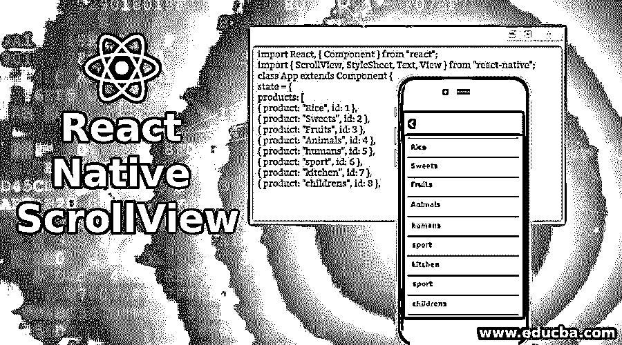
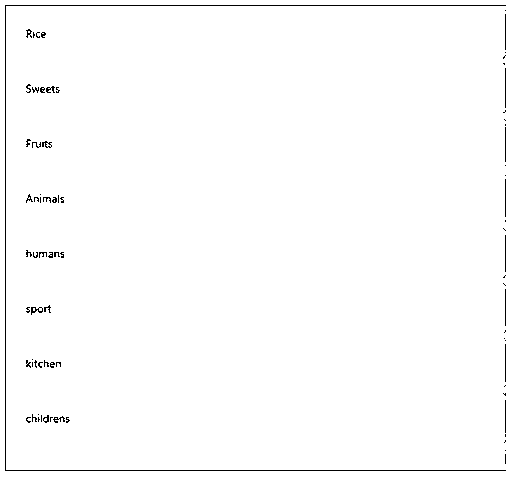
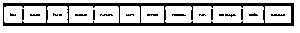

# 反应本机滚动视图

> 原文：<https://www.educba.com/react-native-scrollview/>




## React Native ScrollView 简介

ScrollView 是一个 react 原生组件库，它允许我们实现具有多个子选项的组件滚动，在 react 原生 ScrollView 库的帮助下，我们可以垂直和水平滚动，这给用户在应用程序上冲浪时带来了一种很棒的感觉，我们需要提到它应该在哪个方向滚动，如果我们没有提到它将在垂直方向滚动，我们需要提到水平方向:true(如果是水平方向，则默认为 false)。

**语法**:

<small>网页开发、编程语言、软件测试&其他</small>

```
<ScrollView
horizontal={set boolean value(true or false)}
style={we can define content container style here}
showsHorizontalScrollIndicator={set boolean value here (true or false)}
showsVerticalScrollIndicator={set boolean value(true or false)}
scrollEnabled:{set this property as boolean(true or false)}
>
<Image source={require(img/Krunal.jpg')} style={[styles.image, { width: screenWidth }]}/>
<Text style={styles.welcome}> Welcome to React NativeWelcome to React Native</Text>
</ScrollView>
```

### 属性

*   **alwaysBounceVertical** :会让组件一直垂直弹跳。
*   如果我们想在 Scroll 上执行任何活动，我们可以在 onScroll 函数中完成。
*   **horizontal** :如果我们想要水平滚动，我们可以将这个属性设置为 true(horizontal=true)
*   contentContainerStyle :这是 react native 中的一种样式。这里它将用于容器的内容。
*   **scrollEnabled** :如果我们不想滚动我们的内容，我们可以将这个属性设置为 false。如果我们不定义任何变量，它的值将为真。
*   **bouncesZoom** :这是一种反弹，这里会有它反弹的最小值/最大值。一般来说，反弹不会超过极限。
*   zoomScale :通过这个，我们可以设置当前视图的比例。如果我们不定义它的值，它将是 1.0。
*   onContentSizeChange :如果内容的大小发生变化，我们可以在其中执行一些活动。
*   **maximumZoomScale** :我们可以在这里定义最大缩放尺寸。如果我们不定义 maximumZoomSize，它将是 1.0
*   **minimumZoomScale** :用于定义我们可以为其设置的最小缩放尺寸。如果我们不定义，它将是 1.0。
*   **maximumZoomScale** :在这种情况下，我们可以定义最大缩放比例值。如果我们不定义，它将是 1.0。
*   **minimumZoomScale** :在这种情况下，我们定义最小缩放比例值。如果我们不定义它，那么它将是 1.0。
*   **centerContent** :如果内容比滚动条小，那么如果 centerContent 设置为 true，它将位于中间。如果内容大于滚动条，该属性将不起作用。如果我们不定义它的值，它将是假的。
*   **contentInset** :如果我们想让 Inset 滚动视图内容，那么我们可以使用这个参数。
*   **分页使能**:停止滚动，并给出分页选项。它仅适用于水平分页。
*   **scrollsToTop** :轻触状态栏，scrollsToTop 为真时，允许你移动顶部到滚动视图。如果我们不定义它的值，它将只为真。
*   **snapToAlignment** :如果我们设置 snapToInterval 值将被定义，那么 snapToAlignment 创建一个与滚动视图的对齐关系。它需要三个参数来开始(设置为左水平)、中心(将设置为中心)和结束(将设置为右水平)
*   **showsHorizontalScrollIndicator**:当它的值设置为 true 时，它将显示一个基本上用于水平滚动的指示器。

### React 本机 ScrollView 的示例

以下是给出的例子:

#### 示例#1

在下面的例子中，我们显示了一个产品列表，并且没有传递任何属性。所有的产品都是垂直排列的。这些产品可以水平显示，我们需要传递 horizontal=true。

**代码:**

```
import React, { Component } from "react";
import { ScrollView, StyleSheet, Text, View } from "react-native";
class App extends Component {
state = {
products: [
{ product: "Rice", id: 1 },
{ product: "Sweets", id: 2 },
{ product: "Fruits", id: 3 },
{ product: "Animals", id: 4 },
{ product: "humans", id: 5 },
{ product: "sport", id: 6 },
{ product: "kitchen", id: 7 },
{ product: "childrens", id: 8 },
{ product: "men", id: 9 },
{ product: "old people", id: 10 },
{ product: "shafty", id: 11 },
{ product: "transport", id: 12 }
]
};
render() {
return (
<View>
<ScrollView>
{this.state.products.map((item, index) => (
<View key={item.id} style={styles.item}>
<Text>{item.product}</Text>
</View>
))}
</ScrollView>
</View>
);
}
}
const styles = StyleSheet.create({
item: {
flexDirection: "row",
justifyContent: "space-between",
alignItems: "left",
padding: 20,
margin: 2,
borderColor: "pink",
borderWidth: 3,
backgroundColor: "yellow"
}
});
export default App;
```

**输出:**




#### 实施例 2

在本例中，我们以水平滚动的方式展示产品。因为它的多功能性，也就是它可以根据我们的应用程序的空间和大小来设计。如果水平方向有更多的可用空间，我们将设置水平滚动条；如果垂直方向有更多的可用空间，我们可以使用垂直滚动条。

**代码:**

```
import React, { Component } from "react";
import { ScrollView, StyleSheet, Text, View } from "react-native";
class App extends Component {
state = {
products: [
{ product: "Rice", id: 1 },
{ product: "Sweets", id: 2 },
{ product: "Fruits", id: 3 },
{ product: "Animals", id: 4 },
{ product: "humans", id: 5 },
{ product: "sport", id: 6 },
{ product: "kitchen", id: 7 },
{ product: "childrens", id: 8 },
{ product: "men", id: 9 },
{ product: "old people", id: 10 },
{ product: "shafty", id: 11 },
{ product: "transport", id: 12 }
]
};
render() {
return (
<View>
<ScrollView
showsHorizontalScrollIndicator={false}
style={styles.contentContainerStyle}
horizontal={true}
showsVerticalScrollIndicator={false}
>
{this.state.products.map((item, index) => (
<View key={item.id} style={styles.item}>
<Text>{item.product}</Text>
</View>
))}
</ScrollView>
</View>
);
}
}
const styles = StyleSheet.create({
item: {
alignItems: "left",
justifyContent: "space-between",
flexDirection: "row",
padding: 20,
backgroundColor: "yellow",
margin: 2,
borderWidth: 3,
borderColor: "pink"
},
contentContainerStyle: {
backgroundColor: "green",
paddingVertical: 10,
marginTop: 40
}
});
export default App;
```

**输出:**




### 结论

React native scrollview 允许我们以各种格式表示一个项目列表，滚动多个子选项组件，为客户创建一个交互式 UI，以便轻松查看产品。

### 推荐文章

这是一个反应原生 ScrollView 的指南。这里我们讨论 React Native ScrollView 的介绍以及属性和示例。您也可以看看以下文章，了解更多信息–

1.  [反应原生布局](https://www.educba.com/react-native-layout/)
2.  [React Native FlatList](https://www.educba.com/react-native-flatlist/)
3.  [React Native SectionList](https://www.educba.com/react-native-sectionlist/)
4.  [反应自然状态](https://www.educba.com/react-native-state/)