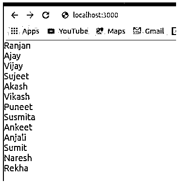
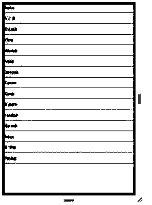

# React 本机 ListView

> 原文：<https://www.educba.com/react-native-listview/>


## React 本机 ListView 简介

React Native ListView 库是 react-native 库，我们可以在其中决定项目列表的显示，它有许多库函数和属性，使我们的组件移动友好，而且这个库组件可以用于显示大量的数据，基本上，在这个组件中，我们必须将列表的数组传递给组件，它将能够以您想要的格式显示所有数据(如带分隔符的列表或不带分隔符的列表)，带有分页(我们可以定义每页可以显示的项目数)。

**语法**:

<small>网页开发、编程语言、软件测试&其他</small>

在下面的语法中，我们可以看到我们正在使用 ListView 组件，我们将列表数组传递给它，以显示列表中某些项目的任何列表。

```
const SL = new ListView.DataSource({
rowHasChanged: (row1, row2) => row1 !== row2
});
this.state = {
initialStatus: SL.cloneWithRows( Array of Data Source)
};
<ListView
dataSource={this.state.initialStatus}//it contains array of list
renderRow={rowData => (
<Text style={Object of style to design each item output here(we can write beautiful custom designs here)}>{rowData}</Text>
)}
/>
```

### 属性

以下是 React 本机 ListView 的不同属性:

**1。dataSource** :这是 react-native 的 ListView 中的一个必需属性。它使用数据数组来创建列表视图。

**2。renderRow** :它为我们创建可渲染的组件。它使用来自数据源的数据，并显示为带有 id 的行。此属性提供了一种机制，我们可以根据自己的需求以不同的方式定制每个列表，例如，假设我们正在显示的列表中，我们希望用不同的颜色标记任何特定的列表，以便对数据进行分析，而不是将所有登录信息写入其中。

**3。pageSize** :这里我们定义页面的大小。这个大小意味着一页上可以显示多少个项目。例如，很多时候一次显示所有项目在 android 应用程序中是不可行的，所以我们可以使用这个属性来决定应用程序中可以显示的列表项目的数量。

**4。样式**:我们可以为显示组件编写自己的样式，这个样式可以用来设计我们的列表外观，它将设计我们的列表颜色和列表位置等。

**5。renderSeparator** :如果我们想在项目列表或行之间创建一个分隔符，我们可以使用它。它让我们更好地理解 UI，因为它在所有项目之间创建了一个分隔符，从而可以更好地进行分析。它创建一个用于渲染的组件，将每个组件渲染为一个分隔符。

**6。onEndReached** :如果我们想要显示一些东西，或者如果我们想要在项目列表的末尾执行一些活动，我们可以使用这个属性。例如，假设我们希望显示列表中的所有项目都已结束，并且我们希望向客户显示列表已结束的消息，那么这将非常有用。

**7。renderFooter:** 在 React native 上，多次渲染任何静态属性都是一项[扩展任务，因此为了避免 React native 中的这种操作，我们使用 renderFooter 和 renderheader。在 renderFooter 中，它绑定了 Footer 元素，这样就不会一次又一次地呈现它。](https://www.educba.com/react-native-asyncstorage/)

### 实现本机 ListView 的示例

下面是 React 本机 ListView 的示例:

#### 示例#1

你已经见过很多次在网站上列出一些项目，在这里的情况下，反应原生我们使用列表视图。ListView 非常流行在 android 和 IOS 上列出项目。

在下面的例子中是下面的任务。

*   我们创建了一个名为 StudentList 的类，这个类扩展了 react 本地核心组件库。
*   在组件 StudentList 中，我们创建了一个构造函数，在这个函数中，我们执行诸如初始化学生数据源之类的操作，并用一个学生姓名数组克隆它。
*   在 render 函数中，我们返回列表视图，在这里我们调用 react 本地 list view 组件，并向其传递所需的参数以及我们在初始化时定义的学生数据源。

以及显示所有学生列表的输出屏幕。

**代码:**

```
import React, { Component } from "react";
import { Text, ListView } from "react-native";
export default class StudentList extends Component {
constructor() {
super();
const SL = new ListView.DataSource({
rowHasChanged: (row1, row2) => row1 !== row2
});
this.state = {
studentList: SL.cloneWithRows([
"Ranjan",
"Ajay",
"Vijay",
"Sujeet",
"Akash",
"Vikash",
"Puneet",
"Susmita",
"Ankeet",
"Anjali",
"Sumit",
"Naresh",
"Rekha"
])
};
}
render() {
return (
<ListView
dataSource={this.state.studentList}
renderRow={student => <Text style={{ fontSize: 18 }}>{student}</Text>}
/>
);
}
}
```

**输出:**




#### 实施例 2

在这个示例中，我们设计了一个组件来显示所有学生的列表，它还具有一些功能，如如果任何人单击任何学生的列表，将会打开一个警告框，显示我们单击的学生姓名。

在下面的例子中，我们正在执行以下任务。

*   首先，我们用 StudentList 创建了一个类，这个类扩展了 react-native 核心组件。
*   在 StudentList 类中，我们定义了构造函数并定义了组件的初始状态。
*   我们通过调用 react-native 的 ListView 组件返回 HTML 视图，并将数据源传递给 ListView 组件。
*   在 ListView 组件内部，我们已经为 onPress 编写了逻辑，在内部组件 TouchableOpacity 上，如果我们单击列表中的任何名称，就会显示一个警告。

**代码:**

```
import React from "react";
import { ListView, View, Text, StyleSheet, Alert } from "react-native";
class StudentList extends React.Component {
constructor(props) {
super(props);
const ds = new ListView.DataSource({
rowHasChanged: (row1, row2) => row1 !== row2
});
this.state = {
studentList: ds.cloneWithRows([
"Anita",
"Akash",
"Rakesh",
"Vijay",
"Manish",
"Ankit",
"Deepak",
"Kumar",
"Ajeet",
"Bheem",
"nandan",
"Naresh",
"Anup",
"Radha",
"Pankaj"
])
};
}
displayStudent = rowData => {
console.log("helloooo");
Alert.alert(rowData);
};
render() {
return (
<ListView
dataSource={this.state.studentList}
style={styles.containerStyle}
renderRow={student => (
<Text
onPress={this.displayStudent.bind(this, student)}
style={styles.rowViewContainerStyle}
{student}
</Text>
)}
renderSeparator={(sID, rId) => (
<View key={rId} style={styles.separatorStyle} />
)}
/>
);
}
}
const styles = StyleSheet.create({
containerStyle: {
flex: 1,
backgroundColor: "green"
},
separatorStyle: {
height: 0.5,
width: "100%",
backgroundColor: "red"
},
rowViewContainerStyle: {
flex: 1,
paddingRight: 15,
alignItems: "center",
paddingTop: 14,
paddingBottom: 14,
borderBottomWidth: 0.5,
borderColor: "'#c9c9c9",
flexDirection: "row",
fontSize: 20,
marginLeft: 10
}
});
export default StudentList;
```

**输出:**




### 结论

从本教程中，我们了解到，我们可以管理 android 和 IOS 应用程序上的项目列表，而无需编写太多的 HTML 代码来指定预定义的属性。

### 推荐文章

这是 React 原生 ListView 的指南。这里我们讨论 React Native ListView 的基本概念、属性和示例，以及代码和输出。您也可以看看以下文章，了解更多信息–

1.  [反应自然状态](https://www.educba.com/react-native-state/)
2.  [反应原生状态栏](https://www.educba.com/react-native-statusbar/)
3.  [React Native ScrollView](https://www.educba.com/react-native-scrollview/)
4.  [反应原生表](https://www.educba.com/react-native-table/)